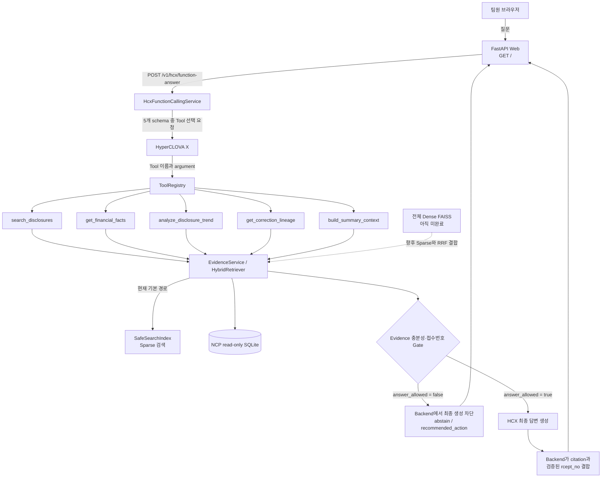

# 공시 Q&A 프로젝트: 지금까지 한 일과 다음 작업

> 대상 브랜치: `agent/financial-account-catalog-v1`<br>
> 최종 갱신: 2026-08-25<br>
> 목적: 처음 프로젝트를 보는 팀원도 현재 구조, 완료 범위, 테스트 방법, 남은 embedding 작업을 한 번에 이해할 수 있게 설명합니다.

## 1. 이 프로젝트를 한 문장으로 설명하면

사용자가 기업 공시에 관해 질문하면 HyperCLOVA X(HCX)가 필요한 검색 Tool을 고르고, 서버가 read-only SQLite에서 근거를 찾은 뒤, 검증된 DART 접수번호가 있을 때만 답변하는 공시 Q&A 서비스입니다.

현재는 **Sparse/Structured 검색을 사용하는 HCX Function Calling V1.1과 팀용 Web 화면까지 동작**합니다. 전체 공시를 대상으로 한 Dense embedding은 아직 운영 경로에 연결하지 않았습니다.

## 2. 먼저 알아둘 용어

| 용어 | 쉬운 설명 |
|---|---|
| SQLite | 공시 원문과 구조화 데이터를 보관한 파일형 데이터베이스입니다. 운영 중에는 읽기 전용입니다. |
| Sparse 검색 | 단어와 형태가 비슷한 문서를 빠르게 찾는 기존 검색 방식입니다. 현재 운영 기본값입니다. |
| Dense embedding | 문장의 의미를 숫자 벡터로 바꾸고 의미가 가까운 문서를 찾는 방식입니다. 전체 corpus 작업은 남아 있습니다. |
| Chunk | 긴 공시를 embedding/search에 넣기 좋은 작은 단위로 나눈 텍스트입니다. |
| Tool | HCX가 호출할 수 있는 허용된 backend 함수입니다. 등록되지 않은 Tool은 실행되지 않습니다. |
| Evidence | 답변의 근거가 되는 공시 조각과 구조화된 출처 정보입니다. |
| `rcept_no` | DART 공시 접수번호입니다. 답변의 실제 근거를 확인하는 핵심 값입니다. |
| `answer_allowed` | Evidence 검증 결과 최종 답변을 만들어도 되는지를 나타내는 backend 판정입니다. |

## 3. 전체 구조도



중요한 점은 HCX가 DB에 직접 접속하지 않는다는 것입니다. HCX는 어떤 Tool을 쓸지만 선택하고, 실제 DB 조회·근거 검증·답변 차단은 backend가 담당합니다.

## 4. 지금까지 완료한 작업

### 4.1 재무계정 카탈로그 중앙화

- 매출액, 영업이익 같은 재무계정 이름과 별칭을 한 곳에서 관리합니다.
- parser, 검색, 재무 Tool이 서로 다른 이름 규칙을 갖지 않도록 routing 기준을 중앙화했습니다.
- 잘못된 계정명이나 애매한 별칭이 다른 기능으로 흘러가는 위험을 줄였습니다.

### 4.2 Embedding Chunk v1 생성기

- XML, HTML, PDF fragment를 결정적인 `chunk-v1` 형식으로 나눕니다.
- 기본 본문 설정은 target 450, max 700, overlap 80 tokens입니다.
- filing과 section이 다른 fragment, 서로 다른 `table_id`는 하나의 chunk로 섞지 않습니다.
- 표에는 caption, header, 단위를 반복하고 chunk와 모든 원본 `evidence_id` 연결을 저장합니다.
- `chunk_id`, `text_sha256`, checkpoint/resume을 결정적으로 유지합니다.
- 37GB SQLite에서 전체 정렬로 임시 디스크가 가득 차지 않도록 keyset/batch streaming으로 고쳤습니다.
- 원본 DB는 수정하지 않고 read-only로 엽니다.

### 4.3 BGE-M3 + FAISS pilot

- 실제 `BAAI/bge-m3` encoder, FAISS `IndexFlatIP`, metadata/manifest 생성을 구현했습니다.
- Dense vector는 L2 정규화하며 FAISS vector 순서와 metadata의 `vector_id` 순서를 검증합니다.
- `--limit`, `--batch-size`, `--resume`, 실패·truncation 기록을 지원합니다.
- 현재 계약은 100개 chunk를 기대하는 `smoke_only`입니다. 전체 corpus 검색 품질을 증명한 상태가 아닙니다.

### 4.4 Sparse/Dense/Hybrid retrieval

- `SparseRetriever`는 기존 `SafeSearchIndex`와 품질·metadata filter 정책을 그대로 사용합니다.
- `DenseFaissRetriever`는 BGE-M3 질문 벡터와 FAISS inner-product로 검색합니다.
- `HybridRetriever`는 RRF로 Sparse와 Dense 순위를 결합합니다.
- Dense 파일이 없거나 오류가 나거나 filter 결과가 0건이면 Sparse로 안전하게 fallback합니다.
- 현재 Function Calling 운영 composition은 `HybridRetriever(sparse, None)`이므로 실제 답변은 Sparse/Structured 기반입니다.

### 4.5 Tool Registry와 Evidence Gate

등록된 Tool은 다음 5개입니다.

1. `search_disclosures`: 일반 공시 검색
2. `get_financial_facts`: 재무 수치 조회
3. `analyze_disclosure_trend`: 공시 추세 분석
4. `get_correction_lineage`: 최초·정정공시 관계 조회
5. `build_summary_context`: 근거 기반 요약 context 구성

Tool 결과는 `sufficient`, `partial`, `insufficient`로 판정하고 `recommended_action`, `answer_allowed`를 함께 만듭니다. 등록되지 않은 Tool과 schema에 맞지 않는 argument는 실행 전에 거부합니다.

### 4.6 HCX Function Calling V1.1

- 흐름은 `HCX Tool 선택 → Registry 실행 → Evidence 검증 → 조건부 HCX 최종 생성`입니다.
- `answer_allowed=false`면 prompt에 맡기지 않고 backend가 최종 HCX 호출 자체를 막습니다.
- 최종 생성도 강제 Function Call인 `submit_grounded_answer`를 사용해 일반 텍스트/잘못된 JSON 응답 문제를 해결했습니다.
- HCX가 citation이나 접수번호를 새로 만들지 못하게 하고 Evidence에 있는 ID만 반환하도록 제한했습니다.
- 유효한 14자리 `rcept_no`가 없으면 충분한 것처럼 보이는 Evidence도 최종 답변에 사용하지 않습니다.
- 실제 HCX smoke에서 `answered`, `answer_allowed=true`, citation과 `rcept_no` 보존을 확인했습니다.

### 4.7 팀용 공시 Q&A Web

- 새 React/Vue 프로젝트 없이 기존 HTML/CSS/JavaScript를 사용했습니다.
- 브라우저는 오직 `POST /v1/hcx/function-answer`만 호출합니다.
- HCX key와 SQLite 경로는 브라우저로 전달되지 않습니다.
- 정상 답변, Evidence 상태, 근거 공시, 접수번호, Tool, latency를 표시합니다.
- 답변 불가, loading, API/network error, 다시 시도 UI가 있습니다.
- 데스크톱과 390px 모바일 화면을 실제 브라우저로 확인했습니다.

## 5. 질문 하나가 처리되는 과정

예시 질문: `삼성전자의 2024년 연결 기준 매출액은 얼마인가?`

1. Web이 질문 문자열만 FastAPI에 보냅니다.
2. HCX가 5개 Tool 중 `get_financial_facts`를 선택합니다.
3. ToolRegistry가 이름과 argument schema를 검증합니다.
4. Tool이 NCP의 read-only SQLite와 EvidenceService에서 실제 수치·공시 근거를 조회합니다.
5. Evidence Gate가 회사, 기간, 계정, 단위, 접수번호를 확인합니다.
6. 충분하지 않으면 여기서 중단하고 `answer_allowed=false`를 반환합니다.
7. 충분하면 HCX가 Evidence ID만 참조해 최종 문장을 만듭니다.
8. backend가 citation ID를 실제 `rcept_no`와 다시 연결한 뒤 Web에 반환합니다.
9. Web은 backend가 준 접수번호만 표시합니다.

## 6. 주요 파일 지도

| 위치 | 역할 |
|---|---|
| `src/disclosure_db/runtime.py` | Agent, ToolRegistry, HCX service를 실제 서버용으로 조립합니다. |
| `src/disclosure_db/hcx_function_calling.py` | HCX Tool 선택, 최종 생성, Evidence/citation gate를 담당합니다. |
| `src/disclosure_db/hcx_prompts.py` | 버전 관리되는 HCX prompt를 보관합니다. |
| `src/disclosure_db/disclosure_tools.py` | 5개 Tool과 Registry contract를 구현합니다. |
| `src/disclosure_db/evidence_sufficiency.py` | sufficient/partial/insufficient와 답변 허용 여부를 판정합니다. |
| `src/disclosure_db/embedding_chunks.py` | read-only SQLite에서 chunk-v1을 생성합니다. |
| `src/disclosure_db/bge_m3_faiss.py` | BGE-M3 embedding과 FAISS index를 생성합니다. |
| `src/disclosure_db/hybrid_retrieval.py` | Sparse/Dense/RRF 검색과 fallback을 구현합니다. |
| `src/disclosure_db/api.py` | FastAPI endpoint와 `/` Web route를 제공합니다. |
| `src/disclosure_db/web/` | 팀용 공시 Q&A HTML/CSS/JS입니다. |
| `scripts/smoke_hcx_function_calling.py` | 배포 후 5종 HCX endpoint smoke를 실행합니다. |
| `docs/development-log.md` | 날짜별 구현·판단·테스트 기록입니다. |

## 7. 테스트는 어떻게 했나

테스트는 한 종류만 통과시키지 않고 여러 층으로 나눠 확인했습니다.

| 테스트 층 | 확인 내용 | 최신 결과 |
|---|---|---|
| Python 전체 회귀 | DB, parser, chunk, retrieval, Tool, HCX, FastAPI, Web route | `486 passed, 2 skipped, 48 warnings, 45 subtests` |
| Web JavaScript | 정상/차단, citation, 접수번호, endpoint, loading, error, history | `12 passed` |
| HCX 실제 smoke | 실제 provider schema, Tool Call, 최종 강제 Tool Call, citation 보존 | 성공 |
| FastAPI integration | `/health`, Function Calling endpoint, backend 답변 차단 | 성공 |
| 브라우저 검증 | 데스크톱/모바일, 정상, abstain, loading, API/network error | 성공 |
| 정적 검증 | Python syntax/bytecode와 whitespace 오류 | compileall/diff check 성공 |

Windows PowerShell에서 다시 실행하는 명령입니다.

```powershell
# 전체 Python 회귀
.\.venv\Scripts\python.exe -m pytest -q

# Web JavaScript 회귀
node --test tests\web_api.test.mjs tests\web_history.test.mjs

# Python 파일 문법 검증
.\.venv\Scripts\python.exe -m compileall -q src

# 공백·충돌 marker 같은 diff 문제 검증
git diff --check
```

`2 skipped`는 필수 기능 실패가 아니라 현재 workspace에 선택적 Dense artifact가 없을 때 의도적으로 건너뛰는 통합 테스트입니다. 경고는 기존 FastAPI lifecycle/TestClient와 Windows subprocess encoding 계열이며 테스트 실패는 아닙니다.

## 8. credential과 데이터 안전 규칙

- 실제 HCX key는 `.env.example`에 넣지 않습니다.
- `.env.example`은 변수 이름을 설명하는 공개 템플릿입니다.
- 실제 값은 Git에서 제외되는 `.env` 또는 서버 환경변수에만 넣습니다.
- `.env`, SQLite, FAISS index, chunk JSONL, model 파일은 Git에 commit하지 않습니다.
- 브라우저에는 key, DB 경로, 원문 DB가 노출되지 않습니다.
- NCP의 base/overlay/search SQLite는 read-only mount를 유지합니다.

Docker Compose는 같은 폴더의 `.env`를 읽습니다.

```powershell
Copy-Item .env.example .env
# 이후 VS Code에서 .env만 열어 실제 경로와 CLOVASTUDIO_API_KEY를 직접 설정합니다.
# 실제 secret은 채팅, README, 명령 출력에 붙여넣지 않습니다.
```

## 9. 로컬과 NCP에서 Web을 여는 방법

필요한 Python 선택 의존성을 설치한 뒤, DB 4개 경로를 직접 지정해 실행할 수 있습니다.

```powershell
.\.venv\Scripts\python.exe -m pip install -e ".[agent]"
.\.venv\Scripts\disclosure-agent.exe serve `
  --database 'D:\...\disclosure_corpus_semantic_v1.sqlite' `
  --overlay 'D:\...\agent_overlay.sqlite' `
  --search-index 'D:\...\agent_search.sqlite' `
  --attestation 'D:\...\database_distribution_manifest_semantic_v1.json' `
  --host 127.0.0.1 `
  --port 8000
```

직접 실행한 Python process는 Docker Compose처럼 `.env`를 자동으로 읽지 않습니다. 실제 HCX 호출이 필요한 로컬 실행에서는 VS Code 실행 환경 또는 현재 process 환경에 `CLOVASTUDIO_API_KEY`를 별도로 설정해야 합니다. Docker Compose 실행은 같은 폴더의 `.env`를 자동으로 읽습니다.

실행 후 다음 주소를 사용합니다.

- Web: `http://127.0.0.1:8000/`
- 상태: `http://127.0.0.1:8000/health`
- Function Calling API: `POST http://127.0.0.1:8000/v1/hcx/function-answer`

NCP에서는 `.env`와 read-only volume 설정을 유지한 상태로 image를 다시 만듭니다.

```bash
cd /srv/mirae/<현재-배포-디렉터리>
docker compose config --quiet
docker compose build disclosure-agent
docker compose up -d --no-deps --force-recreate disclosure-agent
docker compose ps
curl -fsS http://127.0.0.1:8000/health
```

공개 8000 포트가 허용되어 있다면 팀 공유 주소는 `http://<NCP-PUBLIC-IP>:8000/`입니다.

## 10. 남은 핵심 작업: 전체 embedding

### 현재 정확한 상태

- chunk-v1 생성 코드: 완료
- BGE-M3/FAISS 생성 코드: 완료
- 10개·100개 smoke를 위한 테스트: 완료
- 전체 corpus FAISS artifact: 미완료
- 전체 corpus Dense 검색 품질/latency 평가: 미완료
- Function Calling runtime의 Dense 주입: 미완료
- 현재 운영 답변: Sparse/Structured 기반

즉, Dense 코드가 없어서 못 쓰는 상태가 아니라 **전체 데이터를 실제로 vector로 만들고 검증·배포하는 큰 실행 작업이 남은 상태**입니다.

### 10.1 전체 chunk-v1 만들기

대용량 산출물은 Git 밖의 전용 디스크에 만듭니다.

```powershell
$env:PYTHONPATH=(Resolve-Path 'src').Path
python scripts\build_embedding_chunks.py `
  --database 'D:\...\disclosure_corpus_semantic_v1.sqlite' `
  --output-dir 'D:\mirae-asset-project\runs\chunk-v1-full' `
  --batch-size 1000 `
  --overwrite
```

중단 후 이어서 실행할 때는 기존 출력 디렉터리에 `--resume`을 사용합니다. 원본 DB는 read-only이고 출력은 별도 디렉터리에 기록됩니다.

### 10.2 먼저 10개 BGE-M3 smoke

```powershell
.\.venv\Scripts\python.exe -m pip install -e ".[bge-m3-pilot]"
python scripts\build_bge_m3_faiss.py `
  --chunks 'D:\mirae-asset-project\runs\chunk-v1-full\chunks.jsonl' `
  --output-dir 'D:\mirae-asset-project\runs\bge-m3-smoke-10' `
  --limit 10 `
  --batch-size 2
```

확인할 산출물은 `index.faiss`, `chunk_metadata.jsonl`, `manifest.json`입니다. vector 수와 metadata 행 수, `vector_id` 순서, 1024차원, L2 norm, 실패·truncation 수를 확인합니다.

### 10.3 전체 corpus embedding 실행

10개 smoke가 통과한 뒤 `--limit`을 제거하고 별도 full 출력 경로를 사용합니다.

```powershell
python scripts\build_bge_m3_faiss.py `
  --chunks 'D:\mirae-asset-project\runs\chunk-v1-full\chunks.jsonl' `
  --output-dir 'D:\mirae-asset-project\runs\bge-m3-full' `
  --batch-size 2
```

중단된 동일 출력 디렉터리를 이어서 처리할 때만 위 명령에 `--resume`을 추가합니다. CPU 8GB에서도 batch-size 2 계약은 지원하지만 전체 corpus는 오래 걸릴 수 있습니다. NCP GPU 또는 충분한 디스크/메모리 환경에서 checkpoint를 보존하며 실행하는 편이 현실적입니다.

### 10.4 검색 품질을 측정한 뒤에만 채택

전체 FAISS 파일이 만들어졌다고 바로 운영에 연결하지 않습니다.

1. 전체 chunk 수와 FAISS vector 수가 정확히 일치하는지 확인
2. metadata 순서와 `vector_id`가 0부터 연속인지 확인
3. 모든 vector가 L2 normalized인지 확인
4. 회사, `filing_id`, 기간, 정정공시 filter가 유지되는지 확인
5. Dense 오류 시 Sparse fallback이 유지되는지 확인
6. 독립 Gold에서 Recall@20 개선폭이 최소 5%p인지 측정
7. wrong issuer/version이 0인지 확인
8. 실제 serving p95가 2초 이내인지 확인

이 gate를 통과하기 전에는 “Dense가 검색 성능을 개선했다”고 주장하지 않습니다.

### 10.5 artifact 배포와 runtime 연결

검증된 파일은 Git이 아니라 NCP의 별도 read-only 디렉터리로 전송합니다. 두 경로와 corpus 상태를 함께 바꿉니다.

```text
DISCLOSURE_DENSE_INDEX=/data/dense/index.faiss
DISCLOSURE_DENSE_METADATA=/data/dense/chunk_metadata.jsonl
DISCLOSURE_DENSE_MODEL=BAAI/bge-m3
DISCLOSURE_DENSE_CORPUS_STATUS=full_corpus
DISCLOSURE_DENSE_EXPECTED_CORPUS_SIZE=<실제 검증 vector 수>
```

현재 `runtime.py`는 안전을 위해 Dense를 `None`으로 주입합니다. 다음 코드 작업에서는 위 환경변수의 full-corpus artifact를 검증한 경우에만 `DenseFaissRetriever`를 만들고, 기존 Sparse fallback과 Evidence/rcept_no gate는 그대로 유지해야 합니다.

## 11. embedding 다음의 후속 작업

1. 전체 Dense + Sparse RRF retrieval 회귀
2. 5개 Tool의 실제 질문별 선택 정확도 평가
3. HCX endpoint의 전체 corpus E2E 및 반복 latency/실패율 측정
4. Web에서 실제 5종 질문 재검증
5. 필요할 때만 PostgreSQL/pgvector 검토

SQLite가 현재 read-only 운영 요구와 성능 gate를 만족하므로 PostgreSQL이나 GraphRAG를 단순히 구조가 멋져 보인다는 이유로 먼저 도입하지 않습니다.

## 12. 현재 완료/잔여 요약

| 영역 | 상태 |
|---|---|
| 재무계정 카탈로그 | 완료 |
| chunk-v1 생성·streaming·resume | 완료 |
| BGE-M3/FAISS pilot 코드 | 완료 |
| Sparse/Hybrid/fallback 계약 | 완료 |
| Tool Registry 5개 | 완료 |
| Evidence/접수번호 hard gate | 완료 |
| HCX Function Calling V1.1 | 완료, 실제 smoke 성공 |
| FastAPI runtime 연결 | 완료 |
| 팀용 Web | 완료 |
| 전체 corpus embedding artifact | 남음 |
| 전체 Dense 품질·latency 평가 | 남음 |
| Dense 운영 runtime 주입 | 남음 |
| NCP 최신 Web image 재배포 | 사용자가 수행할 운영 작업 |
