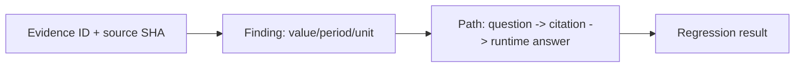

# Agent-audited Gold set audit guide

이 문서는 자동 생성 Gold를 사람 승인 Gold와 분리해 재현·검증하는 운영 가이드입니다. 자동 생성기는 답을 추측하지 않고, immutable semantic SQLite의 evidence·lineage·source 상태를 확인한 행만 `agent_audited`로 남깁니다.

## Quick start

필수 입력은 D: 드라이브의 semantic SQLite, 기존 `gold_qa.jsonl`, validated financial overlay seed입니다. 원본 SQLite는 항상 read-only로 열립니다.

```powershell
$env:PYTHONPATH='src'
$base = 'D:\mirae-asset-project\db\semantic-v1_129f5b0\disclosure_corpus_semantic_v1.sqlite'
$hash = 'b8fb3be8b90d0cb1d8bc2491bee575aee632d29cc9bade21070e7e7b51646563'

# 대형 파일 해시는 별도로 Get-FileHash로 확인한 뒤 외부 attestation을 전달한다.
Get-FileHash -LiteralPath $base -Algorithm SHA256

# 빠른 baseline: 기존 human Gold 23건 + validated overlay 8건
python scripts/build_agent_gold.py `
  --database $base `
  --gold data/derived/gold_qa.jsonl `
  --overlay-seed data/derived/financial_fact_gold_seed.jsonl `
  --output data/derived/gold_qa.agent_audited.jsonl `
  --summary data/derived/gold_qa_agent_audit_summary.json `
  --rejects data/derived/gold_qa_agent_rejects.jsonl `
  --precomputed-base-sha256 $hash `
  --fact-limit 0

python scripts/evaluate_agent.py `
  --database $base `
  --overlay 'D:\mirae-asset-project\db\agent\financial_overlay.sqlite' `
  --gold data/derived/gold_qa.agent_audited.jsonl `
  --output data/derived/agent_audited_eval.json
```

generic `fact` 후보까지 전수 생성하려면 마지막 `--fact-limit 0`을 생략합니다. 현재 코퍼스에서는 predicate allowlist 후보가 5,816 evidence 행이므로 대형 조인·감사에 장시간이 걸릴 수 있습니다. 중단해도 원자적 출력 때문에 기존 artifact가 부분 파일로 바뀌지 않습니다.

## Dataset states

| 상태 | 의미 | 릴리스 Gold 가능 여부 |
|---|---|---|
| `candidate` | source row에서 생성됐지만 게이트 전 | 불가 |
| `agent_audited` | 결정론적 schema/evidence/lineage/value/citation 게이트 통과 | 회귀 평가만 |
| `human_verified` | 사람이 명시적으로 확인한 상태 | 기존 계약 아래 가능 |
| `rejected` | 필수 게이트 실패; reject ledger에 보존 | 불가 |

새 행은 `answer_origin=model_generated`, `review.status=agent_audited`로 기록됩니다. `review.status=approved`와 `answer_origin=human_verified`는 자동 생성기가 설정하지 않습니다.

## Gate decision table

| 단계 | 통과 조건 | 실패 코드 |
|---|---|---|
| Contract | schema 0.1.0, 질문·답·기간·review 필드가 완전함 | `schema_invalid` |
| Evidence | evidence ID가 table cell/fragment에 존재하고 선언 filing과 일치 | `evidence_not_found`, `cross_filing_evidence` |
| Source/table | source와 table parse status가 `success` | `source_parse_failed`, `table_parse_failed` |
| Visual safety | PDF visual evidence를 답변 근거로 사용하지 않음 | `visual_evidence_blocked` |
| Lineage | filing version가 `root` 또는 `resolved` | `lineage_not_answer_safe` |
| Value | numeric 값이 유한 `Decimal`이고 citation ID가 evidence 부분집합 | `numeric_not_decimal`, `citation_mismatch` |
| Dedupe | question/evidence 조합과 evidence ID가 중복되지 않음 | `duplicate_candidate` |

## Reject ledger

`data/derived/gold_qa_agent_rejects.jsonl`은 행마다 `candidate_id`, source/filing/evidence 식별자, `reason_codes`, base·input SHA-256을 담습니다. reject는 삭제하거나 추측 답으로 대체하지 않습니다. `reason_counts`는 `gold_qa_agent_audit_summary.json`에서 확인합니다.

## Evidence → Finding → Path

감사 기록은 다음 체인을 유지해야 합니다.



예를 들어 overlay 행 `ff_kores_2024_revenue`는 `ev1_c08a1a0d7188e805eeacbe6971ad4d43` 셀과 source SHA를 선언하고, 2024 duration·연결·원 단위를 함께 보존합니다. evaluator는 답변 citation이 그 evidence ID를 포함하는지 확인합니다.

## Release boundary

현재 baseline 결과는 31건(기존 `human_verified` 23건 + `agent_audited` 8건)입니다. runtime 평가 결과는 31/31 verified, error 0이며 answerability agreement는 11/31입니다. 이는 숫자 답변 가능성의 회귀 진단이지 human Gold 승인율이 아닙니다.

`agent_audited`를 공모전 제출용 `human_verified`로 승격하려면 사람이 원문 셀과 기간·단위·정정 계보를 대조하고, 기존 Gold annotation contract에 맞는 reviewer/timestamp를 기록해야 합니다. 대량 full-fact run은 사람이 확인할 후보 큐를 만드는 용도이며 자동 승격하지 않습니다.
