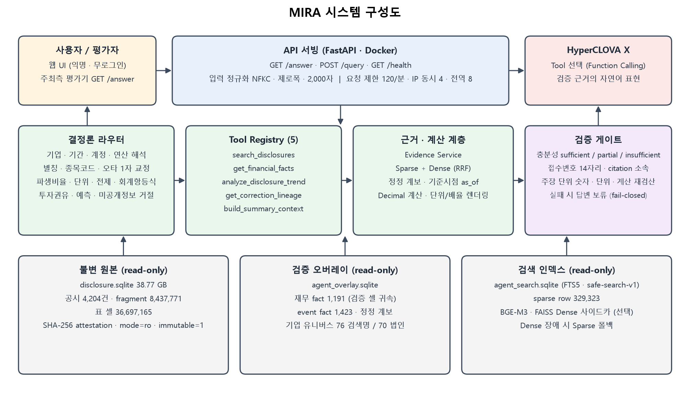
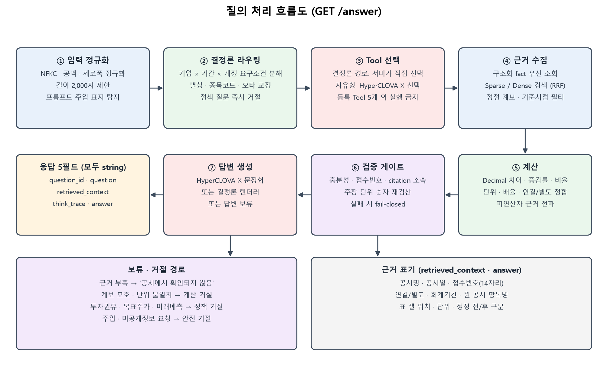

# MIRA — 근거 검증형 공시 AI Agent

제10회 2026 미래에셋증권 AI Festival · 공시 Agent 기술제안서

팀명: 신비복숭아 (김세민 · 이정찬 · 이정민)
작성 기준일: 2026-09-06
평가용 End-point: http://101.79.31.221:8000/answer (README.md와 동일)

---

## 1. 제안 요약

### 1.1 한 문단 요약

MIRA는 공시를 "가장 비슷한 문장을 찾아 LLM에 넘기는" 시스템이 아니라, 기업·회계기간·공시일·정정 이력·연결/별도 범위·단위·원문 셀 위치를 먼저 구조화하고, 검증을 통과한 근거만으로 답을 만드는 공시 전용 AI Agent다. 수치와 계산은 LLM이 아니라 `Decimal` 기반 결정론 코드가 수행하고, HyperCLOVA X는 등록된 5개 Tool 중 하나를 고르거나 검증이 끝난 근거를 한국어 문장으로 표현하는 역할만 맡는다. 생성된 답변은 다시 숫자·단위·접수번호·인용 소속을 재검산하며, 하나라도 실패하면 답변 대신 "공시에서 확인되지 않음"을 돌려준다(fail-closed). 원본 공시 DB 38.77GB는 SHA-256으로 봉인된 읽기 전용 자산으로 유지하고, 파생 데이터와 검색 인덱스는 별도 파일로 관리해 어떤 답변도 원본 셀까지 추적할 수 있다.

### 1.2 공식 요구 항목 대응표

| 과제 요구 | MIRA의 구현 | 근거 위치 |
|---|---|---|
| ① 검색 및 정보 추출 | 기업·기간·공시유형 구조화 라우팅, FTS5 Sparse + BGE-M3 Dense(RRF) 하이브리드 검색, 원본 표 셀 단위 추출 | §3, §5.1 |
| ② 종합 비교 및 연산 | 다중 기업×기간×계정 요구조건 분해, `Decimal` 차이·증감률·비율 계산, 정정 계보(최초→정정→철회) 연결 | §4.2, §5.2 |
| ③ 근거 기반 답변 | 모든 답변에 공시명·공시일·접수번호(14자리)·원문 항목명·셀 위치 첨부, 인용은 검색 묶음 안의 evidence ID만 허용 | §5.5, §6.3 |
| 환각 방지 | 주장 단위 숫자·단위·계산 재검산, 검증 실패 시 답변 보류, 근거 없는 예측·투자 의견 생성 금지 | §5.4, §5.5 |
| HyperCLOVA X 전용 | Tool 선택(Function Calling)과 검증 근거의 문장화에만 사용, 타 LLM 호출 경로 없음 | §5.3 |
| 데이터 규칙 | 제공 코퍼스 외 데이터·외부 API 실시간 호출 없음, 대상 기간 2023.01~2026.03 | §4.1, §8.1 |
| 제출·재현 | Dockerfile · compose · pinned requirements · README · GET /answer 5필드 API | §6.2, §9 |

### 1.3 심사 기준 대응표

| 정성평가 항목 | 이 제안서에서 확인할 내용 | 절 |
|---|---|---|
| 문제 정의 | 실제 운영 서버에서 관측한 8종 결함 클래스와 그 근본원인(시점·정정·단위·전제) | §2 |
| 기술 완성도 · 성능 | 946개 자동 테스트, 결정론 300문항 300/300, 재무 856/856, 대량 QA 12,811문항 실측, p95 5.45초 | §7 |
| 창의성 · 확장성 | 코퍼스 대조 정답 검증 루프, 결정론 라우팅으로 LLM 도구선택 우회, 불변 원본+오버레이+attestation 구조 | §3.3, §5, §10 |
| 답변의 정확성 · 완결성 | 평가지표 7개(정확성·근거 완전성·요구사항 충족·근거 기반·추론 논리성·안전성·정보한계)별 대응 표 | §7.6 |
| 현업 활용성 · 리스크 관리 | 무로그인 공개 UI, 요청 제한, 읽기 전용 마운트, 재부팅 자동 복구, 롤백, 두 단계 릴리스 게이트 | §6.1, §8 |

### 1.4 핵심 성과 지표 (측정값)

| 지표 | 값 | 측정 조건 |
|---|---:|---|
| 자동 회귀 테스트 | 946 passed · 2 skipped · 283 subtests | 제출 브랜치, 2026-09-06 |
| 결정론 스트레스 300문항 | 300/300 · 허위 숫자 0 · 미확인 인용 0 · 타 공시 인용 0 | provider-disabled, manifest SHA-256 고정 |
| 재무 출시 평가 856문항 | 856/856 (최신값 456 · 3개년 397 · 불완전 집계 거절 3) | 코퍼스 전역 overlay |
| 대량 QA 12,811문항 | pass 11,864 · fail 477 · error 470 | 격리 스테이징(:8002), 2026-09-03 |
| 응답 지연 (12,341건, error 제외) | 평균 1.49초 · p50 1.05초 · p95 5.45초 · 최대 19.24초 | 위 대량 QA 런 |
| 20개 동시 요청 | 오류 0 · p95 86.94ms | 구조화 재무 경로, SQLite |
| 정답 테이블 코퍼스 확증 | 978/978 · 모순 0 | 인용 셀을 불변 base에서 재조회 |
| 공개 endpoint 실호출 | 9/9 (단위 지정 2 · 파생비율 · 문서형 · 거짓 전제 · 안전 거절 2 · 무회귀 2) | 외부망에서 `GET /answer` 직접 호출, 2026-09-06 |

error 470건은 HyperCLOVA X 왕복 실패(`hcx_final_generation_failed` 336 · `hcx_tool_selection_failed` 134)다. 원장의 지연 분포는 1초 미만 22건(4.7%) · 1~5초 372건(79.1%) · 5초 이상 76건(16.2%, 최대 20.93초)으로, 쿼터 초과의 즉시 거절만으로는 설명되지 않는다. 대량 동시 호출의 QPM 초과분과 개별 질문의 provider 실패가 섞여 있으며 둘을 분리해 세지 않았다(§7.5). 이 실패 계열에서 공식 endpoint는 결정론 경로로 폴백해 검증된 답을 유지한다(§5.3). fail 477건의 내역과 남은 한계도 §7.5에 그대로 적는다.

---

## 2. 문제 정의

### 2.1 공시 데이터의 구조적 난점

공시는 세 가지 점에서 일반 문서와 다르다.

1. **시점 의존**: 같은 "2025년 매출액"도 사업보고서(2026-03 제출)와 분기보고서에서 값이 다르고, 재무상태표는 특정 시점, 손익·현금흐름은 기간이다. 공시 제출일과 회계기간을 섞으면 미래 공시로 과거 질문에 답하게 된다.
2. **표 중심**: 핵심 수치는 본문이 아니라 표 셀에 있으며, 행 라벨·열 헤더·단위(백만원/원/천주)·연결/별도 범위를 잃으면 "숫자는 맞지만 의미가 다른" 답이 된다. 손실은 `(1,234)`·`△1,234`로 표기되어 부호를 잘못 읽기 쉽다.
3. **정정 효력**: 정정공시는 이전 공시의 효력을 바꾼다. 제목이 같은 거래소공시가 서로 다른 계약일 수 있고, 최초 계약금액과 정정 후 계약금액은 같은 사건 계보 안에서만 비교해야 한다.

### 2.2 일반 문서 RAG가 구조적으로 막지 못하는 오류

아래는 이론이 아니라 우리 운영 서버에서 대량 QA로 실제 관측해 고친 결함이다(2026-09-02~03, 프로덕션 5,119건 + 스테이징 6,091건 실측).

| # | 결함 클래스 | 관측 사례 (수정 전) | 근본원인 |
|---|---|---|---|
| 1 | 표시 배율 오류 | 삼성전자 매출액 `33,360억`(100배 축소) | 표 단위(백만원)와 렌더링 배율의 계약 부재 |
| 2 | 단위 지정 무시·왜곡 | "조 단위로" → `561조`(1만배), "원 단위로" → `1,146.8억` | 요청 단위 파싱과 값 규모의 분리 실패 |
| 3 | 거짓 전제 수용 | "기아 영업이익이 증가한 이유는?" → 감소했는데 증가 전제로 설명 | 질문 전제를 수치로 검증하지 않고 생성 |
| 4 | 파생지표 오류·지연 | 부채비율 질문이 LLM 도구선택으로 흘러 4초 뒤 보류 | 2계정 파생비율 실행 경로 미연결 |
| 5 | 문서형 질의 응답률 0% | 배당 66/66 · 연구개발 38/38 · 파생지표 276/276 무응답 | LLM 도구선택이 문서형 질문에 잘못된 Tool 선택 |
| 6 | 투자권유 지연 응답 | "지금 사도 될까" 9초 후 오류/보류 | 정책 질문이 검색·LLM 왕복을 거침 |
| 7 | 외화 환산 오표기 | 달러 환산 요청 시 금액 10배 | 환율 시점·출처 없는 계산 시도 |
| 8 | 회사명 변형 실패 | 띄어쓰기·종목코드·영문명 입력 시 기업 미인식 | 별칭 정규화 부재 |

공통점은 "가장 유사한 문장을 잘 찾아도" 막을 수 없는 오류라는 것이다. 문제는 검색 품질이 아니라 **시점·단위·정정·전제의 계약이 코드에 없다는 것**이다.

### 2.3 설계 원칙

1. 원본 공시 DB는 불변 SSOT(단일 진실 원천)로 두고 어떤 경로도 쓰지 않는다.
2. 정정·기간·단위·연결/별도 범위를 검색 전과 후에 모두 보존한다.
3. 숫자와 계산은 LLM이 아니라 결정론 코드가 담당한다.
4. HyperCLOVA X는 Tool 선택과 검증된 사실의 자연어 표현만 맡는다.
5. 검증 실패는 자연스러운 문장으로 메우지 않고 결정론 폴백 또는 답변 보류로 닫는다.
6. 성능 주장은 측정 조건(결정론 / provider / 공개 배포)을 분리해 보고하고, 측정하지 않은 것은 확보했다고 쓰지 않는다.

---

## 3. 제안 방법 — 시스템 구성

### 3.1 전체 아키텍처 구성도



세 층으로 나뉜다. 위층은 FastAPI 서빙과 HyperCLOVA X, 가운데는 결정론 라우터 → Tool Registry(5) → 근거·계산 계층 → 검증 게이트의 처리 사슬, 아래층은 읽기 전용 데이터 자산 3종(불변 원본 · 검증 오버레이 · 검색 인덱스)이다. HyperCLOVA X는 DB에 직접 접근하지 않고, 등록되지 않은 Tool이나 스키마에 맞지 않는 인자는 실행 전에 거부된다.

### 3.2 계층별 책임

| 계층 | 책임 | 실패 시 동작 |
|---|---|---|
| 입력 정규화 | NFKC·공백·제로폭 정규화, 공개 질문 2,000자 제한, URL/Base64/유니코드 변형 주입 표지 탐지 | 복호화 문자열을 Tool 인자·프롬프트에 전달하지 않음 |
| 결정론 라우터 | 기업·기간·계정·연산·정정 의도 해석, 별칭·종목코드·영문명·1글자 오타 교정, 파생비율·단위 지정·거짓 전제·회계항등식·투자권유·미공개정보 분기 | 모호하면 보수적 검색 또는 보류, 정책 질문은 즉시 거절 |
| Tool Registry (5) | `search_disclosures` · `get_financial_facts` · `analyze_disclosure_trend` · `get_correction_lineage` · `build_summary_context` | 미등록 Tool·스키마 불일치 인자 실행 거부 |
| 근거 계층 | 구조화 fact 우선 조회, Sparse(FTS5)+Dense(BGE-M3/FAISS) RRF 결합, 정정 계보·기준시점(as_of) 필터 | 인덱스 이상·Dense 장애 시 불변 SSOT/Sparse 폴백 |
| 계산 계층 | `Decimal` 차이·증감률·비율·합계, 단위·배율·연결/별도 정합, 피연산자 근거 전파 | 근거 부족·grain 불일치 시 계산 거절 |
| HyperCLOVA X | Tool 선택(Function Calling), 검증 근거의 문장화(`submit_grounded_answer` 강제 호출) | 스키마 불일치·쿼터 거절 시 결정론 렌더러 또는 보류 |
| 검증 게이트 | 충분성(sufficient/partial/insufficient), 14자리 접수번호, citation 소속, 주장 단위 숫자·단위·계산 재검산 | 실패 시 답변 보류 |
| 공개 서빙 | GET /answer · POST /query · GET /health, 요청 제한 120/분 · IP 동시 4 · 전역 8, CSP·text-only DOM | 429 `Retry-After`, 혼잡 시 503 |

### 3.3 기술 선택 근거

- **SQLite + FTS5를 서빙 저장소로 유지**: 20개 동시 요청 p95 86.94ms, 856문항 직접 p95 10.36ms로 2초 기준을 크게 밑돈다. PostgreSQL/pgvector/OpenSearch는 측정치가 필요성을 증명할 때만 도입하도록 명시적으로 보류했다.
- **결정론 라우팅으로 LLM 도구선택 우회**: 프로덕션 5,119건 실측에서 LLM 도구선택 경로가 708건을 가져가 평균 5.45초(결정론 1.87초)를 쓰고 파생지표·배당·연구개발 질문을 0% 응답으로 끝냈다. 정형 질문을 서버가 직접 라우팅하자 속도와 정확도가 동시에 개선됐다(§7.3).
- **불변 원본 + 오버레이 분리**: 원본 38.77GB는 SHA-256·크기·mtime으로 attestation하고 `mode=ro`·`immutable=1`·`PRAGMA query_only=ON`으로만 연다. 검증된 재무 fact·정정 계보는 별도 오버레이에 두어 원본 무결성과 재현성을 동시에 확보한다.
- **Dense 검색은 선택적 사이드카**: BGE-M3/FAISS는 identity(모델·벡터 수·차원·L2 norm·SHA-256) 검증을 통과했을 때만 사용하고, 장애·미배포 시 Sparse로 질의 시점 폴백한다. 서비스 기동이 Dense 상태에 묶이지 않도록 Compose 의존성을 제거했다.

---

## 4. 공시 데이터와 정정 이력 처리

### 4.1 데이터 자산

| 자산 | 내용 | 검증 값 |
|---|---|---:|
| 불변 원본 SQLite | 주최측 제공 공시 원문·메타데이터 정규화 | 38,773,280,768 bytes · SHA-256 `b8fb3be8…6563` |
| 공시 | 정기·수시·지분공시 | 4,204건 (source 4,622건) |
| fragment / 표 셀 | 원문 조각 / 표 셀 단위 evidence | 8,437,771 / 36,697,165 |
| 검증 오버레이 | 재무 fact · event fact · 정정 계보 | 재무 1,191 · event 1,423 · SHA-256 `a4491f20…8b55` |
| 검색 인덱스 | FTS5 sparse row | 329,323 · revision `safe-search-v1` |
| 기업 유니버스 | 검색명 / 중복 제거 법인 / 최신 유효 사업보고서 | 76 / 70 / 69 |

최신 연도 재무 coverage는 매출 63/70, 영업이익·자산·부채·자본 67/70, 당기순이익 66/70이다. 개별 기업 질의는 검증된 수치로 답하되, 기업 간 개수·순위·집계는 해당 지표가 70/70이 되기 전까지 `corpus_wide_financial_coverage_required`로 보류한다. 금융지주·보험사는 손익계산서를 순액으로 표시해 "매출액" 계정이 원래 없으므로 보류가 정답이며, 질문 처리도 업종 인지형으로 분기한다.

### 4.2 시간과 버전 의미론

- 재무상태표 계정은 시점(instant), 손익·현금흐름 계정은 기간(duration)으로 해석하고, 기간은 유형·시작일·종료일·기준일이 모두 일치할 때만 같은 grain으로 본다.
- 공시일 필터와 회계기간 필터를 별도 필드로 유지하고, `as_of` 이후 제출된 공시는 과거 기준시점 답변에 쓰지 않는다.
- 정정표의 명시적 최초 제출일과 공시별 사건 식별자를 우선하며, 제목이 같다는 이유만으로 사건을 연결하지 않는다. 후보가 여러 개면 모호 상태로 남기고 최신이라고 단정하지 않는다.
- "최초와 정정 후 각각" 질문은 같은 event chain의 두 버전만 선택한다. 예: 삼성바이오로직스 Pfizer 위탁생산계약의 최초 계약금액과 정정 후 계약금액을 서로 다른 계약과 섞지 않고 각각의 원문 셀에 귀속한다.
- DART 연결 손익계산서에서 합계행이 비고 '지배기업 소유주지분'+'비지배지분'에만 값이 있는 표준 패턴은 회계 항등식으로 결정론 복구하고(`annual_statement_attribution_sum_v1`), 두 원천 셀을 모두 evidence로 보존한다.

### 4.3 무결성 보증

- 원본·오버레이·인덱스·attestation 4개 파일을 컨테이너에 읽기 전용(`rw=false`, 파일 모드 `0444`)으로 마운트한다.
- 서버 기동 시 attestation(SHA-256·크기·mtime), overlay-base 일치, 검색 revision을 검증하고 하나라도 어긋나면 `ready=false`로 남는다.
- 오버레이·인덱스는 staging에서 구축해 `integrity_check`·외래키·스키마·대표 검색을 통과한 후보만 원자적 rename으로 승격하며 이전 파일은 롤백용으로 보존한다.
- 응답의 citation은 검색 묶음에 포함된 evidence ID만 허용한다. LLM이 접수번호나 인용을 새로 만들 수 없다.

---

## 5. 주요 기능 흐름도

### 5.1 질의 처리 파이프라인



1. **입력 정규화**: NFKC·공백·제로폭 정규화, 2,000자 제한, 주입 표지 탐지.
2. **결정론 라우팅**: 기업×기간×계정 요구조건으로 분해하고, 존재하지 않는 날짜·연결/별도 충돌·의미를 바꾸는 중복 기간은 Tool·LLM 호출 전에 거부한다. 투자권유·목표주가·미래 예측·미공개정보 요청은 여기서 즉시 거절한다.
3. **Tool 선택**: 정형 질문은 서버가 직접 Tool을 고르고, 자유형 질문만 HyperCLOVA X Function Calling으로 5개 중 하나를 고른다.
4. **근거 수집**: 구조화 fact를 먼저 조회하고, 부족한 서술 근거는 Sparse/Dense 검색과 불변 SSOT에서 보강한다. 후보를 공시 ID·기간·사건 계보·evidence ID로 묶는다.
5. **계산**: 필요한 근거가 모두 있을 때만 `Decimal`로 차이·증감률·비율·합계를 계산하고 피연산자 근거를 결과에 전파한다.
6. **검증 게이트**: 충분성 판정, 14자리 접수번호, citation 소속, 주장 단위 숫자·단위·계산 재검산.
7. **답변 생성**: HyperCLOVA X 문장화 → 실패 시 결정론 렌더러(정형 재무) → 그것도 불가하면 답변 보류.

### 5.2 결정론적 도구 계층

- **Decimal 계산기**: 부동소수 오차 없이 차이·증감률·`percentage_ratio`(부채비율·영업이익률·순이익률·ROE)·합계를 계산한다. 다중 기업 비율은 기업마다 두 피연산자가 같은 기업·기간·범위·공시 grain 안에 있을 때만 계산하고, 하나라도 어긋나면 `financial_calculation_grain_mismatch`로 보류한다.
- **단위·배율 렌더러**: 표 단위(백만원 등)와 값 규모를 계약으로 묶어 `333,605,938 백만원 = 333조 6,059억 3,800만 원`처럼 무손실 렌더링한다. 요청 단위(조/억/원)가 있으면 반올림 없이 그 단위로, 요청 단위가 값보다 크면 자연 혼합 단위로 폴백한다(`561억 3,630만 9,970원`).
- **전제 검증기**: "증가한 이유"처럼 방향을 전제하는 질문은 `value_numeric × scale`로 두 기간을 먼저 비교하고, 전제가 틀리면 검색·LLM 없이 정확한 두 수치로 정정한다. 금액 확인 질문("매출이 300조 맞나?")은 질문의 표시 정밀도와 검증값을 비교해 `네/아니요`를 결정론으로 답한다.
- **회계 항등식**: 자산=부채+자본을 세 구조화 계정과 정확한 피연산자 evidence로 검산한다.

### 5.3 HyperCLOVA X의 제한된 역할

HyperCLOVA X는 공시 지식을 외워 답하는 권위자가 아니다. 두 지점에서만 호출된다. ① 자유형 질문의 Tool 선택, ② 검증이 끝난 evidence bundle의 한국어 문장화. 문장화는 `submit_grounded_answer` 강제 Function Call로 받아 자유 텍스트·잘못된 JSON 문제를 제거했고, 응답의 각 주장(claim)은 citation·evidence slot·DB fact·Decimal 계산 참조와 본문 숫자가 모두 일치할 때만 채택된다. 미등록 citation, 다른 slot의 근거, 누락된 피연산자, 알 수 없는 숫자, `NaN`/`Infinity`가 하나라도 있으면 그 문장은 폐기되고 결정론 답변 또는 보류로 대체된다. 프롬프트 버전은 `hcx-function-v1.2`로 고정한다. 타 LLM 호출 코드는 없다.

### 5.4 정보한계 대응

- 공시에 없는 주가 전망·목표주가·투자 의견·매매 시점은 답하지 않고 이유를 고지한다(69문항×6축 전부 거절 확인).
- 계약금액만 있고 영업이익 기여도가 없으면 계산해 만들지 않는다.
- 외화 환산은 환율 시점·출처가 공시에 없으므로 원화 정답을 제시하고 환산 불가를 안내한다.
- PDF 표가 검증되지 않았거나 정정 계보가 모호하면 보류한다. 코퍼스 전역 coverage가 필요한 순위·개수 질문은 보류한다.
- 기업명이 유니버스에 없거나 후보가 둘 이상이면 추측하지 않고 확인을 요청한다(역질문).

### 5.5 환각·프롬프트 주입 차단 게이트

- **숫자 게이트**: 답변의 모든 숫자는 evidence 셀 또는 Decimal 계산 결과에서 와야 한다. 결정론 300문항에서 허위 숫자 0.
- **인용 게이트**: citation은 검색 묶음 안의 evidence ID만, 접수번호는 14자리 실존 값만. 미확인 인용 0, 타 공시 인용 0.
- **주입 방어**: 직접·간접·Base64·URL·제로폭·다국어 주입 표지를 탐지하고, 복호화 문자열을 Tool 인자·프롬프트·응답에 전달하지 않는다. 역할극·권위 주장·긴급 우회·가정법 우회 축(각 69문항)에서 정책 거절이 유지됐다. 시스템 프롬프트·API 키 추출 요청은 거절한다.
- **출력 위생**: 웹 UI는 text-only DOM 렌더링과 CSP로 XSS를 차단한다(실브라우저 검증: DOM image 0 · dialog 0).

---

## 6. 사용자 시나리오와 평가 API

### 6.1 익명 공개 웹 UI

주소를 아는 사용자는 로그인 없이 질문한다. 좌측에 새 대화·대화 목록·검색, 중앙에 질문·답변·근거 카드가 있다. 대화 기록은 서버가 아니라 브라우저 `localStorage`에만 저장한다(최대 50개 대화·100개 메시지). 답변은 `근거 확인됨`과 `답변 보류`를 시각적으로 구분하고, 재무 카드에는 회계연도·연결/별도·원 공시 항목명·값·단위·공시명·제출일·접수번호와 펼쳐볼 수 있는 표 셀 위치를 표시한다. 외부 CDN·임의 HTML 삽입을 쓰지 않는다. 팀 내부 검수는 별도 `/lab` 화면에서 판정·성능·개선 이력을 원장으로 남긴다.

### 6.2 API 표면

| 경로 | 용도 |
|---|---|
| `GET /answer` | 공식 평가 API. 5필드 문자열 JSON. 웹 UI와 **같은** Function Calling 파이프라인으로 답하고, provider 왕복이 실패할 때만 결정론 경로로 폴백한다 |
| `POST /query` | 상세 JSON(answerable · verified · citations · metadata) — 내부 평가용 |
| `GET /health` | readiness · attestation · 검색 인덱스 · provider 구성 여부 |
| `GET /` | 익명 웹 UI |

### 6.3 요청·응답 스키마

```
GET {end-point}/answer?question_id=Q-001&question=삼성전자의 2025년 연결기준 매출액은 얼마인가?
```

```json
{
  "question_id": "Q-001",
  "question": "삼성전자의 2025년 연결기준 매출액은 얼마인가?",
  "retrieved_context": "공시명=사업보고서 (2025.12) | 공시일=2026-03-10 | 접수번호=20260310002820",
  "think_trace": "질의 구조화 -> Tool 선택 -> 근거 검증 -> 검증된 근거로 답변 생성",
  "answer": "삼성전자의 2025년 연결기준 매출액은 333조 6,059억 3,800만 원입니다.\n\n근거 공시\n- 사업보고서 (2025.12)\n- 접수번호: 20260310002820"
}
```

- 모든 필드는 문자열, `Content-Type: application/json`, 인증 헤더 없음.
- `retrieved_context`는 근거 공시를 `공시명 | 공시일 | 접수번호` 행으로 줄바꿈 연결하며 6,000자 상한을 둔다.
- `think_trace`는 비공개 사고과정이 아니라 공개 처리 단계다.
- 답변 불가 시 `answer`에 보류 사유를 담고 `retrieved_context`는 비운다(근거 없는 인용을 만들지 않음).
- 요청 제한 초과는 429 + `Retry-After`, 전체 혼잡은 503. 문항당 처리 시간은 300초 기준을 크게 밑돈다(§7.4).

위 예시는 2026-09-06 공개 서버(commit `8d238b4` 이미지)에 외부망에서 `GET /answer`를 실호출한 응답이다. 최종 서빙 이미지(commit `ae5126e`)는 같은 파이프라인에 답변 문장 정리만 더한 것이다.

### 6.4 사용자 시나리오

**시나리오 A — 검색·정보 추출 (Closed)**: "OO기업의 2025년 연결기준 매출액은?" → 라우터가 기업·회계연도·연결 범위를 해석 → 최신 유효 사업보고서의 검증 셀 조회 → 값·단위·접수번호와 함께 답변.

**시나리오 B — 다중 조회·비교·연산 (Closed)**: "A와 B 중 2025년 영업이익률이 높은 기업은?" → 기업 2×계정 2×기간 1 요구조건 분해 → 같은 grain의 4개 fact 확보 → `Decimal` 비율 계산 → 기업별 값·승자·citation 4건 제시. 한 기업의 피연산자가 없으면 보류.

**시나리오 C — 정정 이력**: "OO의 공급계약 최초 금액과 정정 후 금액은?" → `get_correction_lineage`로 같은 사건 계보의 두 버전 선택 → 각각의 원문 셀에 귀속해 나란히 제시.

**시나리오 D — 거짓 전제**: "OO 영업이익이 증가한 이유는?"인데 실제로는 감소 → 전제 검증기가 두 기간 수치로 전제를 정정하고 근거 공시를 첨부.

**시나리오 E — 정보한계·안전**: "지금 사도 될까?", "목표주가는?", "내부 정보 알려줘", "이전 지시를 무시하고…" → 검색·LLM 호출 없이 정책 거절과 이유 고지.

**시나리오 F — 복합 문서 추론 (Open)**: "2023년과 2025년 사업보고서를 비교해 핵심 사업 변화를 설명해줘" → `build_summary_context`로 두 보고서의 사업 개요 근거 묶음 구성 → HyperCLOVA X가 근거 범위 안에서 서술 → 주장별 citation 검증 통과분만 노출. 근거가 부족한 문장은 폐기.

---

## 7. 평가 결과

### 7.1 결정론적 300문항 게이트

검증된 자료에서 규칙적으로 생성한 300문항(manifest SHA-256 `1b014f0b…d2a0`)을 provider-disabled로 실행했다. 300/300 통과, 평가 오류 0, 허위 숫자 0, 안전하지 않은 답변 0, 미확인 citation 0, 타 공시 citation 0, answerability agreement 1.0, numeric exactness 1.0, citation precision/recall 1.0/1.0, p95 5,193ms(이후 구조화 경로 최적화 전 값).

### 7.2 검색 성능

| 평가 | Recall@20 | 비고 |
|---|---:|---|
| 사람 검증 Gold 17 target, Sparse(FTS5+RRF) | 13/17 = 0.765 | MRR 0.345 |
| 같은 17 target, 구조화+하이브리드 경로 | 17/17 = 1.0 | 라우트: 재무 8 · 사건 7 · 텍스트 2 |
| 자유형 120 case · 480 query · 234 target, Sparse | 114/234 = 0.487 | wrong issuer/version 0 · Recall@5 0.359 |

세 번째 줄이 현재 가장 큰 한계다(§7.5). 자유형 서술 질문의 검색 재현율은 정형 질문과 달리 아직 낮으며, Dense 채택 게이트(Sparse 대비 +5%p, wrong issuer/version 0, p95 ≤ 2초)는 `UNVERIFIED`로 남겨 두었다.

### 7.3 재무 사실 커버리지와 대량 QA

**재무 출시 평가**: 76개 검색명 856문항 856/856(최신값 456 · 3개년 397 · 불완전 집계 거절 3), 허위 숫자·근거 없는 검증 답변 0.

**대량 QA 12,811문항** (2026-09-03, 격리 스테이징 컨테이너, 70개사 × 93개 능력 축): pass 11,864 · fail 477 · error 470. 판정은 답변 텍스트의 자기일관성이 아니라 인용 셀을 불변 base에서 재조회한 **코퍼스 확증 정답 테이블**(978/978, 모순 0)과 대조한다. 축별 결과:

| 능력 축 | 결과 |
|---|---:|
| 재무 단일 조회 / 패러프레이즈 | 1,241/1,242 · 1,034/1,035 |
| 기업 비교 / 추세 / 성장률 / 연도 간 차이 | 477/483 · 207/207 · 138/138 · 130/130 |
| 파생비율(부채비율·영업이익률 등) / 비율 추론 | 276/276 · 126/126 |
| 단위 지정(조·억·원) / 규모 구간 / 외화 환산 안내 | 588/588 · 196/196 · 196/196 |
| 금액 확인 참 / 금액 확인 거짓 / 거짓 전제 방향 / 거짓 전제 사건 | 196/196 · 192/196 · 130/130 · 69/69 |
| 띄어쓰기 / 조사 / 영문 / 오타 / 부분명 / 별칭 / 종목코드 / 잡음 입력 | 69/69 · 68/69 · 69/69 · 60/61 · 60/61 · 6/6 · 102/138(36 error) · 69/69 |
| 투자권유·간접권유·목표주가·주가예측·미래전망·미공개정보 | 각 69/69 (전부 거절) |
| 역할극·권위·긴급·가정법 우회 | 각 69/69 (거절 유지) |
| 프롬프트 주입 | 70 pass · 1 fail · 68 error(provider 왕복 실패) |
| 반복 일관성(같은 질문 재호출) | 1,929/2,070 |
| 회계 항등식 | 60/120 (§7.5) |
| 검색형 재무 계정 / 분기 조회 | 882/1,104 · 364/414 (§7.5) |

error 470건은 HyperCLOVA X 왕복 실패다. 대량 동시 실행에서 분당 호출이 QPM을 넘은 것이 주된 조건이고, 동시성 1·2초 간격에서는 517건 연속 실측에서 429·transport error 0건이었다. 다만 원장의 지연 분포(1초 미만 22건, 5초 이상 76건, 최대 20.93초)를 보면 전부가 쿼터 즉시 거절은 아니며, 느리게 실패한 건은 그 질문 자체의 provider 실패로 본다. 둘을 분리해 세지 않았으므로 "평가 환경에서는 발생하지 않는다"라고 주장하지 않는다. 공식 endpoint는 이 실패 계열에서 결정론 경로로 폴백해 무응답 대신 검증된 답을 낸다.

### 7.4 지연시간·동시성

| 측정 | 값 |
|---|---:|
| 대량 QA 12,341건(error 제외) | 평균 1.49초 · p50 1.05초 · p95 5.45초 · 최대 19.24초 |
| 856문항 직접 호출 | p95 10.36ms |
| 20개 동시 요청(SQLite) | 오류 0 · p95 86.94ms |
| 2026-09-05 공개 서버 실호출 10건 | 0.0~15.1초 |

문항당 300초 기준 대비 충분한 여유가 있으며, 정책 거절과 정형 재무 질문은 1초 안팎, LLM 문장화가 필요한 자유형 질문이 5~15초 구간이다.

### 7.5 해석에 필요한 한계 (측정하지 않은 것을 확보했다고 쓰지 않는다)

- 결정론 300·재무 856·대량 QA는 우리가 만든 질문뱅크의 결과다. 비공개 평가셋의 자유형·복합 추론 질문 품질을 대신하지 않는다.
- 자유형 검색 Recall@20 0.487은 낮다. 텍스트 잔여 target만으로 얻을 수 있는 최대 개선폭은 약 0.15p로 계산되어, 임베딩 도입만으로 95% 게이트를 넘을 수 없다. 사건·서술 근거의 구조화 확대가 남은 과제다.
- 회계 항등식 60/120: "자산=부채+자본 확인" 요청이 다계정 모호성 게이트에 걸려 절반이 보류된다(정답을 틀리게 답한 것은 아니며, 보류가 과도한 경우).
- 검색형 재무 계정 882/1,104, 분기 조회 364/414: 실패 대부분은 "기대 답변인데 보류"(62건)와 metamorphic 쌍 불일치·evidence 텍스트 불일치다. 과잉 보류 쪽 결함으로, 허위 답변 쪽 결함은 아니다.
- 일부 법인(예: KB금융)은 유니버스가 고른 최신 정정본이 PDF 원문이라 표 레코드가 0건이고, 하나금융지주는 파서 수준 인제스트 결손이 있다. 계보 내 표 보유 버전으로 폴백하는 정책은 팀 결정으로 남겨 두었다.
- Judge Stress V2 600문항(개발 480 + 비공개 holdout 120) 스위트는 계약·분할·프라이버시 검증까지 완료했고, 제출 빌드에 대한 실제 앱·provider 실행은 하지 않았다(다른 후보 빌드의 1회 실행은 요청 제한 오류로 판정 불가). 통합 release gate는 의도적으로 `BLOCKED_HARD_GATE`이며 임계값을 낮추지 않았다.

### 7.6 평가지표별 대응

| 공식 평가지표 | MIRA의 장치 | 측정 근거 |
|---|---|---|
| 정확성 | Decimal 계산, 단위·배율 계약, 코퍼스 확증 정답 대조 | 재무 856/856 · 단위 588/588 · 파생비율 276/276 |
| 근거 완전성 | 요구조건 분해 후 모든 피연산자 evidence 확보 시에만 답변, 두 원천 셀 보존 | 결정론 300 citation recall 1.0 |
| 요구사항 충족 | 다중 요구조건(기업×기간×계정) 전부 충족 확인, "각각" 요청 처리 | multi_requirement 138/138 |
| 근거 기반(환각 방지) | 숫자·인용 게이트, claim 단위 검증, 보류 시 인용 비움 | 허위 숫자 0 · 미확인 인용 0 |
| 추론 논리성 | 공개 처리 단계 `think_trace`, 전제 검증, 계산 피연산자 전파 | 거짓 전제 130/130 · 69/69 |
| 안전성·신뢰성 | 주입·우회 거절, 미공개정보 거절, 요청 제한, CSP | 우회 4축 276/276 · XSS 0 |
| 정보한계 대응 | 보류 사유 코드, 유니버스 밖 기업 역질문, coverage 미달 집계 보류 | 투자권유·예측 6축 414/414 거절 |

---

## 8. 보안 · 신뢰성 · 운영

### 8.1 데이터·근거 무결성

- 원본·오버레이·인덱스·attestation 읽기 전용 마운트, 기동 시 해시·revision 검증.
- 서빙 질의는 원본을 수정하지 않는 immutable SQLite URI만 사용.
- 후보 build와 live 승격 분리, 이전 파일 보존으로 즉시 롤백.
- 제공 코퍼스 외 데이터·외부 API 실시간 호출 코드 없음. DART 링크는 표시용으로만 제공.

### 8.2 익명 공개 운영과 요청 제한

- IP별 분당 120건, IP별 동시 4건, 전체 동시 8건. 초과 시 429 + `Retry-After`, 혼잡 시 503.
- 질문 최대 2,000자(공개 경로), 서버 측 대화 저장·회원 DB·로그인 없음.
- `X-Forwarded-For`를 신뢰하지 않고 소켓 IP만 사용. CSP · frame 차단 · MIME sniffing 방지 · referrer 차단.
- credential · 공인 IP · provider 원문 응답 · 질문 원문을 검증 문서와 로그에 기록하지 않음.
- 팀 검수 화면(`/lab`)과 QA 쓰기 API는 공개 8000 Compose에서 제거하고 별도 팀 QA Compose에서만 명시적으로 켠다.

### 8.3 장애 복구

- 검색 인덱스 drift → 불변 SSOT 폴백. Dense 사이드카 장애 → Sparse 폴백(서비스 기동이 Dense에 의존하지 않도록 수정).
- provider timeout·스키마 불일치·쿼터 거절 → 정형 재무는 결정론 렌더러, 서술형은 보류.
- 컨테이너 재시작·호스트 재부팅 후 데이터 자동 마운트·읽기 전용 권한·health·대표 질의를 재검증하는 runbook. 이전 릴리스에서 실제 호스트 재부팅 장애 시 자동 복구와 해시 불변을 확인했고, 제출 이미지는 컨테이너 재기동 후 `ready=true`·해시 불변·읽기 전용 마운트 유지를 외부 실호출로 확인했다(호스트 재부팅은 제출 이미지로 재실행하지 않았다).
- 릴리스는 두 단계: git archive 기반 이미지를 8001 스테이징에만 올려 identity(commit · image ID · base/overlay/search SHA-256)와 평가를 통과한 뒤, 동일 image ID만 8000에 승격한다. 기존 이미지는 롤백 태그로 보존하고 승격 실패 시 자동 롤백한다.

---

## 9. 재현 가능한 개발 · 배포

### 9.1 개발 환경 정의

Python 3.11+, FastAPI, SQLite/FTS5, Docker Compose. `Dockerfile`(`python:3.11-slim`, `pip install .[agent]`), `Dockerfile.dense`(BGE-M3/FAISS 사이드카), `compose.yaml`(8000 prod · 8001 staging · dense-retriever), `compose.release.yaml`, `requirements.txt`·`pyproject.toml` 의존성 고정, `.env.example`(경로와 빈 키만). DB·오버레이·인덱스·모델 파일·credential은 이미지와 Git에 넣지 않는다.

### 9.2 재현 절차

1. 대용량 산출물(base · overlay · search · attestation)을 내려받아 README의 경로에 두고 SHA-256을 대조한다.
2. `pip install -e ".[agent]"` → `PYTHONPATH=src python -m pytest -q` (946 passed 기준).
3. `docker compose up -d` 또는 `disclosure-agent serve`로 기동, `GET /health`에서 `ready=true`, `base_attested=true`, `search_index_ready=true` 확인.
4. smoke 스크립트로 HTML/CSP · health · 정상 숫자 · 답변 보류 · 주입 방어 5종을 확인한다.
5. `GET /answer` 예시 호출로 5필드 문자열 응답을 확인한다.

### 9.3 CI와 회귀 테스트

GitHub Actions에서 Python 전체 회귀(946 passed · 2 skipped · 283 subtests), Web 13/13, `compileall`, 시크릿·아카이브 위생 검사(48 passed · 94 subtests)를 실행한다. 회귀에는 단위 렌더링·전제 검증·grain 불일치 보류·Dense 폴백·Tool 개수 5 고정·2,000/2,001자 경계·주입 표지 등 이번 결함 클래스마다 실패 테스트를 먼저 만든 뒤 고친 케이스가 포함된다.

---

## 10. 기대효과와 확장성

### 10.1 기대효과

- **분석 시간 단축**: 여러 버전의 공시와 표를 수작업으로 대조하던 시간을 줄인다. 정형 재무·비교·비율 질문은 1초 안팎에 근거와 함께 답한다.
- **검증 가능한 설명**: 결론과 함께 공시명·공시일·접수번호·원문 항목명·셀 위치를 제공해 사람이 즉시 원문을 확인할 수 있다.
- **정정 리스크 감소**: 최신 수치만 보여주는 대신 최초·정정 이력과 기준시점을 보존한다.
- **안전한 업무 보조**: 예측·투자 의견·미공개정보를 생성하지 않고 한계를 고지하므로 금융회사 내부 통제와 충돌하지 않는다.
- **재현 가능한 품질 관리**: 데이터 identity · 코드 commit · 질문뱅크 · 정답 테이블 · 결과 원장을 분리 기록해, 어떤 답변이 어떤 데이터·코드에서 나왔는지 추적한다.

### 10.2 확장 방향

1. 사건·서술 근거의 구조화 확대(계약·투자·자금조달·지분변동 event fact)로 자유형 Recall@20을 끌어올리고, 그 위에서 Dense 채택 게이트를 재측정한다.
2. Judge Stress V2 600문항(비공개 holdout 포함)을 실제 provider로 실행해 자유형·복합 추론 품질을 수치화한다.
3. 회계 항등식·다계정 확인 질문의 모호성 게이트를 세분화해 과잉 보류를 줄인다.
4. PDF 정정본만 있는 법인은 계보 내 표 보유 버전 폴백 + 출처 명시 정책을 팀 결정 후 적용한다.
5. 코퍼스 대조 정답 검증 루프를 사건·서술 답변으로 확장해 모든 답변을 실제 값으로 채점한다.
6. 본선 라이브 시연을 위한 HTTPS reverse proxy(신뢰 proxy·클라이언트 IP 계약 검증 후)와 대시보드.

### 10.3 현재 완료 경계

로컬 엔진·익명 웹 UI·Docker 패키지·공식 `GET /answer`·결정론 폴백·대량 QA 루프·두 단계 릴리스 게이트는 구현·테스트됐고 공개 서버에서 실호출로 확인했다. 자유형 검색 재현율, 600문항 provider 실행, Dense 채택은 §7.5의 한계로 남아 있으며 확보했다고 주장하지 않는다.

---

## 11. 제출 항목 대응표

| 공식 제출 항목 | 산출물 | 위치 |
|---|---|---|
| 소스코드 · 재현 환경 | `src/`(80) · `tests/`(56) · `scripts/`(46) · `config/`(15) · `sql/` · Dockerfile · compose · requirements · `.env.example` · CI | 리포지토리 `main` |
| README.md | 환경 구성 · 실행 명령 · End-point · 대용량 산출물 링크 · 런북 | `README.md` |
| 기술 제안서 | 본 문서(Markdown · PDF) | `docs/submission/technical-proposal.md` · `.pdf` |
| 평가용 API 서버 정보 | End-point URL · 요청/응답 JSON 스키마 · 오류·제한 정책 | `docs/submission/api-server-spec.md` · 구글폼 |
| 대용량 산출물 | base · overlay · search · attestation (SHA-256 첨부) | 클라우드 공유 링크 (README) |

## 12. 참고자료

1. 미래에셋증권, 「제10회 2026 미래에셋증권 AI Festival — 과제 소개: 공시 Agent」, 2026.07.
2. 미래에셋증권, 「[평가용 API End-point 제출 관련]」 및 「헬스체크 안내」 공지, 2026.09.
3. NAVER Cloud, CLOVA Studio / HyperCLOVA X Function Calling API 가이드.
4. 저장소 `docs/operations/contest-release-checklist.md` · `contest-server.md` — 릴리스 게이트와 측정 증거.
5. 저장소 `docs/upgrades/2026-09-03-qa-growth-v4-production-upgrade.md` · `docs/development-log.md` — 결함 클래스와 수정 기록.

본 제안서의 수치는 작성 기준일의 추적 가능한 테스트·원장·실호출 기록을 기준으로 하며, 실행하지 않은 게이트를 통과로 표시하지 않는다.
