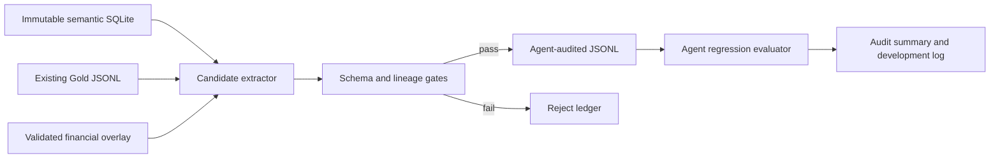

# Agent-audited Gold set design

## Goal

Build a reproducible Gold-candidate pipeline for the Korean disclosure agent. The pipeline may replace manual first-pass work, but it must never mislabel model/agent output as human-approved Gold. It produces an `agent_audited` dataset for regression testing and leaves the existing `human_gold_v1_approved` contract unchanged.

## Current baseline

- Immutable semantic SQLite corpus: 38,773,280,768 bytes; SHA-256 `b8fb3be8b90d0cb1d8bc2491bee575aee632d29cc9bade21070e7e7b51646563`.
- Serving runtime: `src/disclosure_db/agent.py`, `evidence_service.py`, `financial_overlay.py`, `query_planner.py`, `answer_verifier.py`.
- Existing approved Gold: `data/derived/gold_qa.jsonl`, 23 records, human contract metadata retained.
- Existing validated financial overlay: 8 Korea Zinc facts in `data/derived/financial_fact_gold_seed.jsonl`.
- Existing evaluation: 23 records, all runtime responses verified; answerability agreement is a diagnostic 9/23 because event-numeric and unresolved property questions intentionally abstain.

## Design decision

Use deterministic candidate generation plus independent structural and semantic gates. No LLM output is authoritative for a Gold answer. A candidate is included only when the source database can reproduce the answer and its citation under the declared version policy.

### Dataset states

| State | Meaning | May be used as release Gold? |
|---|---|---|
| `candidate` | Generated from a source row or existing approved record; not fully checked | No |
| `agent_audited` | Deterministic checks passed; generated by the pipeline | Regression only |
| `human_verified` | A human reviewer explicitly approved the record | Yes, under the existing contract |
| `rejected` | Any required check failed; retained in the reject ledger | No |

The generator must never rewrite an existing `human_verified` record and must never set `review.status=approved` for a newly generated record. The annotation schema and validator explicitly allow `review.status=agent_audited` for deterministic output while keeping `answer_origin=model_generated`; this is a diagnostic state, not a release approval.

## Candidate sources and strict gates

### Source rows

1. Existing `gold_qa.jsonl` records are copied into the audit stream with their original review metadata preserved.
2. `fact`/`fact_evidence` rows are considered only for an explicit predicate allowlist: contract amount, counterparty, issued shares, treasury shares, and other predicates declared in `config/agent_gold_predicates.json`.
3. Periodic financial statements are sourced only from the validated overlay seed and its evidence-backed cells.
4. Unanswerable and adversarial examples are generated from explicit templates, but their expected answer is always abstention and they contain no invented evidence.

### Required checks

Every proposed record must pass all applicable checks:

- JSON schema fields and question-type-specific required fields from `config/evaluation_contract.json`.
- Filing, source, table, and evidence IDs exist in the immutable corpus.
- The evidence belongs to the same filing and source parse status is `success`.
- Table evidence has `table_record.parse_status='success'`; PDF visual evidence is rejected by the agent-audited pipeline.
- Filing lineage is `root` or `resolved`; correction-aware records have exactly one current version and explicit `as_of` semantics.
- Company, period, scope, statement type, unit, scale, and answer value agree with the source cell/fact.
- Numeric values parse as finite `Decimal`; no float conversion, inference, or arithmetic outside the calculator allowlist.
- Citation IDs returned by the runtime are a subset of the declared evidence IDs.
- Duplicate question/evidence combinations are deduplicated deterministically.
- Rejected candidates retain a machine-readable reason code and source identifiers without storing secrets.

## Data flow

## Repository artifacts

- `scripts/build_agent_gold.py`: deterministic generator; read-only base access; atomic output writes.
- `config/agent_gold_predicates.json`: explicit allowlist and question templates.
- `config/gold_annotation_schema.json` and `src/disclosure_db/gold_validation.py`: allow and validate the explicit `agent_audited` review state without weakening human approval rules.
- `data/derived/gold_qa.agent_audited.jsonl`: generated regression dataset.
- `data/derived/gold_qa_agent_audit_summary.json`: counts, gates, hashes, and rejection distribution.
- `data/derived/gold_qa_agent_rejects.jsonl`: one record per rejected candidate.
- `docs/gold-set-audit.md`: task-oriented audit guide with reproducible commands and Evidence → Finding → Path links.
- `docs/development-log.md`: append-only chronological record of commands, results, failures, fixes, and commit IDs.

## Error and release policy

- Missing or ambiguous evidence produces a reject, never a guessed answer.
- A failed base hash or unavailable overlay blocks numeric candidates.
- The existing human Gold file remains immutable during generation.
- The generated dataset is explicitly diagnostic/regression data until a human reviewer promotes selected records.
- Full OpenSearch/dense embedding is out of scope for this increment; the acceptance gate is improved grounded answerability and zero false numeric claims.

## Acceptance criteria

1. Generator runs against the D: corpus without writing to the base SQLite file.
2. At least the existing 23 records are reproduced or copied with no loss of review metadata.
3. Every emitted `agent_audited` record passes schema, lineage, evidence, and runtime citation checks.
4. Every rejected candidate has a non-empty reason code.
5. The agent evaluator runs on the generated dataset and emits deterministic counts and latency.
6. The full unit-test suite, compile check, JSONL validation, and base-hash attestation pass.
7. Development log records the exact commands and commit for each stage.
