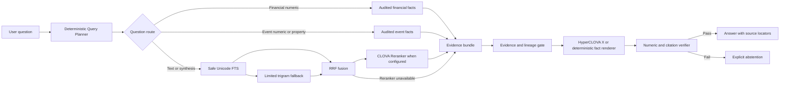

# Disclosure agent serving vertical slice design

## Goal

Deliver a demonstrable Korean disclosure agent by 2026-08-19 that prioritizes grounded
accuracy and bounded latency. Reuse the immutable 38 GB semantic SQLite corpus and the
existing agent runtime, add only the serving artifacts needed to answer audited financial,
event, and textual disclosure questions, and fail closed whenever evidence is incomplete.

The target is a working vertical slice, not a production-scale database migration. A complete
PostgreSQL/OpenSearch migration and corpus-wide dense embedding are explicitly deferred until
measured retrieval gaps justify them.

## Verified baseline

- Immutable semantic corpus: 38,773,280,768 bytes; SHA-256
  `b8fb3be8b90d0cb1d8bc2491bee575aee632d29cc9bade21070e7e7b51646563`.
- Structural corpus: 4,204 filings and 4,622 source documents.
- Existing runtime: deterministic query planner, read-only evidence service, financial overlay,
  Decimal calculator, HyperCLOVA X generator adapter, answer verifier, CLI, and FastAPI surface.
- Gold data: 23 `human_verified/approved` records plus 8 deterministic `agent_audited`
  financial records.
- Current runtime evaluation: all 31 requests finish through the verifier, but only 11/31 match
  expected answerability. This is the next correctness baseline, not a passing result.
- Known failures include period/as-of confusion, disabled event-numeric answers, broad textual
  false positives, excessive citation candidates, and a roughly 26-second first-request base
  hash check.

## Design decisions

1. Keep the semantic SQLite corpus immutable and authoritative.
2. Store serving facts in a small, rebuildable fact overlay attested to the base corpus.
3. Build a separate, rebuildable safe search index rather than querying every unsafe corpus
   row at request time.
4. Route structured numeric/event questions to facts before any text search.
5. Use sparse retrieval first: Unicode FTS, limited trigram FTS, and Reciprocal Rank Fusion.
6. Rerank only the small fused candidate set with CLOVA Studio Reranker when configured.
7. Use HyperCLOVA X only to express an answer from a verified evidence bundle.
8. Verify citations, numeric values, calculations, lineage, and answerability after generation.
9. Activate dense retrieval, OpenSearch/Nori, or PostgreSQL only after a Gold evaluation shows
   that this vertical slice misses the agreed retrieval gate.

## Non-goals

- No mutation of the 38 GB base SQLite file.
- No claim that automatically generated Gold is human-approved release Gold.
- No corpus-wide embeddings in this increment.
- No mandatory OpenSearch, Nori, PostgreSQL, or pgvector runtime dependency.
- No answer grounded in live OpenDART, external web data, or non-competition documents.
- No automatic interpretation of PDF tables or image-dependent numeric evidence.
- No multi-user production scaling, replication, or zero-downtime migration.

## Architecture



The system has three physical data planes.

### Immutable corpus

`disclosure_corpus_semantic_v1.sqlite` remains the source of truth for filings, versions,
source documents, fragments, tables, cells, and evidence IDs. All serving connections use
SQLite URI `mode=ro` and `PRAGMA query_only=ON`.

### Fact overlay

The current financial overlay evolves into an agent fact overlay while remaining a separate
SQLite file. It contains:

- `overlay_revision`: base hash, base size, base mtime, seed/build hashes, schema version, and
  build timestamp.
- `financial_fact`: the existing financial grain plus a `trust_tier` field.
- `event_fact`: contract amount, counterparty, issued shares, treasury shares, and only other
  predicates declared in the explicit allowlist.
- `fact_evidence`: fact-to-cell evidence relationships.
- `build_reject`: candidate ID, source identifiers, deterministic reason codes, and build ID.

`trust_tier` is either `human_verified` or `agent_audited`. The latter may be used by the demo
runtime only after the same evidence, lineage, period, unit, Decimal, and conflict gates are
re-run during overlay import. This does not promote an `agent_audited` Gold record to release
Gold; evaluation dataset status and serving fact eligibility remain separate concepts.

### Safe search index

`agent_search.sqlite` is a disposable projection attested to the same base revision. It stores
search metadata and token indexes, not new factual authority.

Eligible rows must satisfy all of the following:

- Filing lineage is `root` or `resolved`.
- Source and table parse status are `success` where applicable.
- Source is not PDF and does not require image interpretation.
- Evidence ID, filing ID, source ID, company identifiers, effective interval, fragment type,
  and locator are present.
- Text belongs to the competition corpus.

The index includes all safe textual fragments in a Unicode FTS index. A trigram index is
limited to headings, table rows, and other short high-information fragments. Trigram is a
fallback for Korean compound/sub-string matching; it is not used alone because strings shorter
than three characters do not form a trigram match.

Index construction writes to a temporary path, validates row counts and the base attestation,
and promotes the completed file atomically. A partial index is never activated. If the full
build does not finish within the overnight window, the agent continues to use the existing
safe SSOT FTS path.

## Retrieval and routing

### Query plan

The existing `QueryPlan` remains the public planning contract. It gains only fields required
to route without an LLM:

- `fact_domain`: `financial`, `event`, `text`, or `none`.
- `predicate_terms`: normalized event predicates.
- `target_periods`: explicit financial periods, separate from knowledge cutoff `as_of`.
- `requires_complete_evidence_set`: true for comparisons and synthesis.

Company, financial period, and point-in-time version cutoff must remain independent. A year in
"2024년 매출액" identifies the accounting period; it does not by itself exclude a later filing
that reports that period. An API-provided `as_of` remains authoritative for version selection.

### Structured retrieval

Financial and event fact routes run before text retrieval. A fact is answer-eligible only when:

- It has at least one evidence ID in the same filing.
- All evidence rows can be hydrated from the immutable base.
- Lineage and effective-time policy match the query.
- Numeric values are finite `Decimal` strings.
- Period, statement type, scope, unit, currency, and scale are unambiguous where applicable.
- No conflicting eligible fact exists for the same semantic grain.

Comparisons select operands with an identical account/predicate definition, scope, period type,
and unit. The allowlisted Decimal calculator performs the operation; the generator never
calculates values.

### Sparse retrieval

Text retrieval runs in this order:

1. Apply company, lineage, effective-time, source-safety, and document-family filters.
2. Expand only curated company/account/predicate aliases.
3. Retrieve per-term Unicode FTS candidates.
4. Use limited trigram retrieval only when the Unicode path has weak coverage.
5. Fuse rankings with RRF using a fixed `k=60`.
6. Retain at most 30 candidates for optional reranking.
7. Retain at most 8 evidence items for generation.

The reranker receives bounded text snippets, never secrets, system prompts, or unrestricted
files. A timeout, rate limit, malformed response, or missing credential falls back to the RRF
order and records a reason code.

## Evidence and generation contract

`EvidenceBundle` retains `financial_facts` and gains `event_facts`, retrieval diagnostics, and
the complete set requirement. Every evidence item carries its evidence, filing, and source IDs,
locator, report name, filed date, lineage status, and score provenance.

HyperCLOVA X receives only the question, audited facts, bounded evidence text, calculation
result, and the output JSON schema. It must return an answer, answerability flag, citation IDs,
and explicit numeric strings. Temperature remains zero.

The post-generation verifier is authoritative. It checks:

- Every citation is a member of the provided bundle.
- Every factual claim has at least one citation.
- Every numeric string equals an audited fact or calculator result after Decimal normalization.
- All required operands and citations are present for comparison questions.
- An unanswerable response has no citations or numeric claims.
- The response contains no prompt-injection markers.

If generation fails, a deterministic renderer may answer structured fact/calculation questions.
Textual or synthesis questions abstain rather than returning an unverified fallback excerpt.

## HTTP API

Existing endpoint names remain stable.

- `GET /health`: base, overlay, and search-index readiness plus attestation state.
- `POST /v1/query/plan`: deterministic route and normalized constraints.
- `POST /v1/evidence/search`: facts, evidence, diagnostics, and reason codes.
- `GET /v1/financial-facts`: audited financial fact inspection.
- `GET /v1/event-facts`: audited event fact inspection.
- `POST /v1/calculate`: allowlisted Decimal calculation.
- `POST /v1/answer`: final verified answer.

`/v1/answer` returns at least:

```json
{
  "answer": "검증된 공시 근거에 기반한 답변",
  "answerable": true,
  "verified": true,
  "numeric_values": [],
  "calculation": null,
  "citations": [
    {
      "evidence_id": "ev1_...",
      "filing_id": "...",
      "report_name": "...",
      "filed_at": "...",
      "locator": {}
    }
  ],
  "reason_codes": [],
  "request_id": "...",
  "corpus_revision": "semantic-v1",
  "latency_ms": 0
}
```

## Attestation and startup

The full 38 GB SHA-256 is computed during an explicit offline validation/build step, not on a
user request. The resulting attestation records the hash, size, and mtime. Server startup checks
the fast file identity against that attestation and caches readiness in process memory. A size or
mtime mismatch fails closed and requires an explicit full re-attestation. The request path never
hashes the entire corpus.

## Failure policy

| Condition | Runtime behavior |
|---|---|
| Base or overlay attestation mismatch | `/health` not ready; fact answers blocked |
| Search index absent or not promoted | Use existing safe SSOT FTS |
| Reranker unavailable or invalid | Use RRF order; emit fallback reason |
| HyperCLOVA X unavailable or invalid | Deterministic structured answer, otherwise abstain |
| Conflicting facts at one semantic grain | Abstain with conflict reason |
| Company unresolved | Ask for company name or stock code; do not broad-search all companies |
| Evidence hydration or lineage check fails | Remove candidate; abstain if bundle becomes incomplete |
| PDF/image-dependent numeric evidence | Block answer |
| Unknown citation or numeric mismatch | Replace output with verified abstention |

Provider retries are bounded to one retry for transient timeout/rate-limit failures. No retry is
performed for invalid credentials, schema errors, or safety-gate failures.

## Evaluation and acceptance gates

`verified=true` alone is not an evaluation pass. A question passes only when expected
answerability, numeric value, complete evidence requirements, and citations also match.

### Hard safety gates

- False numeric claims: 0.
- Citations outside the evidence bundle: 0.
- Unsafe lineage, missing-original, PDF, or image-dependent numeric use: 0.
- Answers to adversarial, target-price, or future-prediction questions: 0.
- Calculation or unit errors: 0.
- Unverified provider output returned to the caller: 0.

### Quality gates

- Existing 31-record regression set: 31/31 expected answerability matches.
- Numeric exact match: 100% on eligible numeric questions.
- Citation precision: 100%.
- Gold target Recall@20: 100% on the existing conditioned retrieval contract.
- Post-rerank Recall@8: at least 90%.
- Citation recall on answerable questions: at least 90%.
- Filing-separated generated holdout: at least 90% answerability agreement.

Automatically generated paraphrases and negative questions stay grouped with their source filing
and correction lineage so related templates cannot leak across evaluation splits.

### Latency gates

- Query planner p95: at most 20 ms.
- Structured fact lookup p95: at most 200 ms.
- Local FTS plus RRF p95: at most 800 ms.
- Retrieval including configured reranker p95: at most 5 seconds.
- End-to-end answer including HyperCLOVA X p95: at most 10 seconds.
- No request performs a full corpus hash.

## Seven-hour execution sequence

1. **0:00-1:15 — Correctness regression:** fix period/as-of separation, event fact routing,
   unanswerable handling, citation narrowing, and request-path attestation.
2. **1:15-2:45 — Fact serving:** import financial/event allowlist candidates through strict
   gates, persist rejects, and expose inspection reads.
3. **2:45-4:15 — Safe sparse retrieval:** build the atomic safe index, add limited trigram and
   RRF, and preserve the SSOT fallback.
4. **4:15-5:15 — Provider/API integration:** add bounded reranking, source-rich answer output,
   timeouts, and deterministic fallback.
5. **5:15-6:15 — Evaluation loop:** run the 31-record regression, filing-separated holdout,
   retrieval metrics, and latency benchmarks; fix failures without weakening gates.
6. **6:15-7:00 — Closeout:** run the complete test suite and smoke API, record hashes and
   benchmark outputs, update the development log, and commit the verified state.

Long-running safe-index construction may continue in the background, but only a complete,
validated, atomically promoted index is used. The working-agent acceptance criterion does not
depend on that build finishing because the safe SSOT FTS path remains available.

## Expected repository changes

- Extend focused contracts and routing in `src/disclosure_db/agent_contracts.py`,
  `query_planner.py`, `evidence_service.py`, `agent.py`, and `answer_verifier.py`.
- Extend the existing overlay implementation rather than adding another fact framework.
- Add one focused safe-index module and one optional reranker adapter.
- Extend existing FastAPI endpoints and tests; add only `/v1/event-facts`.
- Extend the current evaluator so answerability, numeric, and citation agreement determine pass.
- Add atomic build/evaluation scripts and derived JSON reports.
- Record exact commands, failures, fixes, measurements, and commits in
  `docs/development-log.md`.

## Technical references

- SQLite FTS5 Unicode, trigram, contentless/external-content, and BM25 behavior:
  <https://www.sqlite.org/fts5.html>
- CLOVA Studio Reranker API and document/query contract:
  <https://api.ncloud-docs.com/docs/clovastudio-reranker>
- OpenSearch plugin installation and `analysis-nori` operational requirement:
  <https://docs.opensearch.org/latest/install-and-configure/plugins/>
- pgvector filtering and iterative-scan considerations:
  <https://github.com/pgvector/pgvector>
