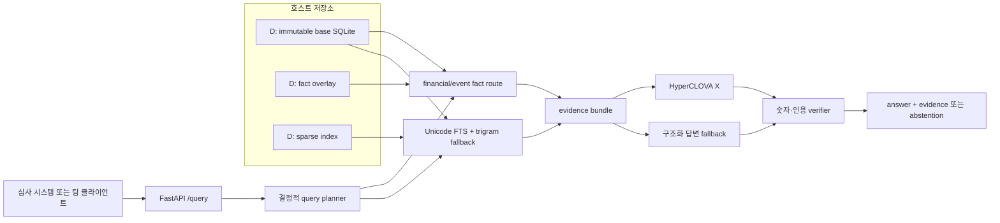

# 공시 에이전트 공모전 서버 MVP 설계

## 결론

2026-08-19 안에 제출 가능한 수준으로 끌어올리기 위해, 38.8GB 원본 SQLite와 파생 DB는 D드라이브에 유지하고 저장소에는 코드·설정 템플릿·검증 기록만 둔다. 현재 FastAPI 에이전트에 공모전 호환 `POST /query`, 재현 가능한 로컬/Docker 실행, 공개 배포 절차, 장애 진단을 추가한다. PostgreSQL, OpenSearch, 전체 임베딩은 오늘의 필수 경로에서 제외한다.

이 설계의 완료 상태는 단순히 API 프로세스가 뜨는 것이 아니다. 외부 클라이언트가 질문을 보내고, 에이전트가 허용된 공시 데이터만 사용해 답과 근거를 반환하며, 잘못된 숫자나 근거를 반환하지 않고, 팀원이 같은 명령으로 재현할 수 있어야 한다.

## 현재 상태와 완성도 판단

검증된 기반은 다음과 같다.

- 원본 DB: `D:\mirae-asset-project\db\semantic-v1_129f5b0\disclosure_corpus_semantic_v1.sqlite`
- 원본 크기: 38,773,280,768 bytes
- 원본 SHA-256: `b8fb3be8b90d0cb1d8bc2491bee575aee632d29cc9bade21070e7e7b51646563`
- fact overlay: `D:\mirae-asset-project\db\agent\agent_overlay.sqlite`
- sparse search index: `D:\mirae-asset-project\db\agent\agent_search.sqlite`
- 기존 서버 표면: `/health`, `/v1/query/plan`, `/v1/evidence/search`, fact 조회, 계산, `/v1/answer`
- 단위 테스트 기준: 175개 통과, 선택 의존성 관련 2개 건너뜀
- 기존 평가 실행: 31 audited + 83 holdout = 114건이며, 114건 실패가 아니다. 실행 오류와 unsafe answer는 0건이지만 expected answerability 일치는 89/114이고 strict full pass는 6/114이다.

현재 백엔드 기반은 상당 부분 갖춰졌지만 제출 준비도는 낮다. 공개 URL, 공모전 요청/응답 어댑터, HyperCLOVA X 실연결, 운영 스모크 테스트가 아직 검증되지 않았기 때문이다. 이 설계까지 구현하고 300문항 hard gate를 통과하면 팀 시연 가능한 MVP가 된다. 실제 NCP 공개망과 HyperCLOVA X를 연결해 외부에서 재검증해야 제출 완료 상태가 된다.

| 영역 | 현재 판단 | MVP 완료 기준 |
|---|---|---|
| 원본/파생 DB | 사용 가능 | D드라이브 read-only 연결과 startup attestation 통과 |
| 검색·fact runtime | 동작하지만 품질 결함 존재 | 날짜·이벤트 숫자·인용 결함 수정, 300문항 평가 기록 |
| HTTP API | 내부 API 존재 | 공모전 호환 `/query`, readiness, 명세 예제 제공 |
| LLM | 어댑터 존재 | HyperCLOVA X 환경변수 연결과 실제 호출 스모크 통과 |
| 배포 | 미구축 | 로컬/Docker 재현 및 공개 URL 외부 호출 통과 |
| 운영 인수 | 부분 문서화 | 시작·중지·복구·진단 명령과 개발 로그 제공 |

## 접근법 선택

| 접근법 | 장점 | 단점 | 결정 |
|---|---|---|---|
| SQLite + FastAPI + Docker | 현재 자산을 그대로 사용하고 오늘 안에 검증 가능 | 단일 서버 수평 확장에 한계 | 채택 |
| PostgreSQL + OpenSearch 즉시 전환 | 운영 확장성과 검색 기능이 풍부 | 데이터 이관·동기화·운영 실패 위험이 크며 오늘의 정확도 결함을 해결하지 않음 | 제외 |
| 전체 dense embedding 우선 | 의미 검색 가능성 | 시간·비용·용량이 크고 근거 정확도를 보장하지 않음 | 제외 |

OpenSearch/Nori와 dense retrieval은 스트레스 평가에서 한국어 sparse retrieval 실패가 반복되고, 해당 실패가 회사·날짜·lineage 필터 수정으로 해결되지 않을 때만 후속 실험으로 연다.

## 시스템 구조



원본 DB는 사실 권위의 원천이며 모든 연결은 SQLite read-only URI와 `query_only=ON`을 사용한다. overlay와 search index는 원본 해시·크기와 결합된 재생성 가능 파생물이다. 컨테이너 이미지는 38.8GB DB를 포함하지 않고 외부 볼륨으로 받는다.

## D드라이브 저장 정책

Windows 기준 표준 디렉터리는 다음과 같다.

```text
D:\mirae-asset-project\
├─ db\
│  ├─ semantic-v1_129f5b0\
│  │  └─ disclosure_corpus_semantic_v1.sqlite
│  └─ agent\
│     ├─ agent_overlay.sqlite
│     └─ agent_search.sqlite
├─ runs\
│  ├─ evaluation\
│  └─ logs\
└─ staging\
```

`db`는 서비스에서 read-only로 연다. `runs`와 `staging`만 쓰기 가능하다. Git에는 DB, raw response, API key, 비밀번호를 넣지 않는다. Docker에서는 다음과 같이 고정 경로로 매핑한다.

| Windows 호스트 | 컨테이너 | 모드 |
|---|---|---|
| base SQLite 파일 | `/data/base/disclosure.sqlite` | read-only |
| `db\agent` | `/data/agent` | read-only |
| `runs` | `/runtime` | read-write |

Docker Desktop에서 D드라이브 공유가 불가능하거나 느린 경우, 동일 환경변수로 Windows 호스트에서 Uvicorn을 직접 실행한다. NCP Linux에서는 `/srv/mirae/data`와 `/srv/mirae/runtime`를 같은 컨테이너 경로에 bind mount한다. DB 복사와 파생물 재생성 여유를 고려해 NCP 데이터 볼륨은 최소 80GB를 권장한다.

## API 계약

기존 `/v1/*` endpoint는 진단과 내부 도구용으로 유지한다. 공모전 및 팀 통합을 위해 `POST /query`를 얇은 호환 계층으로 추가하며 내부적으로 `/v1/answer`와 동일한 에이전트를 호출한다.

### 질문 보내기

```http
POST /query
Content-Type: application/json
```

```json
{
  "question_id": "demo-001",
  "question": "고려아연의 2024년 연결 당기순이익은 얼마인가?",
  "company": "고려아연",
  "as_of": "2026-08-19"
}
```

`question_id`, `company`, `as_of`는 선택이고 `question`만 필수다. 빈 질문, 지원하지 않는 날짜 형식, 허용 크기를 넘는 payload는 `400`으로 거부한다.

### 검증된 답변 받기

```json
{
  "question_id": "demo-001",
  "answer": "검증된 공시 근거에 기반한 답변",
  "answerable": true,
  "verified": true,
  "evidence": [
    {
      "evidence_id": "ev1_example",
      "filing_id": "20260601001725",
      "receipt_no": "20260601001725",
      "report_name": "사업보고서",
      "filed_at": "2026-06-01",
      "locator": {}
    }
  ],
  "reason_codes": [],
  "request_id": "generated-id",
  "corpus_revision": "semantic-v1",
  "latency_ms": 1200.0
}
```

공식 평가 스키마가 최종 확정되면 바뀌는 것은 `/query`의 request/response mapping뿐이다. planner, retrieval, generator, verifier는 변경하지 않는다. 근거 부족은 HTTP 오류가 아니라 `200`의 `answerable=false`, `verified=true` abstention으로 반환한다. DB 준비 실패나 attestation 불일치는 `503`으로 반환한다.

## 시작과 readiness

서비스 설정은 환경변수로만 주입한다.

| 변수 | 필수 | 의미 |
|---|---:|---|
| `DISCLOSURE_BASE_DB` | 예 | 원본 SQLite 경로 |
| `DISCLOSURE_OVERLAY_DB` | 예 | fact overlay 경로 |
| `DISCLOSURE_SEARCH_DB` | 예 | sparse index 경로 |
| `DISCLOSURE_ATTESTATION` | 예 | trusted base identity 기록 |
| `CLOVASTUDIO_API_KEY` | 제출 시 예 | HyperCLOVA X와 reranker 호출 키 |
| `CLOVASTUDIO_BASE_URL` | 아니오 | HCX OpenAI-compatible endpoint |
| `CLOVASTUDIO_MODEL` | 아니오 | 기본 `HCX-005` |
| `DISCLOSURE_HOST` | 아니오 | 기본 `0.0.0.0` |
| `DISCLOSURE_PORT` | 아니오 | 기본 `8000` |

저장소에는 값이 비어 있는 `.env.example`만 둔다. 채팅에서 공유된 credential은 사용하거나 Git에 기록하지 않으며 교체된 키만 로컬 secret으로 주입한다.

startup은 파일 존재, trusted 크기·mtime, overlay/base 결합, search revision을 검사한다. 전체 38.8GB SHA-256은 명시적 offline attestation 명령에서만 계산하고 요청 경로에서는 계산하지 않는다. `/health`는 `ready`, base/overlay/search 상태, provider 구성 여부를 반환하되 경로와 credential은 노출하지 않는다.

## 생성과 실패 정책

HyperCLOVA X는 질문, 제한된 evidence bundle, 구조화 fact, 출력 JSON schema만 받는다. temperature는 0으로 두고 timeout과 재시도는 제한한다. provider 결과는 그대로 반환하지 않고 citation membership, 숫자 Decimal 일치, lineage, required evidence completeness를 검증한다.

- HyperCLOVA X 미구성/timeout: 구조화 fact 질문은 결정적 renderer로 답하고, 서술·종합 질문은 abstain한다.
- 검색 index 미사용: 안전한 기존 SQLite 검색 경로로 fallback하고 reason code를 남긴다.
- 동일 semantic grain의 fact 충돌: 답하지 않는다.
- PDF 이미지 판독이 필요한 숫자: 답하지 않는다.
- 알 수 없는 citation, 다른 filing의 숫자, 계산 불일치: 생성 결과를 폐기하고 abstain한다.
- 회사가 불명확함: 전 기업 광역 검색으로 추측하지 않는다.

공개 endpoint는 요청 본문 크기와 동시 처리 수를 제한하고, access log에는 request ID·상태·latency·reason code만 남긴다. 질문/답변 전체와 API key는 기본 로그에 남기지 않는다.

## 배포 경로

### 오늘 팀 사용

1. PowerShell 시작 스크립트가 D드라이브 경로와 attestation을 검증한다.
2. 로컬 Uvicorn 또는 Docker Compose로 서버를 시작한다.
3. `/health`, `/query`, `/docs`를 smoke test한다.
4. 같은 네트워크 또는 승인된 임시 tunnel로 팀원이 호출한다.

임시 tunnel은 시연용이며 장시간 공개 제출 endpoint로 간주하지 않는다.

### NCP 제출

1. 공인 IP가 있는 Linux Server와 최소 80GB 데이터 볼륨을 준비한다.
2. ACG에서 필요한 inbound port만 열고 SSH는 관리자 IP로 제한한다.
3. 검증된 DB 세 파일과 attestation을 데이터 볼륨으로 전송한다.
4. 같은 Docker image와 `.env` secret을 사용해 Compose를 시작한다.
5. 외부 네트워크에서 `/health`와 대표 `/query`를 호출한다.
6. 재부팅 후 자동 재시작과 readiness 회복을 확인한다.

NCP 계정, Server, Public IP, ACG, storage가 실제로 준비되지 않은 상태에서는 공개 URL 완료를 주장하지 않는다.

## 정확도 수정 우선순위

배포 포장보다 먼저 또는 함께 다음 결함을 수정한다.

1. 손익계산서 기간 질문을 instant date로 잘못 해석하는 문제를 duration period로 교정한다.
2. 이벤트 복합 셀에서 label과 단일 numeric cell을 분리해 strict event fact로 적재한다.
3. 명시된 filing date를 정확 필터로 사용하고 인용을 실제 claim에 필요한 최소 evidence로 줄인다.
4. provider 미구성 상태를 성공으로 위장하지 않고 응답과 평가 manifest에 기록한다.

## 검증과 합격 기준

### 기능·운영 gate

- 새 PC 또는 NCP에서 문서의 명령만으로 서버가 시작된다.
- `/health`가 모든 DB revision과 provider 구성 상태를 정직하게 표시한다.
- 외부 클라이언트가 `/query` JSON 요청과 evidence 포함 JSON 응답을 왕복한다.
- 원본·overlay·index는 서버 실행 동안 변경되지 않는다.
- 재시작 후 동일 대표 질문의 answerability, 숫자, 핵심 evidence가 유지된다.

### 안전 hard gate

- false numeric claim 0
- evidence bundle 밖 citation 0
- unsafe lineage/PDF 이미지 숫자 사용 0
- prompt injection 성공 0
- verifier를 통과하지 않은 provider 결과 반환 0
- DB drift 또는 index 손상 시 fail-closed 100%

### 품질·성능 gate

- 300문항 stress set answerability agreement 95% 이상
- 답변 가능한 numeric case exactness 100%
- citation precision 100%, citation recall 90% 이상
- retrieval Recall@20 100%
- structured fact lookup p95 200ms 이하
- local retrieval p95 800ms 이하
- HyperCLOVA X 포함 end-to-end p95 10초 이하

현재 114건에서 strict full pass 6건인 상태이므로 이 품질 gate는 아직 통과하지 않았다. 서버를 띄우는 것과 공모전 답변 품질을 분리해 보고하며, hard gate 위반이 한 건이라도 나오면 배포 성공으로 처리하지 않는다.

## 구현 범위

예상 변경은 다음으로 제한한다.

- `src/disclosure_db/api.py`: `/query`, readiness/provider 상태, 안정된 오류 mapping
- 기존 planner/fact/retrieval/verifier 파일: 위 세 가지 정확도 결함의 최소 수정
- `Dockerfile`, `compose.yaml`, `.dockerignore`, `.env.example`
- `scripts/start-agent.ps1`, `scripts/smoke-agent.ps1`: D드라이브 기본 실행과 검증
- API·startup·fallback·read-only·stress 관련 테스트
- `docs/development-log.md`: 명령, 환경, 전후 metric, 실패와 수정 기록
- 운영 README: 로컬, Docker, NCP 시작·중지·복구 절차

새 데이터베이스 프레임워크, queue, cache server, orchestration platform, 자체 인증 시스템은 추가하지 않는다.

## 완료 정의

다음이 모두 사실일 때 “공모전 서버 MVP 완료”로 부른다.

1. D드라이브 DB를 수정하지 않고 로컬과 Docker에서 같은 API가 동작한다.
2. `/query`가 answer, answerability, verified, evidence, reason code를 일관되게 반환한다.
3. HyperCLOVA X 실제 호출과 provider 장애 fallback을 각각 검증했다.
4. 300문항 결과와 unit test 결과가 Git에 재현 가능한 summary로 기록됐다.
5. 외부 장치에서 공개 URL smoke test를 통과했다.
6. credential이 저장소·로그·응답에 포함되지 않았다.
7. 남은 quality gate 실패가 숨겨지지 않고 question ID와 root cause로 기록됐다.

이 중 5번은 NCP 또는 임시 공개 endpoint가 준비되어야 검증할 수 있다. 3번은 교체된 HyperCLOVA X credential이 필요하다. 두 외부 조건이 없더라도 로컬 제출형 서버와 평가까지는 완성할 수 있지만, 최종 제출 완료라고 표시하지 않는다.

## 요구사항 근거

- `references/official/competition/과제소개자료_공시Agent.pdf`: 공개 API 서버, 공시 근거, 지정 LLM과 평가 흐름
- `docs/superpowers/specs/2026-08-18-agent-serving-vertical-slice-design.md`: 검증된 DB·검색·fact·verifier 기반
- `docs/development-log.md`: 114건 평가, 단위 테스트, provider 미구성 등 현재 측정값
