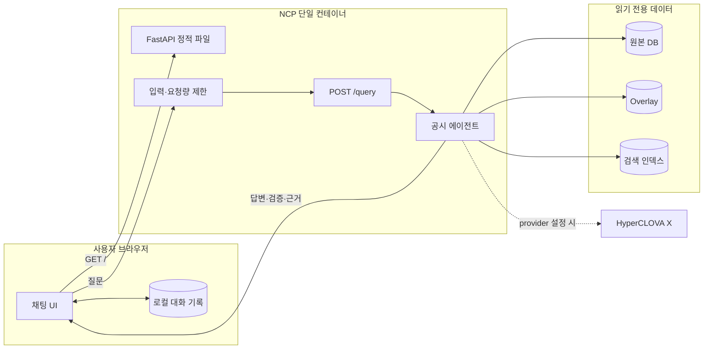

# 익명 공개 공시 에이전트 웹 UI 설계

> **중요:** 이 설계는 공모전 시연용 웹 화면과 익명 공개 운영 경계를 정의한다. 웹 UI를 추가해도 HyperCLOVA X provider schema/300-case gate와 실제 공개 서버 가용성 gate는 별도로 통과해야 한다. 2026-08-20 외부 확인에서 기존 공개 주소의 TCP 22와 8000이 모두 연결되지 않았으므로 배포 전 NCP 자원 상태를 진단하고 복구해야 한다.

## 목표

현재 FastAPI 공시 에이전트에 로그인 없는 공개 채팅 화면을 추가한다. 주소를 아는 사람은 누구나 질문할 수 있고, 답변의 검증 상태와 근거 공시를 확인할 수 있어야 한다. 새 회원·대화 DB나 별도 프론트엔드 서버를 도입하지 않고 기존 NCP 컨테이너 하나에서 서비스한다.

성공한 사용자는 다음 작업을 할 수 있다.

1. 브라우저에서 주소를 열고 즉시 질문한다.
2. 답변 가능·검증 상태와 근거 공시명, 공시일, 접수번호를 확인한다.
3. 같은 브라우저에서 이전 대화를 검색하고 다시 연다.
4. 서버 장애, 처리량 제한, 근거 부족을 서로 다른 상태로 이해한다.

## 결정 사항

| 항목 | 결정 | 이유 |
|---|---|---|
| 공개 범위 | 웹 UI, `GET /health`, `POST /query` 모두 익명 공개 | 공모전 평가 API와 사용자 시연을 같은 주소에서 지원 |
| 인증 | 회원가입, 로그인, API key 없음 | 사용자 승인 요구사항 |
| 프론트엔드 | FastAPI가 정적 HTML/CSS/JavaScript 제공 | 별도 서버·빌드 체인·호스팅 비용 제거 |
| 기록 저장 | 브라우저 `localStorage`만 사용 | 계정 없는 서버 측 기록의 개인정보·소유권 문제 방지 |
| 데이터 저장 | 질문과 답변을 서버 DB에 저장하지 않음 | 원본 DB read-only 원칙 유지, 운영 범위 축소 |
| 외부 자산 | CDN, 외부 폰트, 분석 스크립트 사용 안 함 | 네트워크 의존성과 사용자 추적 제거 |
| 응답 방식 | 기존 비스트리밍 `POST /query` 유지 | 현재 약 2초 응답 경로를 단순하게 유지 |
| 남용 방지 | IP별 요청량과 동시 처리량 제한 | 인증 없는 공개 provider 비용·자원 고갈 방지 |
| 범위 제외 | 파일 업로드, 음성, 서버 동기화, 공유 대화, 관리자 화면 | 공모전 핵심 평가와 무관한 기능 제외 |

## 시스템 구조



브라우저 기록은 NCP로 동기화하지 않는다. 서버는 현재 요청을 처리하는 동안에만 질문을 메모리에 보유하며, 애플리케이션 로그에는 질문 원문이나 답변 원문을 새로 기록하지 않는다.

## 웹 화면

### 데스크톱

- 왼쪽 사이드바: 새 대화, 기록 검색, 최근 수정 순 대화 목록, 개별 삭제, 전체 삭제.
- 중앙 상단: 서비스명, 서버 준비 상태, provider 연결 여부를 과장 없이 표시.
- 중앙 본문: 시작 안내와 예시 질문, 사용자 질문, 에이전트 답변.
- 하단 입력창: 최대 4,000자 질문, 전송 버튼, 처리 중 취소가 아닌 중복 전송 방지 상태.
- 답변 카드: 답변 본문, `검증됨` 또는 `답변 보류`, 처리 시간, 근거 공시 목록.
- 근거 카드: 공시명, 공시일, 접수번호, API가 제공하는 locator를 사람이 읽을 수 있는 형태로 표시.

### 모바일

사이드바는 기본으로 접고 메뉴 버튼으로 연다. 입력창은 화면 하단에 유지하되 답변과 근거를 가리지 않는다. 최소 360px 너비에서 수평 스크롤 없이 사용할 수 있어야 한다.

### 접근성

- 키보드만으로 새 대화, 검색, 질문 전송, 근거 열기, 삭제를 수행할 수 있어야 한다.
- 전송은 `Enter`, 줄바꿈은 `Shift+Enter`로 동작한다.
- 처리 상태와 오류는 `aria-live` 영역으로 알린다.
- 색상만으로 검증·오류 상태를 구분하지 않고 텍스트 라벨을 함께 표시한다.
- 사용자의 질문과 API 답변은 HTML로 해석하지 않고 텍스트로 렌더링한다.

## 브라우저 기록

`localStorage`에는 버전이 있는 단일 문서를 저장한다.

```json
{
  "version": 1,
  "conversations": [
    {
      "id": "browser-generated-id",
      "title": "첫 질문에서 만든 제목",
      "created_at": "2026-08-20T00:00:00.000Z",
      "updated_at": "2026-08-20T00:00:00.000Z",
      "messages": [
        {
          "role": "user",
          "text": "질문",
          "created_at": "2026-08-20T00:00:00.000Z"
        },
        {
          "role": "assistant",
          "text": "답변",
          "answerable": true,
          "verified": true,
          "evidence": [],
          "request_id": "server-request-id",
          "latency_ms": 1800.0,
          "created_at": "2026-08-20T00:00:02.000Z"
        }
      ]
    }
  ]
}
```

- 최대 50개 대화와 대화당 100개 메시지를 보관한다.
- 한도를 넘으면 가장 오래 수정되지 않은 대화 또는 메시지부터 삭제한다.
- 제목은 첫 질문의 공백을 정리한 앞 40자로 만들며 사용자가 수정하는 기능은 이번 범위에서 제외한다.
- 검색은 제목과 질문·답변 텍스트를 현재 브라우저에서만 대소문자 구분 없이 찾는다.
- 스키마가 손상되거나 알 수 없는 버전이면 사용자가 대화를 내보냈다고 가장하지 않고, 안전하게 빈 상태로 시작하며 화면에 로컬 기록 복구 실패를 알린다.
- 전체 삭제 전에는 브라우저 확인 절차를 거친다.

## HTTP 동작

### 웹 자산

| 경로 | 동작 |
|---|---|
| `GET /` | 채팅 화면 HTML 반환 |
| `GET /static/app.css` | 로컬 CSS 반환 |
| `GET /static/app.js` | 로컬 JavaScript 반환 |
| `GET /health` | 기존 readiness와 provider 구성 여부 반환 |
| `POST /query` | 기존 공모전 요청·응답 계약 유지 |

정적 자산은 `src/disclosure_db/web/`에 두고 Python package data와 Docker 이미지에 포함한다. `/docs`와 `/openapi.json`의 기존 FastAPI 문서는 유지하되 웹 화면에서 직접 노출하지 않는다.

### 질문 요청

브라우저는 대화마다 생성한 `question_id`와 질문 원문을 같은 출처의 `POST /query`로 보낸다. `company`, `as_of`, `limit`은 첫 웹 버전에서 별도 입력으로 노출하지 않고 서버 기본값을 사용한다.

성공 응답은 다음 규칙으로 표시한다.

- `answerable=true`, `verified=true`: 답변과 근거를 정상 표시한다.
- `answerable=false` 또는 `verified=false`: 서버의 보류 답변을 유지하고 `공시 근거가 부족해 답변을 보류했습니다` 상태로 표시한다.
- `evidence`: `report_name`, `filed_at`, `receipt_no`, `locator`를 근거 카드로 표시한다. 없는 메타데이터를 추측해서 채우지 않는다.
- `numeric_values`, `calculation`: 존재할 때만 별도 수치 영역에 표시한다.
- `reason_codes`: 기본 화면에서는 기술 코드를 숨기고, 상세 정보에서만 원문 그대로 제공한다.

## 익명 공개 보호 장치

로그인은 만들지 않지만 모든 요청을 무제한으로 처리하지는 않는다.

- 제한 대상: `POST /query`와 `POST /v1/answer`.
- IP별 기본 한도: 1분에 120회, 순간 동시 요청 4개.
- 전체 동시 질문 처리 기본값: 8개.
- 한도는 환경 변수로 조정할 수 있지만 0이나 음수로 우회하지 않는다.
- IP 한도 초과는 `429`와 `Retry-After`를 반환한다.
- 전체 처리량 포화는 짧은 대기 후 `503`과 `server_busy`를 반환한다.
- 직접 연결된 NCP 구성에서는 실제 socket client IP를 기준으로 하며, 신뢰 프록시를 명시적으로 구성하기 전에는 임의 `X-Forwarded-For`를 신뢰하지 않는다.
- 제한기에는 IP별 질문 내용이나 답변을 저장하지 않고 카운터와 만료 시각만 보관한다.
- 프로세스 재시작 시 카운터가 초기화되는 단일 프로세스 메모리 방식으로 시작한다. 영구 제한 저장소는 도입하지 않는다.

공식 평가가 예상 요청률을 초과하는 경우 hard gate를 낮추지 않고, 평가 전에 부하 시험으로 안전한 상한을 측정한 뒤 환경 설정만 조정한다.

## 오류 처리

| 상황 | HTTP/브라우저 표시 | 기록 처리 |
|---|---|---|
| 입력 없음·4,000자 초과 | 전송 전 안내 또는 `422` | 실패 응답을 대화로 저장하지 않음 |
| 서버 readiness 실패 | `503 runtime_not_ready` / 서버 준비 실패 | 사용자 질문은 유지하고 재시도 버튼 제공 |
| 요청량 초과 | `429` / 잠시 후 다시 시도 | 사용자 질문은 유지하고 재시도 가능 |
| 처리량 포화 | `503 server_busy` / 서버 사용량이 많음 | 사용자 질문은 유지하고 재시도 가능 |
| 네트워크 단절·시간 초과 | 연결 실패 / 서버 상태 확인 안내 | 사용자 질문은 유지하고 재시도 가능 |
| 근거 부족 | `200`, 답변 보류 상태 | 정상 대화 기록으로 저장 |
| 손상된 로컬 기록 | 빈 기록으로 시작하고 경고 | 손상 값을 덮어쓰기 전에 메모리에서 격리 |

브라우저 오류에는 비밀값, 서버 경로, stack trace를 표시하지 않는다. `request_id`가 있으면 사용자가 운영자에게 전달할 수 있도록 상세 정보에 표시한다.

## 보안과 개인정보

- 사용자 및 API 문자열은 DOM `textContent`로만 렌더링하고 임의 HTML 삽입을 금지한다.
- 정적 UI에는 inline script와 외부 script를 사용하지 않으며 제한적인 Content Security Policy를 설정한다.
- `X-Content-Type-Options: nosniff`, `Referrer-Policy: no-referrer`, frame 차단 정책을 적용한다.
- 같은 출처에서 UI와 API를 제공하므로 광범위한 CORS 허용을 추가하지 않는다. 서버 간 평가 호출은 CORS의 영향을 받지 않는다.
- 서비스가 HTTP로 시작하더라도 자격증명이나 쿠키를 도입하지 않는다. 최종 공개 제출 전에는 HTTPS 종단을 별도 운영 gate로 검토한다.
- 원본 DB, live overlay, live search index의 파일 모드와 read-only mount를 변경하지 않는다.

## 코드 경계

예상 변경 범위는 다음과 같다.

| 파일·디렉터리 | 책임 |
|---|---|
| `src/disclosure_db/api.py` | 루트 화면, 정적 자산, 보호 헤더, 요청 제한 연결 |
| `src/disclosure_db/public_limits.py` | IP·동시성 제한의 독립된 표준 라이브러리 구현 |
| `src/disclosure_db/web/index.html` | 접근 가능한 화면 구조 |
| `src/disclosure_db/web/app.css` | 반응형 화면 스타일 |
| `src/disclosure_db/web/app.js` | `/query` 호출, 렌더링, 로컬 기록·검색 |
| `pyproject.toml` | 웹 정적 파일 package data 포함 |
| `Dockerfile` | 별도 프론트 빌드 없이 package data 포함 확인 |
| `tests/test_public_web.py` | 정적 경로, 보안 헤더, 요청 제한, 오류 계약 |
| `tests/test_agent_runtime.py` | 기존 `/query` 회귀 보존 |
| `tests/test_deployment_artifacts.py` | 이미지에 웹 자산이 포함되는 계약 |
| `docs/operations/contest-server.md` | 익명 공개 운영, 요청 제한, 장애 진단 |

기존 planner, retrieval, generator, verifier, DB 스키마는 웹 UI 구현에서 변경하지 않는다. 답변 품질 개선과 HyperCLOVA X provider gate는 별도 구현계획으로 유지한다.

## 테스트 전략

구현은 TDD로 진행한다.

1. `GET /`와 세 정적 자산의 상태, MIME type, package 설치 후 접근을 실패 테스트로 먼저 고정한다.
2. 보호 헤더와 inline/external script 부재를 테스트한다.
3. IP 한도, `Retry-After`, 위조 `X-Forwarded-For` 무시, 동시성 해제를 단위 테스트한다.
4. fixture agent로 답변 가능, 답변 보류, `422`, `429`, `503` 화면 상태를 검증한다.
5. 로컬 기록 생성·검색·삭제·손상 복구를 JavaScript 단위 또는 브라우저 계약 테스트로 검증한다.
6. 데스크톱과 360px 모바일에서 실제 브라우저 스모크를 수행한다.
7. `PYTHONPATH=src` 전체 회귀, compileall, `git diff --check`, Docker build/start를 다시 수행한다.
8. 외부 공개망에서 `/`, `/health`, 대표 `/query`, 요청 제한, 컨테이너 재시작, 호스트 재부팅 후 복구를 확인한다.

웹 UI 테스트 통과를 답변 품질 통과로 대신하지 않는다. 기존 300-case deterministic hard gate를 재실행하고, rotated HyperCLOVA X credential이 준비되면 provider schema smoke와 provider 300-case gate를 별도로 통과해야 한다.

## 배포 순서

1. 기존 공개 주소의 TCP 22와 8000이 모두 닫힌 원인을 NCP 콘솔에서 확인한다.
2. 서버 중지, 공인 IP 분리, ACG 변경, 컨테이너 장애를 계층별로 구분하고 원인만 수정한다.
3. 로컬 fixture와 전체 회귀에서 웹 UI를 검증한다.
4. 동일 Docker 이미지로 NCP 컨테이너를 교체하되 DB 세 파일은 다시 쓰거나 재구축하지 않는다.
5. 외부 브라우저와 API 클라이언트에서 익명 접속을 확인한다.
6. 운영 체크리스트에 UI, 제한, 현재 provider 상태, 외부 request ID를 기록한다.

## 완료 기준

다음이 모두 사실이어야 웹 UI 작업을 완료로 부른다.

- 로그인 없이 공개 주소의 `/`에서 질문하고 응답을 확인할 수 있다.
- 대화 생성, 목록, 검색, 삭제가 브라우저별로 동작한다.
- 답변 가능·보류·오류·요청 제한 상태가 구분된다.
- 근거 공시 메타데이터를 누락 없이 표시하고 없는 값을 추측하지 않는다.
- 360px 모바일과 데스크톱에서 핵심 기능을 사용할 수 있다.
- 요청 제한과 보안 헤더가 자동 테스트로 증명된다.
- 기존 `/query` 계약과 deterministic hard gate가 회귀하지 않는다.
- Docker 및 실제 공개망 스모크가 통과한다.
- DB 세 파일의 hash, 파일 모드, read-only mount가 배포 전후 동일하다.

웹 UI 완료만으로 최종 공모전 제출 GO를 선언하지 않는다. 최종 GO에는 HyperCLOVA X provider schema smoke, provider 300-case pass, 기술제안서, 제출 API 명세와 실제 서버 가용성이 추가로 필요하다.
