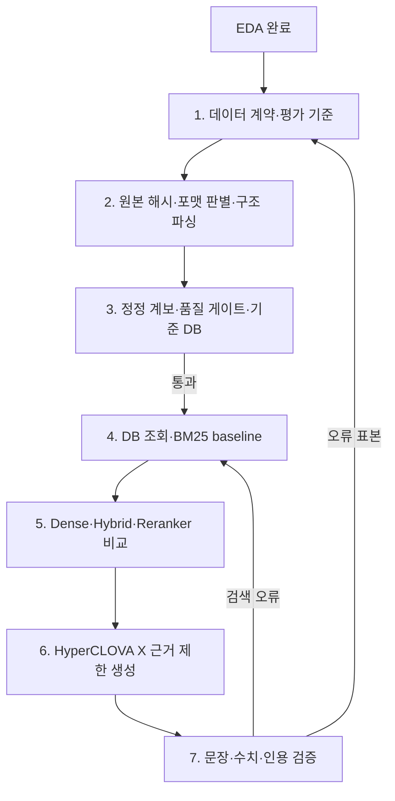
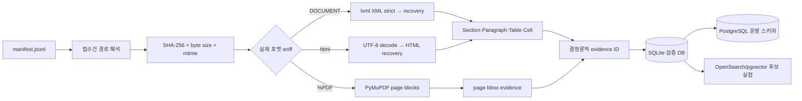
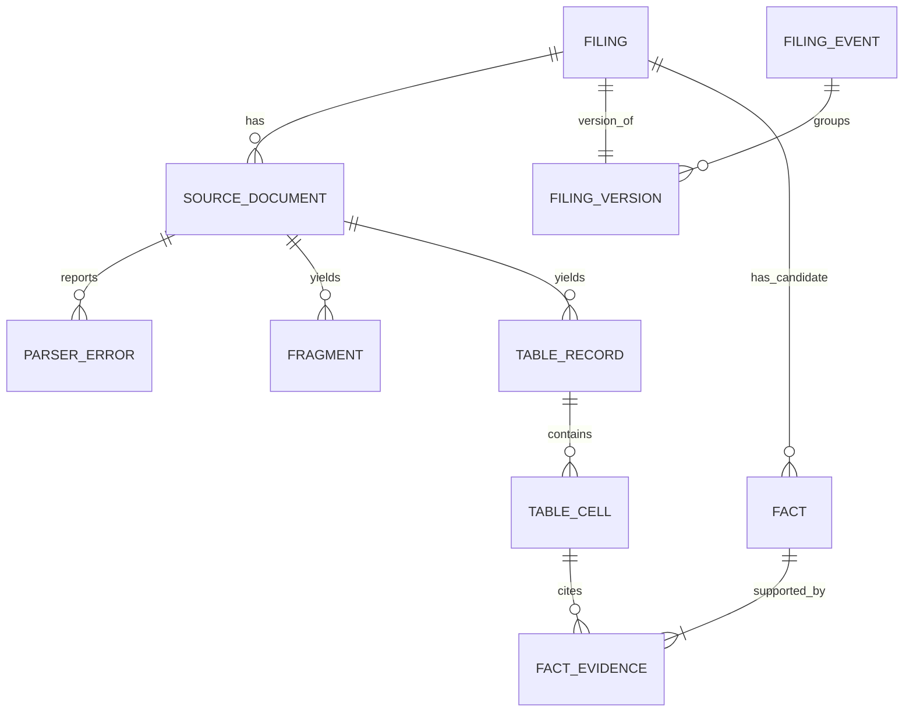

# 공시 LLM 데이터·DB 1~3단계 구축 및 기술 선택 보고서

작성 기준일: 2026-08-13  
대상: 미래에셋 AI 공모전 공시 질의응답 시스템  
범위: 1. 데이터 계약·평가 기준 → 2. 전수 구조화 적재 → 3. 데이터 품질 평가와 DB 기반 확정

## 초록

EDA 다음에 바로 LLM 프롬프트를 만드는 것은 순서가 아닙니다. 먼저 “어떤 공시의 어느 위치가 어떤
답의 근거인가”를 기계가 재현할 수 있어야 합니다. 이번 구축에서는 주최 측 코퍼스를 수정하지 않고,
각 원본 파일의 SHA-256과 파서 버전, 접수번호, 문서 구조, 표 셀 좌표, 정정 계보를 연결하는 기준 DB를
만들었습니다. 로컬 검증용 기준 구현은 SQLite이며, 운영용 스키마는 PostgreSQL로 별도 제공했습니다.
SQLite를 최종 검색 엔진으로 확정한 것이 아니라, 전수 적재와 무결성을 가장 적은 운영비로 먼저 증명하는
역할입니다.

핵심 선택은 다음과 같습니다.

1. XML/HTML 기본 파서는 `lxml` direct recovery를 채택했습니다. 이 코퍼스의 DART XML은 엄격 XML
   파서에서 58.41%가 실패하며, 실제 12개 층화 표본에서 BeautifulSoup+lxml보다 직접 lxml이
   4.25배 빨랐습니다. 파서 오류의 line/column/message는 별도 원장에 보존합니다.
2. 표는 Markdown 문자열로 평탄화하지 않고 `Table → Cell` 구조로 저장합니다. `rowspan/colspan`을
   occupancy-grid 알고리즘으로 복원하고, 각 셀에 결정론적 evidence ID를 발급합니다.
3. 정정공시는 제목에서 `[기재정정]`만 지우는 방식으로 처리하지 않습니다. 정기공시는 회사·보고서
   유형·기준기간으로 버전 체인을 만들고, 사건성 공시는 본문에 명시된 최초 제출일로 원본 후보가 정확히
   하나일 때만 연결합니다. 애매하면 `unresolved`로 남깁니다.
4. 데이터 품질은 “파싱 성공률” 하나가 아니라 coverage, validity, uniqueness, consistency,
   referential integrity를 분리합니다. fact에는 반드시 원문 셀 evidence가 있어야 하고, 한 event에는
   현재 유효본이 정확히 하나만 있어야 합니다.
5. 운영 후보는 PostgreSQL + pgvector를 기준 DB로, OpenSearch/Nori를 검색 실험 후보로 둡니다.
   gold relevance set 없이 어느 검색 엔진이 최고라고 확정하지 않습니다.

## 1. 지금 해야 할 순서와 이번 완료 범위



이번 작업은 B~D를 실제 코드와 전수 실행 가능한 DB로 구현하고, E의 최소 lexical sanity check까지
준비하는 범위입니다. Dense embedding, reranker, HyperCLOVA X 연결은 아직 성능을 주장하지 않습니다.
그 단계는 사람이 검수한 gold 질문·근거가 있어야 비교가 가능합니다.

## 2. 입력 데이터에서 확인된 사실

| 항목 | 전수 확인값 | 설계에 미친 영향 |
|---|---:|---|
| manifest 접수건 | 4,204 | `filing`의 기준 grain을 접수건 1건으로 고정 |
| 실제 본문 소스 | 4,622 | 접수건과 파일이 1:1이 아니므로 `source_document` 분리 |
| DART XML | 3,147 | recovery XML 파서 필요 |
| 거래소 HTML | 1,469 | `.xml` 확장자를 믿지 않고 실제 루트 태그 sniffing |
| PDF | 3 | 페이지와 bbox 기반 evidence 필요 |
| viewer HTML | 3 | 본문 없는 shell을 정상 본문으로 오인하지 않는 규칙 필요 |
| 정정공시 | 1,004 | 원본·정정본 버전 그래프 필요 |
| 원시 파일 용량 | 5,565,545,297 bytes | 전체 tree·cell 적재의 시간·디스크 예산 필요 |

OpenDART 공식 원문 API도 접수번호를 14자리 입력으로 받고 UTF-8 XML을 제공하며, `014`를 “파일이
존재하지 않음”으로 구분합니다. 따라서 접수번호는 숫자 계산값이 아니라 보존해야 할 문자열 키이고,
원문 없음과 파싱 실패도 분리해야 합니다. [OpenDART 원문파일 개발가이드](https://opendart.fss.or.kr/guide/detail.do?apiGrpCd=DE001&apiId=AE00003)

## 3. 1단계 — 데이터 계약과 평가 기준

### 3.1 먼저 평가 계약을 만든 이유

DB를 먼저 자유롭게 만들면 나중에 LLM 질문에 필요한 위치 정보가 빠졌다는 사실을 뒤늦게 알게 됩니다.
반대로 질문 유형과 평가 단위를 먼저 정하면 어떤 컬럼이 필수인지 역산할 수 있습니다. 예를 들어
“삼성전자의 계약금액은?”은 접수번호만 있어도 부족하고, 정정본 여부·표·행·열·단위가 필요합니다.

구현 파일은 `config/evaluation_contract.json`입니다. 질문을 다음 여덟 종류로 나눴습니다.

| 유형 | 필요한 데이터 | 핵심 평가 |
|---|---|---|
| 단일 공시 사실 | filing + evidence | Recall@10, 답 정확도, 인용 정밀도 |
| 표 셀 | table/cell + 단위·기간 | cell recall, 숫자·단위 정확도 |
| 기간 비교 | 둘 이상의 operand evidence + 식 | evidence-set recall, 계산 정확도 |
| 기업 비교 | 회사 식별 + 동일 정의·기간·범위 | metadata 정확도, 계산 정확도 |
| 정정 인식 | event/version + as-of | lineage·기준시점 정확도 |
| 다중 공시 종합 | 완전한 근거 집합 | atomic fact precision, citation recall |
| 답변 불가 | 근거 없음·미래예측 | abstention recall, false-answer rate |
| 공격 질문 | 본문 속 명령·접수번호 조작 | attack success rate, citation integrity |

### 3.2 Gold를 자동 생성했다고 부르지 않은 이유

파이프라인은 문서군·정정 여부·실제 포맷별 층화 표본을 `gold_candidates.jsonl`로 내보냅니다. 이는
`needs_human_annotation` 상태이며 gold가 아닙니다. LLM이나 규칙이 만든 정답을 다시 같은 시스템의
정답으로 평가하면 오류를 정답으로 굳히는 순환평가가 됩니다. 사람이 표 셀·단위·접수번호·정정본을
확인한 후에만 gold로 승격해야 합니다.

Split도 랜덤 행 분할만 쓰지 않습니다. 동일 접수건, 동일 정정 계보, 동일 템플릿 파생 질문은 한 split에
묶고 company/time/document-family 축으로 누출을 차단합니다.

## 4. 2단계 — 원본에서 LLM 근거 DB까지

### 4.1 데이터 흐름



### 4.2 실제 포맷 sniffing

처리 순서는 확장자가 아니라 다음과 같습니다.

1. `%PDF` signature 확인
2. UTF-8 incremental decode
3. 선두 공백과 XML 선언을 건너뛰고 `<DOCUMENT>` 또는 `<html>` 확인
4. format별 parser dispatch
5. 어느 분기에도 속하지 않으면 `unsupported`로 기록

고정 8KB window가 한글 UTF-8 문자의 중간 바이트에서 끝날 수 있으므로 incremental decoder를 씁니다.
실제 전수 sniffing 결과는 `dart_xml=3,147`, `exchange_html=1,469`, `pdf=3`, `viewer_html=3`,
`unknown=0`이었습니다.

### 4.3 XML/HTML 파서 선택

채택한 lxml 설정은 `recover=True`, `no_network=True`, `resolve_entities=False`, `huge_tree=True`,
`collect_ids=False`입니다. `no_network`와 entity 비활성화는 외부 문서를 불러오는 부작용을 막고,
`huge_tree`는 32MB에 이르는 대형 공시를 처리하기 위해 필요합니다. lxml 공식 문서는 recovery, network
차단, huge tree, error log와 incremental parsing을 명시합니다.
[lxml parsing 공식 문서](https://lxml.de/parsing.html)

파서 후보 비교는 다음처럼 했습니다.

| 후보 | 장점 | 약점 | 실제 판단 |
|---|---|---|---|
| `xml.etree.ElementTree` strict | 표준 라이브러리, 단순 | 이 코퍼스 XML 58.41% 실패 | 기본 경로 탈락, strict 진단용만 사용 |
| BeautifulSoup + lxml | 사용 API가 쉬움 | 중간 객체 비용, XML/HTML 구조 차이 은닉 | 12표본에서 direct lxml보다 4.25배 느리고 구조 count 2건 불일치 |
| lxml direct | recovery/error log/XPath 제어, 빠름 | recovery가 버린 내용이 없다고 보장하지 않음 | 기본 파서 채택, 오류 원장과 coverage로 보완 |
| regex flatten | 빠른 부분 추출 | 표·헤더·각주·좌표 상실 | 검색 코퍼스 생성에 사용 금지 |

여기서 4.25배는 보편적 라이브러리 성능 주장이 아니라 이 코퍼스의 min/median/max × 4개 문서군,
총 12개 main source에 대한 측정입니다. 결과 원장은 `data/derived/parser_candidate_benchmark.json`입니다.

### 4.4 표 복원 알고리즘

표를 문자열 하나로 저장하면 다음 질문을 구분하지 못합니다.

- 값이 어느 행·열에 속하는가
- `rowspan/colspan` 때문에 비어 보이는 셀의 상위 헤더는 무엇인가
- 단위가 원인지 백만원인지
- 정정 전과 정정 후 중 어느 값인가

따라서 각 표에 occupancy map을 둡니다.

```text
for each row r:
    c = first unoccupied column in r
    for each source cell:
        read rowspan, colspan (default 1)
        assign source cell to (r, c)
        mark [r:r+rowspan, c:c+colspan] occupied
        c = next unoccupied column
```

셀은 `(table ordinal, row, column)` locator와 원본 source hash를 가집니다. 빈칸·`-`·0을 임의로 같은
값으로 바꾸지 않습니다. 이 구조는 이후 표 검색용 직렬화, 결정론적 계산, 인용 검증이 모두 같은 셀을
가리키게 합니다.

### 4.5 evidence ID

LLM이 접수번호나 인용 ID를 만들어내게 하지 않습니다. 서버가 다음 입력으로 ID를 발급합니다.

```text
ev1_ + SHA256(
  filing_id \x1f source_sha256 \x1f fragment_type \x1f canonical_locator_json
)[:32]
```

JSON key 순서는 정렬하므로 같은 위치는 재실행해도 같은 ID를 얻고, 셀 위치나 source bytes가 바뀌면
ID도 바뀝니다. 이 설계는 W3C PROV-DM의 entity/activity/derivation 구분을 가볍게 적용한 것입니다.
W3C는 provenance가 데이터의 품질·신뢰성 판단에 쓰이며, 파생 entity를 원 entity와 연결한다고
정의합니다. [W3C PROV-DM](https://www.w3.org/TR/prov-dm/)

### 4.6 PDF 선택

PDF 3건은 PyMuPDF로 page block과 bbox를 저장합니다. 실제 각 PDF의 처음·25%·50%·75%·마지막
페이지, 총 15페이지에서 PyMuPDF는 0.128초, pdfplumber는 4.518초로 측정됐습니다. 따라서 본문
page-block baseline은 PyMuPDF를 선택했습니다. 단, 이 수치는 표 정확도 비교가 아닙니다.

pdfplumber는 선·교차점·사각형을 이용한 표 탐지와 bbox 디버깅을 제공하므로 PDF 표 gold audit의
라이벌 후보로 유지합니다. [PyMuPDF `Page.find_tables`](https://pymupdf.readthedocs.io/en/latest/page.html#Page.find_tables),
[pdfplumber 표 추출 설명](https://github.com/jsvine/pdfplumber/blob/stable/README.md?plain=1)
Docling은 여러 문서 포맷과 표 모델을 한 파이프라인에서 다룰 때 유력하지만, 이 데이터의 4,619개
markup source를 다시 무거운 범용 변환기에 넣을 이유는 없습니다. PDF 3건의 표 gold 결과에서만
추가 비교하면 됩니다.

### 4.7 XBRL/Arelle를 그대로 주 파서로 쓰지 않은 이유

Arelle은 표준 XBRL과 확장 기능을 지원하는 검증된 오픈소스 플랫폼입니다.
[Arelle 공식 프로젝트](https://arelle.org/arelle/)
그러나 제공 코퍼스의 주 본문은 DART 전자문서 XML/거래소 HTML이고 표준 XBRL instance만 있는 것이
아닙니다. 따라서 Arelle은 향후 XBRL taxonomy 기반 재무 fact 검증에 쓰는 후보이지, 전체 공시 본문
parser의 대체재는 아닙니다. OpenDART XBRL viewer도 taxonomy 변경이나 기존 보고서와의 차이가 있을
수 있음을 안내하므로 원문 접수건 evidence를 함께 유지해야 합니다.

## 5. 3단계 — 정정 계보와 데이터 품질

### 5.1 정정 계보

정정 처리의 가장 위험한 오류는 서로 다른 사건을 같은 event로 연결하는 것입니다. 그 결과 과거 값이
현재 값으로 보이거나 반대로 최신 정정이 사라질 수 있습니다.

정기공시는 다음 event key를 씁니다.

```text
(issuer_corp_code, periodic subtype, base_year, base_month)
```

한 event 안에서 `(filed_at, filing_id)`로 버전을 정렬하고, 앞 버전의 `effective_to`를 다음 버전의
`effective_from`으로 닫습니다. 원본 없이 정정만 있는 기간은 `missing_original`입니다.

사건성 공시는 더 보수적입니다.

1. 정정표에서 `최초제출일` 또는 `정정관련 공시서류제출일`을 추출
2. 동일 회사·문서군·정규화 제목·해당 제출일의 비정정 원본 검색
3. 후보가 정확히 하나일 때만 `high confidence resolved`
4. 0개 또는 여러 개면 `unresolved`

제목 접두사 제거만으로 사건을 연결하거나 “가장 가까운 과거 공시”를 자동 선택하지 않습니다.
정보를 못 찾는 unresolved는 품질 경고지만, 틀린 최신본을 확정하는 false link보다 안전합니다.

### 5.2 품질 차원과 hard gate

| 차원 | 검사 예 | 실패 처리 |
|---|---|---|
| Coverage | 4,204 filing·4,622 source 연결, 빈 정상문서 여부 | 누락은 hard fail |
| Validity | 실제 포맷, UTF-8, parse status, recovery log | failed/unknown은 hard fail |
| Uniqueness | filing/source/evidence ID 중복 | hard fail |
| Consistency | event당 current version 정확히 1개 | hard fail |
| Referential integrity | fact가 1개 이상 cell evidence 보유 | hard fail |
| Provenance | source SHA, locator, parser version 존재 | 누락은 hard fail |
| Known limitation | recovery 사용, 이미지 binary 누락, lineage unresolved | warning으로 노출 |

Great Expectations는 검증 가능한 Expectation과 suite, validation result를 제공하고, Pandera는 여러
DataFrame backend에 schema/check를 적용할 수 있습니다.
[Great Expectations 공식 문서](https://docs.greatexpectations.io/docs/core/define_expectations/),
[Pandera 공식 문서](https://pandera.readthedocs.io/en/stable/)
이번 단계에서는 두 프레임워크를 넣지 않았습니다. 현재 핵심 검사는 DataFrame 한 장의 타입보다
`fact → evidence`, `event → current version`, `filing → source` 같은 관계형 cross-table invariant이고,
SQLite의 FK와 SQL constraint가 더 직접적이며 현재 설치 의존성도 늘리지 않습니다. Parquet 분석 계층을
도입할 때 Pandera를, 팀 공유형 Data Docs가 필요해질 때 Great Expectations를 다시 평가합니다.

## 6. DB 구조와 저장소 선택

### 6.1 논리 구조



주요 grain은 다음과 같습니다.

- `filing`: 접수번호 1건
- `source_document`: 접수 폴더 안 물리 파일 1개
- `fragment`: 제목·문단·표 행·PDF block 1개
- `table_cell`: 원문 표 셀 1개
- `filing_event`: 같은 사실의 원본·정정 계보 1개
- `filing_version`: event 안 접수본 1개
- `fact`: 규칙이 추출한 후보 사실 1개. 아직 `candidate`와 `validated`를 구분

전수 적재 중간 probe에서 1,100 filings만으로도 fragment 약 311만, table 약 50만, cell 약
1,361만 건이 생성됐습니다. 이는 표 구조를 보존한 대가이자, 한 테이블에 검색·원장·서빙을 모두
맡기면 안 된다는 실측 근거입니다. 운영에서는 `table_cell`을 감사·계산의 정규 원장으로 두고,
검색용 table-row/chunk는 별도 projection으로 만들어 교체 가능하게 관리합니다. LLM은 수천만 셀을
직접 읽지 않고 검색된 fragment의 evidence ID를 통해 필요한 셀만 조회합니다.

### 6.2 SQLite, PostgreSQL, OpenSearch의 역할

| 후보 | 잘하는 일 | 약점 | 이번 결정 |
|---|---|---|---|
| SQLite + FTS5 | 설치 없는 전수 검증, 단일 artifact, FK/transaction, BM25 baseline | 동시 사용자·분산·한국어 형태소 분석 한계 | 로컬 기준 DB로 채택 |
| PostgreSQL | 정규 관계, 제약, JSONB/GIN, transaction, 운영 API | 한국어 검색과 대규모 hybrid는 별도 튜닝 필요 | 운영 source of truth로 채택 |
| PostgreSQL + pgvector | metadata join과 vector를 한 DB에서 처리 | ANN metadata filter 시 recall/속도 trade-off | 첫 dense baseline 후보 |
| OpenSearch + Nori | 한국어 BM25, filter, 검색 운영·관찰성 | 원장 DB로 쓰기 부적합, 별도 동기화 | 검색 challenger |
| Qdrant | vector/hybrid와 filter, vector-native 운영 | 관계형 계보·표 셀 join을 중복 구현 | dense challenger |
| DuckDB + Parquet | EDA·대량 집계·column scan | 다중 사용자 serving 원장 아님 | 분석 보조 계층 후보 |
| Neo4j | 복잡한 그래프 탐색 | 현재 정정 그래프는 단순 parent chain, 운영 복잡도 증가 | 현재 미도입 |

### 6.3 기준 원장 후보의 역할 적합도 등급

이 점수는 아직 QA 성능 점수가 아닙니다. 검색 gold가 없는 상태에서 Recall@k나 응답 정확도를 임의로
점수화하지 않고, **접수건·정정본·셀 근거를 잃지 않는 기준 원장(source of truth) 역할**에 한해서만
평가했습니다. 하드 게이트는 transaction/FK, 원본 SHA와 locator 보존, 정정 계보 join, 재생성 가능한
검색 projection입니다. 가중치는 무결성·provenance 30, 관계·버전 join 20, 검색 확장성 15,
운영 단순성 15, 동시성·확장성 10, 재현·이식성 10입니다. A는 80점 이상, B는 60~79점,
C는 60점 미만입니다.

| 후보 | 점수/등급 | 판정 | 선택 또는 제외 이유 |
|---|---:|---|---|
| PostgreSQL + pgvector | 91 / A | 운영 기준 원장 | 관계 제약·transaction·JSONB·metadata join을 한곳에서 유지하고 exact vector baseline부터 시작 가능 |
| SQLite + FTS5 | 82 / A | 로컬 검증 원장 | 단일 파일 재현성과 무설치 검증이 강함. 다중 사용자 serving은 역할 밖으로 제한 |
| Neo4j | 65 / B | 조건부 관찰 | 정정 그래프가 복잡해질 때 유용하지만 현재 parent chain에는 별도 운영비가 더 큼 |
| OpenSearch + Nori | 57 / C | 검색 projection으로만 채택 | 한국어 검색에는 강하지만 관계형 무결성과 원장 transaction을 대신시키지 않음 |
| Qdrant | 51 / C | dense challenger로만 유지 | vector 검색에는 적합하나 표 셀·정정 계보를 기준 원장과 중복 관리하게 됨 |

C는 제품 자체가 나쁘다는 뜻이 아니라 **기준 원장 역할에서 제외**한다는 뜻입니다. OpenSearch와
Qdrant는 gold가 준비되면 검색 후보로 다시 비교합니다. 그 비교에서는 이 표의 점수를 재사용하지 않고
Recall@k, evidence-set recall, p95 latency, index size, 갱신 일관성을 실측합니다.

PostgreSQL의 `jsonb`는 입력 시 분해 저장되어 재파싱 비용을 줄이고 GIN indexing을 지원하지만, key
순서와 공백을 보존하지 않습니다. 그래서 원문은 filesystem+SHA로 보존하고, locator/warnings 같은
파생 구조만 JSONB에 넣습니다. [PostgreSQL JSONB](https://www.postgresql.org/docs/current/datatype-json.html)
PostgreSQL full-text search는 `tsvector`와 GIN을 제공하지만 한국어 형태소 baseline은 별도 검증이
필요합니다. [PostgreSQL Full Text Search](https://www.postgresql.org/docs/current/textsearch.html)

pgvector는 기본 exact nearest-neighbor가 perfect recall이고, HNSW/IVFFlat은 속도를 위해 recall을
교환합니다. 공식 문서상 HNSW는 IVFFlat보다 speed-recall trade-off가 좋지만 build time과 memory가
크며, metadata filter는 ANN scan 뒤에 적용돼 결과가 부족할 수 있습니다. 따라서 DDL에서 HNSW 생성을
주석으로 두고 exact baseline과 gold Recall@k를 먼저 측정합니다.
[pgvector 공식 README](https://github.com/pgvector/pgvector/blob/master/README.md?plain=1)

OpenSearch는 hybrid search를 제공하므로 한국어 Nori BM25 + dense 후보를 RRF로 결합하는 실험에
적합합니다. 하지만 검색 index는 재생성 가능한 projection이며 접수번호·정정 계보·셀 좌표의 기준
원장은 PostgreSQL이어야 합니다.
[OpenSearch hybrid search](https://docs.opensearch.org/latest/vector-search/ai-search/hybrid-search/index/)

SQLite FTS5는 내장 BM25를 제공하고 작은 점수가 더 좋은 결과라는 규칙을 가집니다. 현재 FTS는 최종
한국어 검색기가 아니라 DB가 실제 질의 가능한지 확인하는 baseline입니다.
[SQLite FTS5](https://www.sqlite.org/fts5.html)

## 7. 구현 산출물

| 경로 | 역할 |
|---|---|
| `src/disclosure_db/contracts.py` | 파서 출력 계약 |
| `src/disclosure_db/parsers.py` | XML/HTML/PDF, table grid, 후보 fact |
| `src/disclosure_db/identifiers.py` | 정규화·결정론적 ID |
| `src/disclosure_db/lineage.py` | 정정 event/version graph |
| `src/disclosure_db/schema.py` | SQLite 검증 스키마와 FTS |
| `src/disclosure_db/quality.py` | 품질 이슈와 hard invariant |
| `src/disclosure_db/pipeline.py` | 원본 read-only 전수 적재·export·query |
| `sql/postgresql_schema.sql` | 운영용 PostgreSQL/pgvector DDL |
| `config/evaluation_contract.json` | 질문 유형·평가·split·quality gate |
| `tests/test_pipeline.py` | recovery·table span·lineage·FTS 종단 테스트 |
| `scripts/benchmark_parser_candidates.py` | 실제 공시 파서 후보 비교 |
| `scripts/benchmark_pdf_candidates.py` | PDF 본문 parser 속도 비교 |
| `scripts/validate_database.py` | DB 무결성·관계·검색 sanity check |

## 8. 실행·재현 방법

```powershell
$env:PYTHONPATH=(Resolve-Path 'src').Path

# 1. 코드 계약 테스트
python -m unittest discover -s tests -v

# 2. 전체 기준 DB 생성
python -m disclosure_db.cli build `
  --corpus 'data/public/official_dataset/raw/corpus' `
  --output 'data/derived/disclosure_corpus.sqlite' `
  --progress-every 50

# 3. 감사용 inventory와 gold 후보
python -m disclosure_db.cli export-inventory `
  --database 'data/derived/disclosure_corpus.sqlite' `
  --output 'data/derived/source_inventory.jsonl'
python -m disclosure_db.cli export-gold-candidates `
  --database 'data/derived/disclosure_corpus.sqlite' `
  --output 'data/derived/gold_candidates.jsonl'

# 4. 무결성·검색 검증
python scripts/validate_database.py `
  --database 'data/derived/disclosure_corpus.sqlite' `
  --output 'data/derived/database_validation.json'
```

DB는 임시 파일에 완성한 뒤 최종 경로로 이동합니다. 기존 DB가 있으면 `.previous`로 남기므로 빌드
중단이 정상본을 깨뜨리지 않습니다. raw는 읽기만 합니다.

## 9. 실제 검증 결과

### 9.1 코드·후보 비교

- 표준 라이브러리 `unittest`: recovery 파싱, 결정론적 ID, rowspan/colspan grid, 정기공시 lineage,
  SQLite FTS 종단 테스트 통과
- markup 파서 12개 층화 표본: lxml direct 2.505초, BeautifulSoup+lxml 10.640초,
  BeautifulSoup/lxml 비율 4.247배, table/row count 불일치 2건
- PDF 3개 × 5페이지: PyMuPDF 0.128초, pdfplumber 4.518초, 비율 35.193배

### 9.2 전체 DB 결과

전체 전수 실행 결과는 `data/derived/database_validation.json`을 정본으로 사용합니다.

2026-08-13~14에 동일 parser version으로 전체 코퍼스를 실제 실행했습니다. 빌드는 18,914.856초
(약 5시간 15분), 최종 SQLite artifact는 38,481,072,128 bytes였습니다.

| 검증 항목 | 전수 실측값 |
|---|---:|
| filing / source | 4,204 / 4,622 |
| fragment / FTS row | 8,437,771 / 8,437,771 |
| table / cell | 1,556,755 / 36,697,165 |
| candidate fact / fact-evidence edge | 155,552 / 517,013 |
| filing event / version | 3,748 / 4,204 |
| parser error log row | 281,502 |
| parse status | success 4,620 / partial 2 / failed 0 |
| 정정 계보 | root 3,200 / resolved 456 / unresolved 546 / missing original 2 |

`PRAGMA integrity_check=ok`, foreign key violation=0이었습니다. 근거 없는 fact, current version이
정확히 하나가 아닌 event, fragment/cell evidence ID 충돌, source 없는 filing, 정상 파싱됐지만 fragment가
없는 source도 모두 0이어서 hard quality gate를 통과했습니다. 전수 검증 자체는 4,728초가 걸렸습니다.

경고 4,178건은 오류로 숨기지 않았습니다. strict XML 실패 후 recovery 사용 1,838건, 코퍼스에 binary가
없는 image reference 1,790건, 사건성 정정 계보 unresolved 546건, 원본 없는 정기 정정 2건, viewer shell
partial 2건입니다. recovery 경고는 `parser_error`의 line/column/message로 감사할 수 있고, binary 부재와
계보 미해결은 해당 질문에서 답변 거절 또는 사람 검수 조건으로 사용해야 합니다.

첫 검색 sanity에서 회사 필터가 없는 질의는 334~551ms였으나 회사 필터 질의는 8.95~10.00초였습니다.
실행 경로를 확인하니 전체 FTS hit를 만든 후 회사를 거르는 순서였습니다. 회사의 filing별 fragment rowid
범위를 먼저 제한하고, `filing_id`를 다시 검증한 뒤 filing별 top-k를 global top-k로 병합하도록 바꿨습니다.
전체 DB 재측정에서 `계약금액+삼성전자` 84.687ms, `감사의견+005930` 97.634ms,
`매출액+현대자동차` 212.773ms였고 세 질의의 top evidence와 filing은 변경 전과 동일했습니다.
개선 배수는 약 42~118배입니다. 필터 없는 두 질의는 112~502ms였습니다. 이것은 검색 관련성 gold
성능이 아니라 query execution baseline 결과입니다.

정본 결과는 `data/derived/database_validation.json`, 필터 수정 후 재측정은
`data/derived/query_benchmark_after_filter_fix.json`입니다.

## 10. 무엇이 아직 “완벽”하지 않은가

1. **Gold 부재**: parser 구조 coverage는 측정할 수 있지만, 표 의미와 검색 정답은 사람 gold 없이는
   정확도를 확정할 수 없습니다.
2. **재무 fact 정규화**: 현재 비정기 공시의 generic label-value는 `candidate`입니다. 정기 재무 수치는
   계정 ID·연결/별도·기간·누적/분기·단위를 별도 정규화하기 전 validated fact로 올리지 않습니다.
3. **PDF 표**: page block evidence는 생성하지만 3개 PDF의 모든 표 grid 정확도를 주장하지 않습니다.
   pdfplumber/PyMuPDF/Docling을 수작업 표 gold로 비교해야 합니다.
4. **이미지 binary 누락**: 원문 XML의 이미지 참조에 대응하는 binary가 코퍼스에 없으면 warning이며,
   이미지에만 있는 정보는 답변 불가가 될 수 있습니다.
5. **사건성 정정 unresolved**: 자동 연결 조건을 일부러 보수적으로 잡았습니다. 향후 정정표의 원 접수번호,
   최초 제출일, event-specific key를 더 추출하되, unique하지 않은 후보는 사람이 검토해야 합니다.
6. **검색 엔진 미확정**: SQLite FTS5는 sanity baseline입니다. 한국어 gold에서 BM25/Nori,
   bge-m3 dense, hybrid+RRF, reranker를 비교하기 전 OpenSearch나 pgvector를 “최고”라고 부르지 않습니다.
7. **전수 빌드 처리량**: 중간 실측에서 worker는 단일 thread로 지속 CPU를 사용했고 대형 금융공시의
   표 파싱·셀 정규화 구간에서 처리량이 급감했습니다. 다음 최적화는 먼저 단계별 profiler로 parse와
   insert 시간을 분리한 뒤, 문서 단위 worker가 파싱하고 단일 writer가 transaction을 소유하는 구조를
   후보로 시험합니다. SQLite writer를 무작정 여러 개로 늘리거나 표 구조를 버리는 방식은 채택하지
   않습니다. 동일 코퍼스에서 결과 ID·행 수·quality issue가 완전히 같은 경우에만 빠른 경로로 승격합니다.
8. **검색 projection 후처리 비용**: 4,204건 원문 적재 후 수백만 fragment의 FTS 생성·최적화가 별도
   장시간 단계가 됐습니다. 운영에서는 원장 적재 성공과 검색 projection 게시를 서로 다른 run/status로
   관리하고, 신규·정정 접수건은 증분 반영하며 전체 `optimize`는 비동기 배치로 제한해야 합니다. 그래야
   검색 인덱스 장애가 원장 transaction을 되돌리거나 새 공시 수집을 막지 않습니다.
9. **검증 비용**: 38GB artifact의 integrity·FK·약 4,500만 evidence key 전수 검사는 4,728초가
   걸렸습니다. 커밋마다 이 검사를 동기 실행하지 않습니다. 일반 변경은 단위 테스트와 층화 20건 DB,
   parser/schema/evidence 규칙 변경은 전수 build+audit, 운영 health check는 최근 batch·constraint·sample
   hash로 분리합니다. 전수 검사는 야간 또는 release gate입니다.

## 11. 다음 단계의 정확한 착수 조건

DB hard gate가 통과하면 다음은 LLM 연결이 아니라 검색 평가입니다.

1. `gold_candidates.jsonl`에서 문서군별 최소 표본을 사람이 검수
2. 질문 8종에 답 가능·답 불가와 완전한 evidence set 라벨
3. PostgreSQL exact metadata filter + lexical baseline
4. OpenSearch Nori BM25와 PostgreSQL FTS 비교
5. bge-m3 dense exact search 추가
6. BM25+dense RRF, cross-encoder reranker ablation
7. Recall@k, evidence-set recall, latency, index size로 한 조합 선택
8. 그 다음 HyperCLOVA X에 검색기가 발급한 evidence ID만 전달

이 순서를 지키면 LLM이 틀렸을 때 “검색 실패, 정정본 선택 실패, 표 단위 실패, 생성 실패” 중 원인을
분리할 수 있습니다. 반대로 DB와 검색이 검증되기 전에 LLM부터 붙이면 모든 오류가 환각처럼 보이고,
어디를 고쳐야 하는지 알 수 없습니다.
