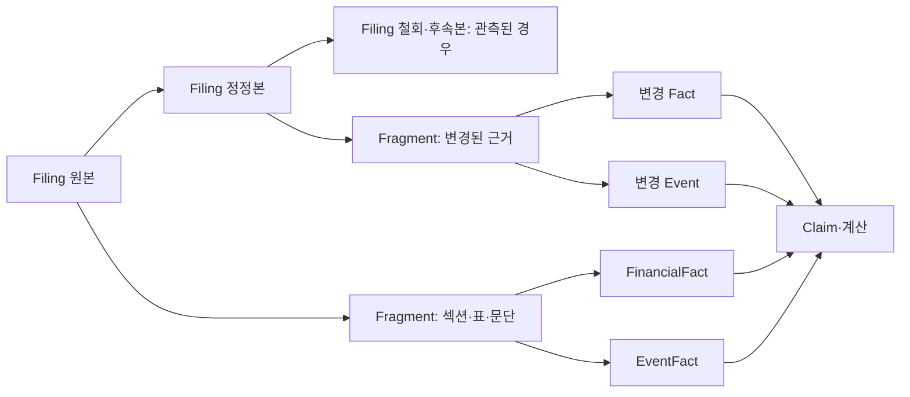

# 한국 공시 데이터의 구조와 해석 원리

> 문서 상태: 연구 기준선 v1.0  
> 기준일: 2026-08-12  
> 데이터 정본: 주최 측 제공 DART 공시 코퍼스  
> 목적: 공시 질의응답의 파싱·정규화·비교·정정·인용 규칙 정의

## 초록

공시는 일반 텍스트 문서가 아니다. 한 건의 공시는 회사, 문서유형, 제출시점, 대상기간, 연결 또는 별도 범위, 표와 주석, 정정 상태를 함께 가진 시간 의존적 기록이다. 재무 수치 하나도 계정 개념, 기업, 기간, 단위, 연결범위와 차원 정보가 일치해야 비교할 수 있다. 수시·주요사항 공시는 결정, 계약, 승인, 완료, 철회 등 서로 다른 사건 상태를 구분해야 한다. 따라서 공시 질의응답을 임베딩 검색과 문장 생성만으로 구현하면 숫자와 이력에서 구조적인 오류가 발생한다.

주최 측 데이터셋은 70개사, 2023-01-01부터 2026-03-31까지 4,204개 공시 문서와 4,616개 XML을 제공한다. 정정공시 1,004건을 원본과 함께 보존하며, 정기·주요사항·거래소·지분 공시를 포함한다. 이 문서는 실제 데이터 구조와 공식 DART·KRX·XBRL·IFRS 자료, StockBot V3의 검증된 전처리 패턴을 결합해 canonical schema, 기간·단위 정규화, 정정 그래프, 사건 상태 모델, 근거 추적형 계산 규칙을 제시한다.

이 문서는 원천 공시의 의미·정규화·시간성을 다룬다. 질의 처리, 검색, 생성과 검증 파이프라인은 [LLM 시스템 문서](llm_system_principles.md)를 정본으로 삼는다. 과제 범위는 [공식 과제소개자료](../official/competition/과제소개자료_공시Agent.pdf) 4~8쪽, 코퍼스 수치는 [제공 데이터 설명](../../data/public/official_dataset/raw/corpus/README.md)과 매니페스트 전수 집계에서 확인했다.

## 문서 안내

1. 공식 범위와 데이터셋 실사
2. DART와 KIND의 역할
3. 식별자와 시간
4. canonical 데이터 모델
5. XML·표·PDF 파싱
6. XBRL과 재무 수치
7. 공시 유형별 해석
8. 정정·철회와 최신 유효본
9. 검색과 근거 추적
10. 결정론적 알고리즘
11. StockBot V3 감사 결과
12. 실패 모드
13. 데이터 품질 검증
14. 결론

| 구분 | 현재 상태 |
|---|---|
| 코퍼스 규모·유형·파일 정합성 | 전수 검증 완료 |
| DART·XBRL 필드 의미 | 공식 문서·표준으로 확인 |
| canonical schema·버전 그래프 | 설계 가설 |
| 정정 계열 자동 연결 정확도 | gold set 실험 필요 |
| XML·표 parser의 유형별 완전성 | gold set 실험 필요 |

## 1. 공식 범위와 데이터셋 실사

### 1.1 평가에 사용할 수 있는 데이터

공식 과제소개서는 주최 측이 제공한 코퍼스 외 데이터, 뉴스·리포트·위키, OpenDART 실시간 호출을 금지한다. 답변은 제공 공시만 근거로 생성해야 하며 확인할 수 없는 내용은 명시적으로 거절해야 한다. 외부 공식 문서와 논문은 개발 원리를 공부하는 데 사용할 수 있지만 평가 시 검색 인덱스에는 들어가면 안 된다.

### 1.2 실제 코퍼스

데이터셋 자체 [README](../../data/public/official_dataset/raw/corpus/README.md)와 [필터 명세](../../data/public/official_dataset/raw/corpus/data_filter.md)를 대조한 결과는 다음과 같다.

| 항목 | 확인값 |
|---|---:|
| 기업 | 70개사 |
| 시장 | KOSPI 61, KOSDAQ 9 |
| 기간 | 2023-01-01~2026-03-31 |
| 전체 문서 | 4,204건 |
| 원문 XML | 4,616개 |
| 정정공시 | 1,004건 |
| 정기공시 | 1,054건 |
| 주요사항보고서 | 598건 |
| 거래소공시 | 1,469건 |
| 지분공시 | 1,083건 |

원문 XML 미제공 3건은 공식 PDF와 공시뷰어 HTML로 대체되었다. 따라서 parser는 XML만 전제로 하면 안 된다. 문서 메타데이터는 `manifest.jsonl`, 회사 마스터는 `universe.csv/xlsx`, 실제 원문은 `raw/{periodic|major|exchange|holding}` 아래에 있다.

### 1.3 실제 원문은 한 가지 XML이 아니다

파일 확장자는 `.xml`이어도 내용 구조가 다르다.

- 정기·주요사항·지분 공시는 `DOCUMENT`, `BODY`, `SECTION-*`, `TABLE`, `TD/TU/TE` 등 DART 문서 XML 구조를 사용한다.
- 거래소공시 일부는 `<html>` 문서와 `xforms` class를 가진 HTML형 XML이다.
- 사업보고서 한 접수 건에 본문과 감사보고서 첨부 XML 등 여러 파일이 있을 수 있다.
- 3건은 PDF+viewer HTML이므로 PDF 텍스트·표 추출과 HTML 파서가 필요하다.

확장자에 따른 단일 parser 대신 content sniffing 후 parser family를 선택해야 한다.

## 2. DART와 KIND의 역할

DART/OpenDART는 금융감독원의 법정공시 원문, XBRL 재무정보와 주요 항목 API를 제공한다. KIND는 한국거래소의 상장법인 공시 채널로 수시·조회·자율·공정공시와 시장조치에 강점이 있다.[^opendart-intro][^krx-overview] 양쪽에 같은 사건이 나타날 수 있지만 시스템과 문서 계약은 동일하지 않다.

OpenDART 공시검색의 공식 분류 코드는 다음을 포함한다.[^dart-list]

| 코드 | 범주 | 이 데이터셋의 포함 여부 |
|---|---|---|
| A | 정기공시 | 포함 |
| B | 주요사항보고 | 포함 |
| C | 발행공시 | 직접 그룹 없음, 주요사항 내용에 관련 사건 존재 가능 |
| D | 지분공시 | 5% 대량보유 포함 |
| I | 거래소공시 | 일부 유형 포함 |

데이터셋은 공시 전체가 아니라 과제용 선별 코퍼스다. “해당 회사에 사건이 없었다”와 “이 코퍼스가 그 유형을 수집하지 않았다”를 구분해야 한다. coverage manifest가 필요한 이유다.

## 3. 식별자와 시간

### 3.1 세 식별자를 섞지 않는다

- `corp_code`: DART 회사 고유번호 8자리
- `stock_code`: 상장 종목코드 6자리
- `rcept_no`: 제출 건별 접수번호 14자리

공식 API는 이 필드를 별도로 정의한다.[^dart-company][^dart-list] 회사 관계는 `corp_code`, 사용자 입력 해소는 `listed_name`·`corp_name` alias, 증거와 문서 버전은 `rcept_no`로 관리한다. `stock_code`는 상장 종목 연결에는 유용하지만 범용 법인 ID가 아니다. 모든 코드는 문자열로 읽어 선행 0을 보존한다.

### 3.2 하나의 공시에는 여러 시간이 있다

`rcept_dt`는 제출일이지 항상 사건 발생일이 아니다. canonical event는 다음 시간을 구분한다.

```text
occurred_at     실제 사건 발생일
decided_at      이사회 등 의사결정일
confirmed_at    회사가 사실을 확인한 날
filed_at        공시 접수일
effective_at    법적·경제적 효력 발생일
expected_at     예정일
valid_from/to   해당 공시 버전의 질의 기준시점상 유효기간
```

예를 들어 합병 “결정”은 합병 “완료”가 아니며, 계약 체결은 매출 인식이 아니다. OpenDART의 합병·소송 API도 결정일, 제기일, 확인일과 같은 날짜를 별도 필드로 둔다.[^dart-merger][^dart-lawsuit]

### 3.3 Point-in-time 원칙

질의 기준시점 \(t_q\)가 있으면 \(filed\_at \le t_q\)인 공시만 사용할 수 있다. 이후 정정본을 과거 질문에 사용하는 것은 look-ahead leakage다. 기준시점이 명시되지 않은 일반 질문은 데이터셋 마지막 시점까지의 최신 유효본을 사용하되 답변 기준일을 기록한다.

## 4. Canonical 데이터 모델

공시 원문을 바로 벡터 DB에 넣기 전에 네 계층으로 분리한다.



그림 1. 공시 버전은 원형을 보존하고 각 버전에서 근거 조각과 fact를 파생한다. 답변 claim은 질의 기준시점에 선택된 버전의 fact만 참조한다.

### 4.1 Filing

```text
Filing
  doc_id, rcept_no, corp_code, stock_code
  report_nm, doc_group, doc_subtype
  filed_at, base_year, base_month
  is_correction, version_status
  predecessor_rcept_no, root_rcept_no
  valid_from, valid_to, is_effective
  source_files[], content_hash
```

### 4.2 Document fragment

```text
Fragment
  fragment_id, rcept_no, source_file
  section_path, block_type
  table_id, row_path, column_path
  char_start, char_end  # 원본 파일을 디코딩한 Unicode 문자열 기준
  raw_text, normalized_text
  parser_name, parser_version
```

### 4.3 Financial fact

```text
FinancialFact
  fact_id, rcept_no, corp_code
  concept_id?, source_label, statement_type
  mapping_status, mapping_provenance
  scope(CFS/OFS), period_type(instant/duration)
  period_start, period_end, instant
  unit, currency, dimensions?, precision_source?
  raw_value, normalized_value
  table_id, row_path, column_path
```

### 4.4 Event fact

```text
EventFact
  event_id, event_type, corp_code
  status, amount, ratio, counterparty
  occurred_at, decided_at, effective_at, expected_at
  root_rcept_no, supporting_rcept_nos[]
  field_provenance{}
```

문서 검색 결과와 정형 fact는 서로 대체하지 않는다. 정형 fact가 값과 비교에 강하고, 원문 fragment가 조건·예외·맥락을 설명한다.

## 5. 문서 파싱

### 5.1 원본을 먼저 고정한다

원본 파일에 대해 SHA-256을 계산하고 parser 버전을 기록한다. 파싱 결과의 revision은 다음과 같이 구성할 수 있다.

\[
revision = H(rcept\_no \parallel source\_hash \parallel parser\_version)
\]

이 값이 있어야 parser 변경 뒤 어떤 청크·fact가 달라졌는지 추적할 수 있다.

### 5.2 ZIP과 첨부파일 안전성

공시 패키지를 다룰 때는 파일 수, 총 비압축 크기, 경로 이탈(`../`), 허용 확장자를 검사한다. StockBot V3는 ZIP 파일 수와 해제 크기를 제한하고 traversal을 거부하며 XML/HTML만 허용하는 패턴을 구현했다. 이는 그대로 가져올 가치가 있다. 다만 대회 코퍼스는 이미 전개되어 있어도 제출·재현 파이프라인에 같은 검사가 필요하다.

### 5.3 목차와 섹션

정기공시는 `TITLE`, `ATOC`, `AASSOCNOTE`, SECTION 계층을 이용해 목차 경로를 복원한다. 경로 예시는 `II. 사업의 내용 > 2. 주요 제품 및 서비스`다. 단순 태그 제거는 제목·표·각주의 관계를 잃는다.

섹션 parser는 다음을 산출해야 한다.

- 원문 순서가 보존된 block 목록
- heading level과 완전한 `section_path`
- 문단과 표의 경계
- “기재 생략”, “해당사항 없음” 같은 명시적 부재 표현
- 각 block의 source locator

### 5.4 표

공시 표는 `ROWSPAN`, `COLSPAN`, 다단 열 헤더, 단위 표기, 괄호 음수와 각주를 가진다. 표 평탄화 절차는 다음과 같다.

1. rowspan/colspan을 좌표 격자로 확장한다.
2. 열마다 상위 헤더를 결합해 `column_path`를 만든다.
3. 행 계층을 보존해 `row_path`를 만든다.
4. 표 제목·직전 단위 문구·각주를 표 메타데이터에 연결한다.
5. 셀 값은 raw string과 typed value를 함께 보존한다.
6. Markdown은 LLM 표시용 파생물로 만들되 canonical cell grid를 버리지 않는다.

표를 문장으로만 바꾸면 계산의 피연산자 좌표를 잃는다. LLM용 텍스트와 계산용 셀 저장소를 병행한다.

### 5.5 HTML형 거래소공시와 PDF 대체본

거래소공시는 `xforms_input`, label/value span 등 템플릿별 구조를 가진다. 템플릿 필드 코드를 우선 사용하고 위치 기반 휴리스틱은 마지막 수단으로 둔다. PDF 대체본은 페이지와 bounding box를 보존하며, viewer HTML과 교차 확인한다. PDF에서 읽은 숫자는 낮은 신뢰등급으로 시작해 동일 문서 HTML 또는 표 헤더와 맞을 때 승격한다.

## 6. XBRL을 참고한 재무 수치 정규화

중요한 입력 경계를 먼저 고정한다. 제공 코퍼스의 정기공시 XML을 전수 표식 검색한 결과 `contextRef`, `xbrli:`, `ix:`와 `account_id`가 없었다. 즉 평가 입력은 XBRL instance가 아니라 DART 문서 XML의 표다. 아래 XBRL 모델은 비교 가능한 재무 fact를 설계하기 위한 정규화 목표이며, OpenDART 재무 API와 XBRL 원본은 학습·설계 참고자료일 뿐 평가 런타임 원천이 아니다.

### 6.1 숫자는 튜플이다

XBRL fact는 값 하나가 아니라 다음 튜플로 이해한다.[^xbrl-oim][^xbrl21]

\[
Fact=(concept, entity, period, unit, dimensions, value, decimals)
\]

표에서 뽑은 숫자도 가능한 범위에서 이 좌표로 정규화한다. 다만 표에 명시되지 않은 `concept`, `dimensions`, `decimals`는 추정 확정하지 않고 nullable로 두며, 원문 행 이름과 매핑 규칙·버전을 보존한다. 두 숫자의 비교 가능성은 값의 모양이 아니라 확인된 좌표의 정합성으로 판정한다.

### 6.2 instant와 duration

- `instant`: 특정 기준일의 자산·부채·자본·기말 주식수
- `duration`: 시작일부터 종료일까지의 매출·이익·현금흐름

XBRL 공식 가이드도 시점과 기간 context를 구분한다.[^xbrl-dates] 재무상태표의 2025-12-31 자산과 2024-12-31 자산은 instant 비교다. 2025년 매출과 2025년 1분기 매출은 duration 길이가 달라 직접 증감률을 계산할 수 없다.

### 6.3 연결과 별도

OpenDART 전체 재무제표는 `fs_div=CFS` 연결과 `OFS` 별도를 구분한다.[^dart-fs] IFRS 10의 연결재무제표는 지배기업과 종속기업을 하나의 경제실체처럼 표시한다.[^ifrs10] IAS 27의 별도재무제표는 종속·관계·공동기업 투자에 별도 회계정책을 적용할 수 있다.[^ias27]

QA 규칙은 다음과 같다.

1. 질문에 범위가 없고 연결이 존재하면 연결을 기본 후보로 삼되 답변에 명시한다.
2. 모회사 자체 차입·배당가능이익·별도 보유주식 등 법인 단독 질문은 별도를 사용한다.
3. 연결과 별도를 한 계산에서 섞지 않는다.
4. 기업 비교 시 두 기업의 범위를 동일하게 맞춘다.

### 6.4 보고서 코드와 기간

- `11011`: 사업보고서
- `11012`: 반기보고서
- `11013`: 1분기보고서
- `11014`: 3분기보고서

OpenDART는 당기 금액과 누적 금액을 구분해 제공한다.[^dart-fs] 중간재무보고는 연초 누적 측정이 포함될 수 있다.[^ias34]

StockBot V3에서 검증된 기간 정규화 패턴은 유용하다.

- 손익계산서의 분기 단독 값과 누적 값을 분리한다.
- 현금흐름표가 연초 누적만 있으면 Q2 단독은 `반기 누적 - 1분기 누적`, Q3 단독은 `9개월 누적 - 반기 누적`으로 계산한다.
- 앞선 형제 분기가 없으면 단독으로 가장하지 않고 `YTD` 라벨을 유지한다.
- TTM은 `현재 YTD + 전년도 연간 - 전년도 동기간 YTD`로 계산하며 세 입력이 모두 있을 때만 사용한다.

\[
TTM_t=YTD_t+FY_{t-1}-YTD_{t-1,same\ period}
\]

연결범위·계정·통화·기간 정의가 모두 같아야 차분 또는 TTM을 허용한다.

### 6.5 단위, 정밀도와 결측

`원`, `천원`, `백만원`, `주`, `%`, `원/주`는 서로 다른 단위다. 문서 표의 “단위: 백만원”을 놓치면 10⁶배 오류가 난다. 표 원문에서 정밀도를 확인할 수 없으면 `precision_source`를 미확인으로 둔다. 참고로 XBRL의 `decimals`는 보고 정밀도를 뜻하므로 반올림된 부분합이 총계와 정확히 일치하지 않을 수 있다.[^xbrl-calc]

다음 값은 구분한다.

- `0`: 보고된 영
- `nil`: XBRL에서 명시한 빈 값
- `-`: 표에서 없음·해당 없음·미기재 등 문맥 의존 표기
- missing: 해당 concept/context 자체가 없음
- parse_error: 값은 있으나 파싱 실패

괄호 숫자 `(1,234)`는 보통 음수로 파싱한다. 쉼표를 제거하고 유한 숫자인지 확인하며, 분모가 0이거나 없으면 비율은 `None`으로 반환한다.

### 6.6 계정 매핑과 중복 fact

제공 표에는 `account_id`가 없으므로 `source_label`을 원형 보존하고, 표준 concept로 매핑할 때 규칙·출처·confidence를 둔다. 매핑되지 않은 계정은 임의 통합하지 않는다. 이름이 같아도 statement와 context가 다르면 같은 fact가 아니다.

XBRL은 같은 aspect를 가진 중복 fact가 존재할 수 있으며 complete/consistent/inconsistent duplicate를 구분한다.[^xbrl-duplicate] 첫 값 선택이나 무조건 `DISTINCT`를 쓰지 않는다. 값과 decimals가 일관되면 정밀도가 높은 fact를 우선할 수 있지만, 불일치하면 충돌 상태를 기록하고 원문 확인 대상으로 보낸다.

## 7. 공시 유형별 해석

### 7.1 정기공시

사업·반기·분기보고서는 재무제표만이 아니라 사업 내용, 제품·서비스, 생산설비, 수주, 연구개발, 위험요인, 임직원과 주주 정보를 담는다. 질문을 먼저 statement fact, 표, narrative section 중 어디에서 답할지 분류한다.

“연결 매출액”은 재무 fact가 우선이다. “핵심 사업이 어떻게 변화했는가”는 두 연도의 사업 섹션을 대응시키고 새로 등장·사라진 사업, 매출 구성, 회사가 설명한 전략 변화를 각각 근거로 찾아야 한다. 임베딩 유사도만으로 “변화”를 생성하지 않는다.

### 7.2 주요사항보고와 거래소공시

주요사항보고서는 합병·분할·증자·감자·자기주식·CB/BW/EB·자산양수도·소송·부도·회생절차 등 사건을 다룬다.[^dart-major] 거래소 수시공시는 재무·경영·생산·영업·투자·손익·소송 등 투자판단에 중요한 사건을 다룬다.[^krx-timely]

사건 parser는 템플릿별 필드를 canonical event에 매핑한다.

```text
계약: 계약명, 상대방, 확정/조건부 금액, 최근매출 대비, 시작/종료일, 지역, 상태
시설투자: 투자대상, 금액, 자기자본 대비, 기간, 자금조달, 목적, 상태
자금조달: 유상증자/CB/BW/EB, 발행액, 방식, 발행가, 납입일, 전환조건, 상태
합병·분할: 상대회사, 비율, 결정일, 예정일, 승인·완료 여부
소송: 사건명, 청구금액, 제기일, 확인일, 진행상태
```

필드마다 원문 셀 locator를 보존한다. “결정”, “계약”, “신청”, “승인”, “완료”, “철회”를 하나의 boolean으로 줄이지 않는다.

### 7.3 지분공시

5% 대량보유상황보고서는 발행회사뿐 아니라 보고자, 특별관계자, 보유 목적, 보고의무발생일, 기준일, 직전·현재 보유 수량과 비율을 다룬다. `filed_at` 대신 `보고의무발생일`과 `보고서작성기준일`이 지분 변화의 시간축이다. 같은 보고자 그룹과 보유 목적을 정규화해야 이력을 연결할 수 있다.

### 7.4 섹터별 렌즈

섹터 렌즈는 검색 확장과 결과 우선순위에만 사용한다. 공시에서 확인하지 않은 산업 상식을 사실로 답변하면 안 된다.

| 섹터 | 우선 공시·섹션 | 대표 fact |
|---|---|---|
| 조선·건설·방산 | 공급계약, 계약 변경·해지, 수주 현황 | 계약금액, 신규수주, 수주잔고 |
| 반도체·2차전지 | 시설투자, 유형자산, 사업보고서 | CAPEX, 생산능력, 가동률 |
| 제약·바이오 | 임상·허가, 기술이전, R&D | 임상단계, 계약금, 연구개발비 |
| 플랫폼·게임·엔터 | 사업부문, 계약, 타법인 투자 | 부문매출, 영업이익, 인수금액 |
| 금융·보험 | 정기공시, 자본성증권, 손실·충당금 | NIM/CSM, 건전성, 자본비율 |

기업별 taxonomy와 업종별 회계 표시가 다르므로 이 표는 concept mapping의 정답표가 아니라 검색 routing prior다.

## 8. 정정·철회와 최신 유효본

### 8.1 `is_correction`은 충분하지 않다

데이터셋은 `[기재정정]`을 `is_correction=true`로 표시하지만 원본 접수번호를 직접 가리키는 parent 필드는 manifest에 없다. 제목의 정정 prefix 제거는 분류 편의를 줄 뿐 계보를 만들지 못한다. 공식 공시검색의 `rm`은 정정 존재와 철회 상태를 나타내며 `last_reprt_at=Y`는 최종보고서 검색에 사용된다.[^dart-list] 그러나 제공 코퍼스 안에서 실제 관계를 재구성하는 절차가 필요하다.

제공 명세는 `[기재정정]`만 병행 수집하고 다른 태그는 원칙적으로 제외한다. 따라서 `공급계약 해지`라는 별도 사건 공시와 `공시서류 철회`를 구분해야 하며, 코퍼스에서 명시적으로 관측되지 않은 철회 상태를 외부 API 지식으로 보충하거나 추론하면 안 된다. 철회 계보가 필요한데 근거가 없으면 `coverage_unknown`으로 두고 현재값 답변을 거절한다.

### 8.2 버전 그래프

```text
FilingVersion
  root_event_key
  rcept_no
  predecessor_rcept_no?
  change_type(original|correction|attachment|withdrawal)
  filed_at
  effective_status
  field_diff{}
```

연결 알고리즘의 증거 우선순위는 다음과 같다.

1. 원문 정정 헤더의 “정정관련 공시서류”와 “제출일” 등 명시 참조
2. 데이터셋에 추가될 명시적 parent metadata
3. 동일 회사·템플릿·사건 식별자·대상기간·상대방의 복합 일치
4. 제목과 인접 제출일만 맞는 경우는 자동 연결하지 않고 후보로 표시

문서 전체를 덮어쓰지 않고 field-level diff를 만든다. 계약금액만 바뀌었는지, 종료일이 연장됐는지, 계약이 해지됐는지 구분해야 후속 질문에 답할 수 있다.

### 8.3 질의별 버전 선택

- 현재값 질문: 기준시점 이전 최신 유효본
- 최초 발표 질문: root 원본
- 변경 내용 질문: 원본과 선택 정정본의 diff
- 이력 질문: 전체 version chain
- 코퍼스에서 명시적으로 관측된 철회: 현재 사실 후보에서 제외, 이력에는 보존

답변에는 실제 사용한 버전의 접수번호를 인용한다. 정정본의 값으로 답하면서 원본 접수번호만 인용하지 않는다.

## 9. 검색과 근거 추적

### 9.1 근거 주소

접수번호만으로는 재현에 부족하다. 내부 evidence 주소는 다음처럼 구성한다.

```text
E:{rcept_no}:{source_file}:{section_path}:{table_id}:{row}:{column}:{span}
```

최종 사용자에게는 접수번호와 공시명·공시일을 보여주고, 내부 로그에는 정확한 표 셀 또는 문자 범위를 유지한다.

### 9.2 근거 수준

StockBot V3에서 확인된 `METADATA`, `BODY`, `STRUCTURED` 구분은 재사용 가치가 높다.

- METADATA: 공시가 존재하고 제목·날짜가 무엇인지 증명
- BODY: 원문 문장·표가 말한 내용을 증명
- STRUCTURED: 명시적 필드와 정규화 fact를 증명
- DERIVED: 여러 fact와 수식으로 계산한 결과

제목만 보고 계약금액·위험 사실을 추론하지 않는다. DERIVED 결과는 모든 입력 fact와 수식을 함께 인용한다.

### 9.3 답변 claim

```text
Claim
  claim_id
  text
  evidence_ids[]
  derivation_id?
  verification_status
```

문장 하나에 여러 독립 사실이 있으면 claim을 분리한다. 그래야 일부 근거 누락을 찾을 수 있다.

## 10. 결정론적 알고리즘

### 10.1 최신본 선택 의사코드

```python
def select_version(chain, as_of, mode="latest"):
    eligible = [v for v in chain if v.filed_at <= as_of]
    if not eligible:
        return None
    if not has_unambiguous_order(eligible):
        return Ambiguous("same-day or unresolved version order")
    ordered = sort_by_verified_transition_order(eligible)
    if mode == "original":
        return ordered[0]
    state = fold_version_transitions(ordered)
    if state.status in {"withdrawn", "coverage_unknown"}:
        return None
    return state.current_version
```

실제 구현은 명시적 version edge를 먼저 확인해야 한다. 철회본을 단순히 제거하면 직전 공시가 다시 유효해지는 오류가 생기므로 전이를 제출 순서대로 fold한다. `rcept_dt`는 날짜만 제공하므로 같은 날 접수번호 정렬이 실제 순서를 보장한다고 가정하지 않는다. 원문 참조로 순서를 확정할 수 없으면 모호 상태로 남긴다. 같은 제목의 서로 다른 사건도 한 chain으로 묶지 않는다.

### 10.2 재무 비교 게이트

```python
def comparable(a, b):
    return (
        a.concept_id == b.concept_id
        and a.scope == b.scope
        and a.unit == b.unit
        and a.period_type == b.period_type
        and a.dimensions == b.dimensions
        and same_duration_or_corresponding_instant(a, b)
    )
```

`False`이면 LLM에 값을 넘겨 임의 비교하게 하지 않는다. mapping rule 또는 명시적 단위변환으로 조건을 충족한 뒤 계산한다.

### 10.3 증감률

증감률 공식은 지표 정책으로 고정한다.

| 정책 | 공식 | 적용 주의 |
|---|---|---|
| 일반 전년 대비 | \((current-prior)/prior\times100\) | prior가 양수이고 같은 측정기준일 때 |
| 변화 크기 | \((current-prior)/\lvert prior\rvert\times100\) | 음수 기저에서 방향 설명을 별도로 제공 |
| 흑자·적자 전환 | 비율 미산출 | “흑자전환/적자전환”과 원시값을 표시 |

분모가 0이거나 결측이면 계산하지 않는다. 숫자를 표시할 때 적용한 `metric_policy`, 원시값, 변환 단위와 반올림 규칙을 기록한다.

## 11. StockBot V3에서 가져올 교훈

현재 StockBot V3의 DART 관련 회귀 테스트 141개가 통과한 상태에서 확인된 재사용 후보는 다음과 같다.

- DART 응답 `000`, 진짜 no-data `013`, 그 외 오류를 구분해 결측과 장애를 섞지 않음
- 표준 account ID 우선, 제한된 계정명 fallback, 충돌 시 임의 선택 대신 오류
- 분기 현금흐름 YTD와 3개월 단독 구분, sibling 분기 차분
- 접수번호와 원문 hash를 포함한 revision/provenance
- METADATA/BODY/STRUCTURED 증거 수준 분리
- 숫자 결측·분모 오류에 대한 fail-loud 처리
- 문서 제목만으로 위험 사실을 단정하지 않는 규칙

그대로 재사용하면 안 되는 한계도 확인됐다.

- KIND 수집 미구현
- 정정 계보·supersession·field diff 없음
- 본문 태그 제거 과정에서 표와 정확한 offset 손실
- 최대 몇 문장만 뽑는 요약은 전체 QA 코퍼스에 부적합
- 템플릿 위치 기반 숫자 추출은 일반 표 parser가 아님
- 접수 건 fetch 제한과 목록 pagination 부재는 전수 인덱싱에 부적합

결론적으로 StockBot V3는 공시 QA 완제품이 아니라 타입 계약과 결정론적 전처리 패턴의 참고 구현이다.

## 12. 주요 실패 모드와 방지책

| 실패 | 방지책 |
|---|---|
| 회사명 문자열 조인 | `corp_code` SSOT + alias resolver |
| 연결/별도 혼합 | scope hard gate |
| instant/duration 혼합 | period type 검사 |
| 분기 단독/누적 혼동 | explicit basis label |
| 단위 누락 | 표 caption·unit 상속 |
| 괄호 음수 손실 | typed amount parser |
| `-`를 0으로 처리 | nil/zero/missing 분리 |
| 정정 전 값 사용 | version graph + as-of selection |
| 철회를 유효 사건으로 처리 | 관측된 철회는 state transition, 미관측 범위는 `coverage_unknown` |
| 접수일을 사건일로 처리 | 다중 시간 필드 |
| “결정”을 “완료”로 표현 | 상태 동사 보존 |
| 계정명만으로 통합 | concept+context 비교 |
| 중복 fact 첫 값 선택 | duplicate consistency 판정 |
| 반올림 차이를 오류로 단정 | decimals 인지 계산 |
| 다단 헤더 기간 뒤바꿈 | row/column path 보존 |
| 표와 주석 충돌 은폐 | conflict 상태 + 양쪽 인용 |
| 인접 숫자를 답으로 선택 | 셀 좌표·semantic field 확인 |
| 이후 정정본으로 과거 답변 | point-in-time cutoff |

## 13. 데이터 품질 검증 계획

### 13.1 수집·파일 검증

- manifest 4,204행과 실제 문서 폴더 수 일치
- `n_files`와 실제 파일 수 일치
- 모든 `file_path` 존재
- 원문 hash 중복과 예상치 못한 동일 문서 탐지
- XML well-formedness와 encoding 확인
- PDF+HTML 대체 3건의 양쪽 파일 존재

### 13.2 스키마 검증

- `corp_code` 8자리, `stock_code` 6자리, `rcept_no` 14자리 문자열
- universe와 manifest의 기업 정보 조인 완전성
- `doc_group/subtype` 허용값
- `base_year/month`와 보고서명 일관성
- `is_correction=true` 문서의 정정 헤더 존재율

### 13.3 파서 gold set

문서유형과 기업을 층화해 수작업 gold를 만든다.

- 정기공시: 재무표, 사업 섹션, 주석, 다단표
- 주요사항: 합병, 증자, CB/BW/EB, 자기주식, 소송
- 거래소: 공급계약 체결·정정·해지, 시설투자, 주요경영사항
- 지분: 신규 5%, 변동, 목적 변경, 특별관계자
- 대체본: PDF+HTML 3건 전수

문서당 section 경계, 표 grid, 핵심 fact, version edge와 evidence locator를 사람이 확인한다.

### 13.4 정정 불변식

- 모든 버전은 원형 보존
- 한 버전은 최대 하나의 직접 predecessor
- chain에 순환 없음
- `valid_from < valid_to` 또는 마지막 버전의 open end
- 답변에 사용한 버전은 질의 기준시점 이후 제출본이 아님
- 관측된 철회가 마지막 전이거나 철회 범위가 불명확하면 현재 사실로 답하지 않음

## 14. 결론

공시 질의응답의 최소 단위는 “문장 청크”가 아니라 시간과 회계 맥락을 가진 근거다. 재무 질문은 `concept × period × unit × scope × dimensions`, 사건 질문은 `event × status × event time × filing version`으로 모델링해야 한다. 검색기는 이 좌표를 좁히고, 계산기는 정합성을 확인하며, LLM은 검증된 결과를 설명한다.

가장 먼저 구축할 자산은 벡터 DB가 아니라 canonical schema와 provenance다. 이 두 가지가 없으면 더 좋은 embedding과 더 큰 context도 틀린 기간, 정정 전 값, 잘못된 단위를 그럴듯하게 설명하는 속도만 높인다.

권장 구축 순서는 `원본·해시 고정 → 유형별 parser gold set → canonical schema와 locator → 정정 version graph → lexical 검색 기준선 → fact·dense 인덱스`다. 각 단계는 이전 단계의 검증 산출물을 소비하며, 원문 좌표를 잃은 파생물은 다음 단계로 승격하지 않는다.

### 방법론과 한계

코퍼스 실사는 매니페스트 4,204행을 읽어 유형·형식·정정 수를 집계하고, 모든 `file_path`와 문서별 `n_files`를 실제 파일과 대조했다. 누락 경로와 파일 수 불일치는 모두 0건이었다. StockBot V3 감사는 현재 dirty working tree를 읽기 전용으로 조사하고 관련 DART 테스트 141개를 실행한 결과이므로 커밋 기준선 전체의 품질 보증은 아니다. 정정 parent 자동 연결, 표 parser 정확도, 기업 확장 taxonomy 매핑은 아직 미확인이며 수작업 gold set으로 검증해야 한다.

## 참고문헌과 공식 자료

[^opendart-intro]: 금융감독원, [OpenDART 오픈API 소개](https://opendart.fss.or.kr/intro/main.do).
[^krx-overview]: 한국거래소, [기업공시제도와 KIND](https://global.krx.co.kr/contents/GLB/06/0602/0602020101/GLB0602020101T1.jsp).
[^dart-list]: 금융감독원, [공시검색 API 개발가이드](https://opendart.fss.or.kr/guide/detail.do?apiGrpCd=DS001&apiId=2019001).
[^dart-company]: 금융감독원, [기업개황 API 개발가이드](https://opendart.fss.or.kr/guide/detail.do?apiGrpCd=DS001&apiId=2019002).
[^dart-merger]: 금융감독원, [회사합병 결정 API](https://opendart.fss.or.kr/guide/detail.do?apiGrpCd=DS005&apiId=2020050).
[^dart-lawsuit]: 금융감독원, [소송 등의 제기 API](https://opendart.fss.or.kr/guide/detail.do?apiGrpCd=DS005&apiId=2020028).
[^xbrl-oim]: XBRL International, [Open Information Model](https://www.xbrl.org/Specification/oim/CR-2020-10-14/oim-CR-2020-10-14.html).
[^xbrl21]: XBRL International, [XBRL 2.1 Specification](https://www.xbrl.org/Specification/xbrl-recommendation-2003-12-31.pdf).
[^xbrl-dates]: XBRL International, [Dates in XBRL](https://www.xbrl.org/dates-in-xbrl/).
[^dart-fs]: 금융감독원, [단일회사 전체 재무제표 API](https://opendart.fss.or.kr/guide/detail.do?apiGrpCd=DS003&apiId=2019020).
[^ifrs10]: IFRS Foundation, [IFRS 10 Consolidated Financial Statements](https://www.ifrs.org/issued-standards/list-of-standards/ifrs-10-consolidated-financial-statements/).
[^ias27]: IFRS Foundation, [IAS 27 Separate Financial Statements](https://www.ifrs.org/content/dam/ifrs/publications/pdf-standards/english/2021/issued/part-a/ias-27-separate-financial-statements.pdf?bypass=on).
[^ias34]: IFRS Foundation, [IAS 34 Interim Financial Reporting](https://www.ifrs.org/issued-standards/list-of-standards/ias-34-interim-financial-reporting/).
[^xbrl-calc]: XBRL International, [Calculations 1.1](https://www.xbrl.org/Specification/calculation-1.1/REC-2023-02-22%2Bcorrected-errata-2024-02-14/calculation-1.1-REC-2023-02-22%2Bcorrected-errata-2024-02-14.html).
[^xbrl-duplicate]: XBRL International, [Handling Duplicate Facts](https://www.xbrl.org/WGN/xbrl-duplicates/WGN-2025-01-14/xbrl-duplicates-2025-01-14.html).
[^dart-major]: 금융감독원, [주요사항보고서 주요정보 API 목록](https://opendart.fss.or.kr/guide/main.do?apiGrpCd=DS005).
[^krx-timely]: 한국거래소, [수시공시](https://global.krx.co.kr/contents/GLB/06/0602/0602020102/GLB0602020102T2T1.jsp).
