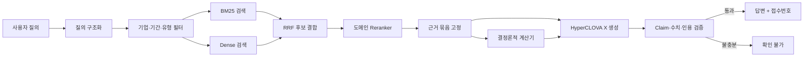

# HyperCLOVA X 기반 공시 질의응답 시스템의 설계 원리

> 문서 상태: 연구 기준선 v1.0  
> 기준일: 2026-08-12  
> 적용 범위: 제10회 2026 미래에셋증권 AI Festival 공시 Agent  
> 공식 제약: HyperCLOVA X만 LLM으로 사용, 주최 측 제공 코퍼스만 답변 근거로 사용

## 초록

이 과제에서 구축해야 할 대상은 거대 언어모델을 처음부터 사전학습한 독자 기반모델이 아니다. HyperCLOVA X를 생성기로 사용하면서 공시 전용 데이터 모델, 검색기, 재순위화기, 수치 연산기, 공시 이력 추적기, 근거 검증기와 답변 거절 정책을 자체 설계한 복합 질의응답 시스템이다. 이 구분이 중요한 이유는 언어모델의 다음 토큰 예측 목적함수가 사실의 진위, 숫자의 단위, 정정공시의 효력 또는 접수번호의 귀속을 보장하지 않기 때문이다.

권장 기준선은 다음과 같다. 질의를 기업·기간·공시유형·요구 연산으로 구조화한 뒤, 메타데이터 필터와 BM25·dense retrieval을 병렬 적용한다. Reciprocal Rank Fusion(RRF)으로 후보를 합치고, 질의-문서 동시 인코딩 reranker로 근거를 재정렬한다. 표와 재무 수치는 결정론적 코드가 계산하며, HyperCLOVA X는 검증된 근거 묶음을 자연어로 설명한다. 마지막으로 문장별 근거 귀속, 수치·단위·기간, 답변 가능 여부를 검사한다. 검색과 생성은 하나의 점수로 평가하지 않고 각각 분리 측정한다.

이 문서는 질의 처리·검색·생성·검증 계층을 다룬다. 원천 공시의 의미, 회계 기간과 정정 계보는 [공시 데이터 문서](disclosure_data_principles.md)를 정본으로 삼는다. 공식 제약과 평가항목은 [과제소개자료](../official/competition/과제소개자료_공시Agent.pdf) 4~8쪽에서 확인했다.

## 문서 안내

1. 연구 질문과 성공 조건
2. 언어모델 원리와 자체 구축 범위
3. 전체 아키텍처
4. 데이터 인덱싱
5. BM25·밀집 검색·결합·재순위화
6. 질의 이해와 분해
7. 표·수치 계산
8. HyperCLOVA X 사용 전략
9. 근거 귀속·검증·거절
10. 프롬프트 주입 방어
11. 평가 설계
12. 오픈소스 채택 기준
13. 실험 순서
14. 결론

| 구분 | 현재 상태 |
|---|---|
| 공식 제약·코퍼스 규모 | 공식 자료와 로컬 데이터로 확인 |
| 알고리즘 원리 | 논문·표준·공식 API 문서로 확인 |
| 권장 아키텍처 | 설계 가설 |
| 한국 공시에서의 검색·재순위화 우위 | 실험 필요 |
| HyperCLOVA X 튜닝 효과와 비용 | 실험 필요 |

## 1. 연구 질문과 성공 조건

연구 질문은 “어떤 LLM이 가장 똑똑한가”가 아니다. 공식 과제에서 LLM은 HyperCLOVA X로 고정되어 있다. 실제 질문은 다음 세 가지다.

1. 필요한 공시와 정확한 표·섹션을 제한시간 안에 얼마나 자주 찾는가?
2. 찾은 근거만으로 수치·비교·변경 이력을 재현 가능하게 계산하는가?
3. 근거가 불충분할 때 그럴듯한 답을 만들지 않고 답변을 거절하는가?

공식 평가자료는 정확성, 근거 완전성, 요구사항 충족, 근거 기반성, 추론 논리성, 안전성과 신뢰성, 정보한계 대응을 제시한다. 모든 답변에는 근거 공시가 포함되어야 한다. 따라서 시스템의 목적함수는 단순한 자연어 유창성이 아니라 다음의 결합이다.

\[
U = w_1 A + w_2 E + w_3 C + w_4 S - w_5 H - w_6 L
\]

- \(A\): 답변 사실·수치 정확성
- \(E\): 필수 근거 집합의 회수율과 인용 정확성
- \(C\): 질의 요구사항 충족률
- \(S\): 답변 불가 판별과 공격 대응 안전성
- \(H\): 근거 없는 주장 비율
- \(L\): 응답 지연과 비용

가중치는 비공개 평가식과 같다고 가정하지 않는다. 개발 중에는 각 축을 따로 기록해야 어느 단계가 병목인지 알 수 있다.

## 2. 언어모델이 하는 일과 하지 못하는 일

### 2.1 Transformer와 다음 토큰 예측

Transformer의 attention은 질의, 키, 값 벡터 사이의 관련도를 계산한다.

\[
\operatorname{Attention}(Q,K,V)
= \operatorname{softmax}\left(\frac{QK^\top}{\sqrt{d_k}}\right)V
\]

여러 attention head가 서로 다른 관계를 병렬로 학습하고, autoregressive decoder는 앞선 토큰만 보도록 causal mask를 적용한다. 기본 학습 목적은 다음 토큰의 음의 로그우도 최소화다.

\[
\mathcal{L}_{AR}(\theta)
= -\sum_t \log p_\theta(x_t \mid x_{<t})
\]

이 목적함수는 자연스러운 연속 문장을 학습하지만 “2025년 연결 매출이 맞는가”, “이 값이 억원인가 원인가”, “인용한 접수번호가 실제 근거인가”를 직접 최적화하지 않는다. 그래서 모델의 설명 능력과 사실 판정 능력을 분리해야 한다. Transformer의 원리는 Vaswani et al.(2017), autoregressive 대규모 언어모델의 학습·few-shot 특성은 Brown et al.(2020)을 참조한다.[^vaswani][^brown]

### 2.2 온도와 사실성은 다른 문제다

낮은 temperature와 고정 seed는 출력 변동성을 줄이는 운영 설정이다. 잘못된 근거를 일관되게 읽으면 같은 오답을 안정적으로 반복할 뿐이다. CLOVA Studio도 HyperCLOVA X를 확률적 언어모델로 설명한다.[^hcx-concepts] 재현 가능한 평가를 위해 낮은 temperature를 쓰되, 사실성은 검색·연산·검증 계층에서 확보해야 한다.

### 2.3 이 과제에서 “자체 구축”의 의미

자체 구축 범위는 다음과 같다.

- 공시 원문과 메타데이터의 정규화 스키마
- 기업·기간·공시유형 해석기
- sparse/dense 검색과 재순위화
- 원본-정정-철회 관계를 다루는 버전 그래프
- 표에서 추출·정규화한 재무 fact와 문서 span을 연결하는 근거 저장소
- 비교·증감률·기간 차분을 처리하는 수치 엔진
- HyperCLOVA X 호출과 상태 전이
- 인용·수치·답변 가능성 검증기
- 평가셋, 오류 분류체계, 지연·비용 관측

기반모델의 파라미터와 서비스 API는 네이버클라우드가 제공한다. 그러나 최종 시스템의 정확도를 좌우하는 기억 구조와 추론 경로는 우리가 설계한다.

## 3. 전체 아키텍처



그림 1. 생성기는 전체 시스템의 한 단계다. 검색 실패와 계산 오류를 프롬프트만으로 복구하려 하지 않고 단계별 계약과 검증으로 차단한다.

파이프라인은 유한 상태 그래프로 구현하는 편이 안전하다. 자유형 Agent가 임의의 도구를 무제한 호출하게 하지 않고 `parse_query → resolve_scope → retrieve → compute → synthesize → verify`의 상태와 최대 반복 횟수를 고정한다. 모든 도구는 제공 코퍼스에 대한 읽기 전용 작업이어야 한다.

## 4. 데이터 인덱싱

### 4.1 원문과 검색 단위를 분리한다

원문 보존 단위는 공시 접수 건이고, 검색 단위는 목적에 따라 달라진다.

| 계층 | 적합한 검색 질문 | 최소 메타데이터 |
|---|---|---|
| 공시 문서 | 어느 사업보고서인가 | 기업, 접수번호, 유형, 기준기간, 버전 |
| 섹션 | 어느 사업 영역·주석인가 | 문서 ID, 목차 경로, 순서 |
| 표 | 어느 재무·계약 표인가 | 표 ID, 제목, 단위, 행·열 헤더 |
| 문단·span | 어떤 설명 문장인가 | section ID, 문자 offset |
| 구조화 fact | 정확한 수치·날짜·상태는 무엇인가 | concept, period, unit, dimensions |

고정 길이 문자 청킹만 사용하면 목차 경계, 표 머리글과 본문 관계가 끊어진다. 기본 청크는 `section_path + table_caption + header context + content`로 구성하고, 긴 섹션 안에서만 문단 경계를 따라 세분한다. 각 청크는 원문 좌표와 해시를 가져야 한다.

### 4.2 부모-자식 검색

문서 전체 임베딩은 세부 사실을 희석하고, 작은 청크는 전역 맥락을 잃는다. 이 문제는 두 단계로 푼다.

1. 메타데이터와 문서·섹션 요약으로 부모 후보를 찾는다.
2. 선택된 부모 안에서 표·문단·fact를 다시 찾는다.

질문이 “2025년 사업보고서와 2023년 사업보고서의 핵심 사업 변화”라면 두 문서를 먼저 확정하고 각 문서의 동일 또는 대응 섹션을 찾는다. 전체 코퍼스에서 독립 청크만 검색하면 한 연도의 근거가 빠질 가능성이 높다.

### 4.3 문서 버전은 인덱스 필터다

정정공시는 단순한 키워드가 아니다. 기본 질의는 기준시점 이전 최신 유효본을 대상으로 하고, “최초 발표 당시” 같은 질문만 최초본을 선택한다. `effective_version_id`와 `valid_from/valid_to`가 결정되기 전에는 검색 결과를 최종 근거로 승격하지 않는다.

## 5. 검색 알고리즘

### 5.1 BM25는 공시 검색의 강한 기준선이다

BM25 점수는 문서 길이를 보정한 단어 빈도와 역문서빈도를 결합한다.

\[
\operatorname{BM25}(D,Q)=\sum_{q_i\in Q} IDF(q_i)
\frac{f(q_i,D)(k_1+1)}{f(q_i,D)+k_1(1-b+b|D|/\operatorname{avgdl})}
\]

공시에는 기업명, 종목코드, 접수번호, 계정과목, 보고서명, 연도와 분기 같은 exact token이 많다. 이런 값은 lexical 검색이 잘 찾는다. 반면 “설비 투자”와 “신규시설투자”, “매출”과 “영업수익”처럼 표현이 달라지면 재현율이 낮아질 수 있다. BM25의 이론과 실무적 형태는 Robertson and Zaragoza(2009)를 따른다.[^bm25]

### 5.2 Dense retrieval은 의미적 어휘 차이를 보완한다

Dual encoder는 질의와 문서를 독립적으로 임베딩한다.

\[
q=E_q(Q),\quad d=E_d(D),\quad s(q,d)=q^\top d
\]

대조학습은 정답 문서의 점수를 같은 배치의 음성 문서보다 높인다.

\[
\mathcal{L}_{ret}=-\log
\frac{\exp s(q,d^+)}{\sum_j \exp s(q,d_j)}
\]

DPR은 일부 open-domain QA 데이터셋에서 BM25보다 높은 top-20 회수율을 보였지만, 그 결과가 한국 공시 표와 숫자 질의에 자동으로 전이되지는 않는다.[^dpr] Dense 단독 채택이 아니라 BM25와의 ablation이 필요하다.

CLOVA Studio Embedding v2는 `bge-m3`를 제공한다. 공식 API는 dense embedding을 반환하며, BGE-M3 논문의 sparse와 multi-vector 출력을 자동 제공하는 것은 아니다.[^hcx-embedding][^bgem3] 이 차이를 구현 문서에 명시해야 한다.

위 내적식은 DPR의 일반식이다. CLOVA Embedding v2 출력은 정규화되어 있지 않고 공식 유사도는 cosine이므로, 실제 구현은 cosine을 직접 계산하거나 두 벡터를 L2 정규화한 뒤 inner product를 사용한다.

### 5.3 Hybrid와 RRF

BM25 점수와 cosine similarity는 척도가 다르므로 원점수를 그대로 더하면 데이터셋마다 보정이 필요하다. RRF는 순위만 사용한다.

\[
\operatorname{RRF}(d)=\sum_{r\in \mathcal{R}}
\frac{1}{k+\operatorname{rank}_r(d)}
\]

초기값은 원 논문에서 널리 쓰인 \(k=60\)으로 두되, 공시 평가셋에서 조정한다. RRF는 여러 TREC 검색 결과에서 강한 결합 성능을 보였지만, 한국 공시에 대한 우월성은 실험으로 증명해야 한다.[^rrf]

권장 실험은 `BM25`, `dense`, `RRF hybrid` 세 조건의 Recall@k와 MRR 비교다. 기업·기간·공시유형 필터는 가능하면 검색 전에 적용한다.

### 5.4 Reranker

Dual encoder는 빠르지만 질의와 문서의 토큰 상호작용을 압축된 한 벡터에 담는다. Cross-encoder는 `[query; candidate]`를 함께 읽어 더 정밀하게 점수화하므로 RRF 상위 후보에만 적용한다. ColBERT의 late interaction은 각 질의 토큰에 가장 가까운 문서 토큰을 결합한다.

\[
s(q,d)=\sum_i \max_j E_q(q_i)\cdot E_d(d_j)
\]

이는 dual encoder와 full cross-encoder 사이의 선택지다.[^colbert] CLOVA Studio에도 관련도 기반 Reranker API가 있고, 검색 문서와 질의의 관련도를 평가해 인용 문서를 반환한다.[^hcx-reranker] 공식 문서가 내부 구조를 cross-encoder라고 밝힌 것은 아니므로 cross-encoder와 ColBERT는 별도 구현 후보로 취급한다. 어떤 방식이 대회 데이터에 최적인지는 별도 gold relevance set으로 검증한다.

## 6. 질의 이해와 분해

질의 구조체는 최소한 다음 필드를 가진다.

```json
{
  "companies": ["corp_code"],
  "time_scope": {"start": null, "end": null, "period_type": null},
  "filing_types": [],
  "metrics_or_events": [],
  "operation": "lookup|compare|aggregate|history|summarize",
  "basis": "CFS|OFS|unspecified",
  "answer_shape": "number|boolean|list|explanation",
  "ambiguities": []
}
```

복합 질문은 독립적으로 검증 가능한 하위 질문으로 분해한다. 예를 들어 두 기업의 2025년 설비투자를 비교하는 질문은 다음의 네 단계다.

1. 기업 A와 B를 각각 `corp_code`로 해소한다.
2. 같은 기간·같은 회계 범위의 설비투자 근거를 각 기업에서 찾는다.
3. 단위와 누적/단독 기간을 맞춘다.
4. 코드가 두 값을 비교하고 LLM은 결과와 근거를 설명한다.

Self-Ask는 명시적 후속 질문 분해, IRCoT는 근거를 얻은 뒤 다음 검색을 갱신하는 방식을 제안했다.[^selfask][^ircot] 이 원리를 가져오되 무제한 chain-of-thought를 노출하지 않는다. 공식 API 응답 예시의 `think_trace`는 세부 스펙 확정 전까지 내부 도구 호출 요약과 검증 로그로 설계하고, 모델의 비공개 추론 전문을 저장·반환하는 것으로 가정하지 않는다.

## 7. 표와 숫자는 프로그램으로 계산한다

금융 QA는 텍스트 span뿐 아니라 표와 계산을 요구한다. FinQA는 전문가가 작성한 재무 질문과 gold reasoning program을 제공했고, TAT-QA는 텍스트와 표에서 관련 셀·span을 추출한 뒤 symbolic operator를 적용하는 TAGOP을 제안했다.[^finqa][^tatqa]

이 과제에 적용할 계산 계약은 다음과 같다.

```text
CalculationRecord
  operation: subtract | add | divide | percent_change | compare | count
  operands:
    - fact_id
    - normalized_value
    - unit
    - period
    - scope(CFS/OFS)
  formula
  result
  rounding_rule
  supporting_rcept_no[]
```

LLM은 연산 계획과 설명을 담당할 수 있지만 최종 산술은 코드가 수행한다. 연산 전에 다음 불변식을 검사한다.

- 통화와 표시 단위가 동일하거나 명시적으로 변환됨
- 연결/별도 범위가 동일함
- instant와 duration을 혼합하지 않음
- 분기 단독과 누적 기간을 혼동하지 않음
- 0, 미공시, nil, 대시를 구분함
- 정정 버전과 질의 기준시점이 맞음

검사 실패는 추정값 생성이 아니라 `insufficient_evidence`로 종료한다.

## 8. HyperCLOVA X 사용 전략

### 8.1 공식 기능을 설계 입력으로 취급한다

2026-08-12 공식 문서 기준으로 CLOVA Studio는 Chat Completions, function calling, structured outputs, embedding, Reranker, RAG Reasoning과 tuning API를 제공한다.[^hcx-overview] 기능 지원은 모델별로 다르다. 특히 tuned model에서 function calling 또는 structured outputs를 당연히 사용할 수 있다고 가정하면 안 된다. 현재 모델 지원표와 API 제한을 구현 직전에 다시 확인해야 한다.[^hcx-models][^hcx-fc]

안전한 기준선은 애플리케이션이 검색과 연산을 직접 통제하고, 구조화 출력을 지원하는 기본 모델이 최종 응답 JSON을 생성하도록 하는 것이다. RAG Reasoning API는 function calling 형식으로 검색 도구를 선택하고 도구 결과의 문서 ID를 인용에 사용할 수 있다. Reranker와의 체이닝도 공식적으로 안내된다.[^hcx-rag][^hcx-reranker]

### 8.2 내부 생성·검증 스키마 제안

모델 출력과 서버가 검증한 최종 응답을 분리한다. 모델은 서버가 발급한 근거 ID만 선택한다.

```json
{
  "status": "answered|insufficient_evidence|clarification_required",
  "answer": "최종 답변",
  "claims": [
    {
      "claim_id": "C1",
      "text": "검증 가능한 한 문장",
      "evidence_ids": ["E1"]
    }
  ],
  "calculations": [],
  "warnings": []
}
```

서버는 스키마·근거·계산 검증을 통과한 뒤 `question_id`, `rcept_nos`, 검증 상태를 삽입해 `VerifiedResponse`를 만든다. 모델이 접수번호 문자열을 새로 쓰지 않게 하여 존재하지 않는 인용 생성 가능성을 구조적으로 줄인다. 이 스키마는 내부 계약이며 공식 예시를 대체하지 않는다. 대외 API adapter는 주최 측의 최종 명세에 맞춰 `question_id`, `question`, `retrieved_context`, `think_trace`, `answer` 등으로 변환한다. `think_trace`는 비공개 사고 전문이 아니라 선택 근거·도구 호출·검증 결과의 구조화 요약으로 정의한다.

### 8.3 Fine-tuning의 역할

RAG와 tuning은 경쟁 관계가 아니다.

| 대상 | 우선 수단 | 이유 |
|---|---|---|
| 공시 사실·정정값 | RAG/구조화 저장소 | 갱신·삭제·출처 추적 가능 |
| 기업·기간·유형 분류 | prompt 후 tuning 후보 | 반복되는 행동 패턴 |
| JSON 형식·인용 행동 | structured output 또는 tuning | 출력 계약 안정화 |
| 근거 없을 때 거절 | 규칙 + tuning 후보 | 위험 행동 억제 |
| 숫자 계산 | 결정론적 코드 | 재현성과 정확성 |

사실을 파라미터에 외우게 하면 정정 반영과 출처 복원이 어렵다. 먼저 untuned RAG 기준선을 만들고 오류가 반복되는 행동만 tuning 대상으로 삼는다. RAFT는 정답 문서와 distractor를 함께 주어 관련 근거를 인용하고 무관 문서를 무시하도록 학습하는 아이디어를 제공한다.[^raft] 다만 한국 공시와 HyperCLOVA X에서의 이득은 미확인이므로 ablation 없이 채택하지 않는다.

## 9. 근거 귀속과 검증

### 9.1 인용은 장식이 아니다

다음 세 지표를 분리한다.

- citation correctness: 인용한 근거가 해당 claim을 실제로 지지하는가
- citation completeness: 검증 가능한 모든 claim에 필요한 근거가 붙었는가
- citation precision: 불필요하거나 틀린 인용이 섞이지 않았는가

답이 우연히 맞아도 접수번호가 틀리면 근거 기반 답변이 아니다. ALCE는 유창성·정확성·인용 품질을 분리 평가했고, 자기 인용 프롬프트만으로 완전한 support를 보장하지 못함을 보였다.[^alce]

### 9.2 Claim 단위 검증

1. 답변을 독립적인 atomic claim으로 나눈다.
2. 각 claim이 선택한 evidence span에서 entail되는지 검사한다.
3. 숫자 claim은 값·단위·기간·연결범위·수식을 다시 계산한다.
4. 접수번호가 evidence registry에 실제 존재하는지 확인한다.
5. 하나라도 실패하면 해당 claim을 제거·재생성하거나 전체를 답변 불가로 전환한다.

검증 주체는 위험에 따라 나눈다. 접수번호 존재성, 수치·단위·기간과 수식은 규칙·코드로 판정한다. 문장과 근거의 의미적 함의는 우선 HyperCLOVA X의 제한된 판정 프롬프트로 후보를 거르고, 사람이 라벨링한 검증셋에서 오탐·미탐을 측정한다. 별도 자연어추론 모델은 한국 공시 gold set에서 현재 방식보다 유의하게 나을 때만 도입한다. 같은 생성 모델의 자기검증 결과만으로 통과를 확정하지 않는다.

FActScore의 atomic fact 분해는 장문 답변에서 어떤 사실이 미지원인지 진단하는 데 유용하다.[^factscore] Closed API인 HyperCLOVA X에는 모델 내부 gradient 기반 attribution을 적용할 수 없으므로, 입력 근거와 출력 claim의 post-hoc 검증을 사용한다.

### 9.3 답변 거절

거절은 실패가 아니라 평가 대상 기능이다. 다음 중 하나면 답변을 중단한다.

- 기업 또는 기준기간이 복수로 해석되고 해소되지 않음
- 필수 하위질문 슬롯 중 하나 이상에 검증 가능한 근거가 없음
- 정정본 사이에 해결되지 않은 충돌이 있음
- 표 단위·기간·연결범위를 확정할 수 없음
- 계산기의 피연산자가 부족함
- claim-evidence 검증이 임계값 미달
- 질문이 제공 기간 밖 사실, 뉴스, 미래 예측 또는 투자 의견을 요구함

검색 top score 하나만으로 답변 가능 여부를 결정하지 않는다. 개발셋에서 threshold를 보정하고 `unanswerable인데 답함`을 별도 위험지표로 둔다.

## 10. Prompt injection과 안전성

검색된 문서나 사용자 질문 안의 자연어 명령이 시스템 지시와 같은 채널로 들어가면 indirect prompt injection이 가능하다.[^greshake] RAG와 fine-tuning도 이 문제를 완전히 제거하지 못한다는 것이 OWASP의 현재 지침이다.[^owasp]

이 프로젝트의 방어 원칙은 다음과 같다.

- 공시 원문을 `<evidence>` 데이터 영역으로 분리하고 내부 명령을 실행하지 않음
- LLM에 파일·네트워크·셸·쓰기 권한을 부여하지 않음
- 도구 이름·인자·호출 횟수를 allowlist와 schema로 제한
- 사용자 입력과 원문에서 숨은 Unicode·HTML·인코딩 패턴 검사
- 출력 JSON validation과 접수번호 존재성 검사
- 시스템 프롬프트 요구, 근거 조작, 제공 데이터 밖 검색 요청을 공격셋에 포함
- 모든 요청, 검색 결과 ID, 도구 호출, 검증 실패를 감사 로그로 보존

공시 코퍼스는 주최 측 고정 데이터라 임의 웹 문서보다 오염 위험이 낮다. 그래도 사용자가 질문에 공격 지시를 넣을 수 있고, XML/HTML 안의 문자열을 지시로 오해할 수 있으므로 데이터와 명령의 분리는 유지한다.

## 11. 평가 설계

### 11.1 검색 평가

- Recall@k: 필요한 근거 중 top-k에 들어온 비율
- Precision@k: top-k 중 관련 근거 비율
- MRR: 첫 정답 근거 순위의 역수 평균
- nDCG@k: 관련성 등급과 순위를 함께 반영
- evidence-set recall: 복합 답변에 필요한 모든 문서를 함께 회수했는가
- metadata accuracy: 기업·기간·공시유형·버전 선택이 맞는가

첫 번째 목표는 Recall@k다. 생성기는 검색되지 않은 근거를 사용할 수 없다. 문서 회수와 문서 내부 section/table 회수를 따로 측정한다.

### 11.2 답변 평가

- 숫자·factoid exact match와 허용 오차
- 요구사항 coverage
- atomic factual precision
- citation correctness/completeness/precision
- 계산식·피연산자·단위·기간 정확성
- answerability accuracy와 false-answer rate
- 공격 요청에 대한 unsafe compliance rate
- p50/p95 latency, 토큰, 비용/query

RAGAS는 context relevance, faithfulness와 answer quality의 빠른 회귀 측정에 쓸 수 있다.[^ragas] 그러나 LLM judge의 판정을 정답으로 취급하지 않는다. ARES가 소량 인간 라벨로 자동 judge를 보정한 것처럼, 핵심 테스트는 사람이 확인한 gold 근거와 계산식을 유지한다.[^ares]

### 11.3 평가셋 층화

| 유형 | 대표 위험 |
|---|---|
| 단일 공시 factoid | 정확한 셀·span 회수 |
| 표 수치 | 단위·열 헤더 |
| 기간 비교 | 누적/단독, instant/duration |
| 기업 비교 | 범위·통화·결산월 정합성 |
| 정정 이력 | 최신 유효본과 최초본 구분 |
| 다중 문서 종합 | evidence-set 누락 |
| 계산 | 식·피연산자·반올림 |
| 근거 없음 | 거절 행동 |
| 미래 예측·투자의견 | 범위 밖 요청 거절 |
| prompt injection | 지시/데이터 분리 |

train/dev/test는 질문 문구만 무작위 분할하지 않는다. 같은 문서·기업·정정 계열이 양쪽에 걸리면 누출된다. 문서, 기업, 시점 단위 split을 병행해 일반화 성능을 본다.

## 12. 오픈소스에서 가져올 것과 가져오지 않을 것

오픈소스 저장소는 완제품이 아니라 알고리즘 후보군이다. 다음 절차로 채택한다.

1. 논문 또는 공식 문서에서 알고리즘과 가정을 확인한다.
2. 저장소의 라이선스와 실제 구현을 읽는다.
3. 우리 인터페이스로 최소 구현하거나 격리 adapter를 만든다.
4. 제공 코퍼스 gold set에서 기존 기준선과 ablation한다.
5. 정확도·지연·메모리·실패 모드를 함께 기록한다.
6. 이득이 재현된 구성만 승격한다.

가져올 후보는 BM25, RRF, dense dual encoder, cross-encoder/late-interaction reranking, structure-aware chunking, query decomposition, claim-level evaluation이다. 가져오지 말아야 할 것은 외부 LLM 호출, 뉴스·위키가 섞인 검색 connector, 설명되지 않는 투자 의견, 전체 프레임워크의 불필요한 agent abstraction이다.

## 13. 권장 실험 순서

| 단계 | 산출물 | 승격 조건 |
|---|---|---|
| Oracle 기준선 | gold 문서를 준 HCX 답변 | 생성·인용 성능의 상한과 오류 유형 확보 |
| Lexical 기준선 | metadata filter + BM25 결과 | parser 오류 분리, Recall@k 기준값 확보 |
| Hybrid | dense + RRF ablation | 단일 검색보다 전체 Recall 또는 MRR 개선 |
| 재순위화 | 상위 후보와 지연 | Recall을 훼손하지 않고 상위 precision 개선 |
| 구조·복합 검색 | 문서→섹션→표 근거 묶음 | multi-hop evidence-set recall 개선 |
| 정정 그래프 | 시점별 선택 결과 | 수작업 version-chain 정답과 일치 |
| 계산·검증기 | 계산·claim 판정 기록 | 수치 exact match와 인용 위험 한도 충족 |
| 튜닝 후보 | untuned 대비 ablation | 반복 행동 오류가 유의하게 감소 |
| 비용 최적화 | p50/p95·요청비용 | 정확도 회귀 없이 운영 한도 충족 |

각 단계는 이전 단계와 같은 평가셋·seed·시간예산으로 비교한다. 목표 수치는 평가셋과 위험 허용도를 정한 뒤 확정하며, 실제 ΔRecall@k, Δcitation correctness, Δlatency로 채택 여부를 결정한다.

## 14. 결론

공시 Agent의 품질은 LLM 크기보다 근거가 손실 없이 이동하는 경로에 달려 있다. 질문에서 기업과 기간을 해소하고, 올바른 버전의 공시를 찾고, 표의 단위와 회계 범위를 보존하고, 계산 결과에 원본 fact ID를 전파해야 한다. HyperCLOVA X는 이 검증된 상태를 사람이 읽을 수 있는 답으로 바꾸는 생성기다. 검색되지 않은 사실을 복원하거나 잘못된 숫자를 진실로 만드는 장치가 아니다.

따라서 첫 구현의 우선순위는 튜닝이 아니라 평가 가능한 retrieval baseline, 근거 스키마와 결정론적 계산기다. 이 세 가지가 안정된 뒤에야 agent loop나 tuning의 실제 가치를 측정할 수 있다.

### 방법론과 한계

이 문서는 공식 과제자료·네이버클라우드 문서, 검색/RAG·금융 QA의 1차 논문, 제공 데이터셋 실사와 StockBot V3 읽기 전용 감사를 종합했다. 논문에서 보고된 성능은 한국어 공시와 HyperCLOVA X에 그대로 전이된다고 보지 않았다. 아직 공시 QA gold set, 모델별 비용·지연, 재순위화와 튜닝의 실제 이득은 미확인이다. 구현 단계에서는 공식 API 지원표를 다시 확인하고 각 구성요소를 독립 ablation으로 검증해야 한다.

## 참고문헌

[^vaswani]: Vaswani et al. (2017), [Attention Is All You Need](https://arxiv.org/abs/1706.03762).
[^brown]: Brown et al. (2020), [Language Models are Few-Shot Learners](https://arxiv.org/abs/2005.14165).
[^hcx-concepts]: NAVER Cloud, [CLOVA Studio concepts](https://guide.ncloud-docs.com/docs/en/clovastudio-info).
[^bm25]: Robertson and Zaragoza (2009), [The Probabilistic Relevance Framework: BM25 and Beyond](https://www.ccs.neu.edu/home/vip/teach/IRcourse/IR_surveys/robertson_foundations.pdf).
[^dpr]: Karpukhin et al. (2020), [Dense Passage Retrieval for Open-Domain Question Answering](https://aclanthology.org/2020.emnlp-main.550/).
[^hcx-embedding]: NAVER Cloud, [CLOVA Studio Explorer API tools](https://guide.ncloud-docs.com/docs/en/clovastudio-explorer03).
[^bgem3]: Chen et al. (2024), [BGE M3-Embedding](https://arxiv.org/abs/2402.03216).
[^rrf]: Cormack, Clarke and Büttcher (2009), [Reciprocal Rank Fusion outperforms Condorcet and individual rank learning methods](https://cormack.uwaterloo.ca/cormacksigir09-rrf.pdf).
[^colbert]: Khattab and Zaharia (2020), [ColBERT: Efficient and Effective Passage Search via Contextualized Late Interaction over BERT](https://arxiv.org/abs/2004.12832).
[^hcx-reranker]: NAVER Cloud, [CLOVA Studio Reranker API](https://api.ncloud-docs.com/docs/en/clovastudio-reranker).
[^selfask]: Press et al. (2023), [Measuring and Narrowing the Compositionality Gap in Language Models](https://arxiv.org/abs/2210.03350).
[^ircot]: Trivedi et al. (2023), [Interleaving Retrieval with Chain-of-Thought Reasoning for Knowledge-Intensive Multi-Step Questions](https://arxiv.org/abs/2212.10509).
[^finqa]: Chen et al. (2021), [FinQA: A Dataset of Numerical Reasoning over Financial Data](https://aclanthology.org/2021.emnlp-main.300/).
[^tatqa]: Zhu et al. (2021), [TAT-QA: A Question Answering Benchmark on a Hybrid of Tabular and Textual Content in Finance](https://aclanthology.org/2021.acl-long.254/).
[^hcx-overview]: NAVER Cloud, [CLOVA Studio API overview](https://api.ncloud-docs.com/docs/en/ai-naver-clovastudio-summary).
[^hcx-models]: NAVER Cloud, [CLOVA Studio models](https://guide.ncloud-docs.com/docs/en/clovastudio-model).
[^hcx-fc]: NAVER Cloud, [Chat Completions v3 Function calling](https://api.ncloud-docs.com/docs/en/clovastudio-chatcompletionsv3-fc).
[^hcx-rag]: NAVER Cloud, [RAG Reasoning API](https://api.ncloud-docs.com/docs/en/clovastudio-ragreasoning).
[^raft]: Zhang et al. (2024), [RAFT: Adapting Language Model to Domain Specific RAG](https://arxiv.org/abs/2403.10131).
[^alce]: Gao et al. (2023), [Enabling Large Language Models to Generate Text with Citations](https://arxiv.org/abs/2305.14627).
[^factscore]: Min et al. (2023), [FActScore: Fine-grained Atomic Evaluation of Factual Precision in Long Form Text Generation](https://arxiv.org/abs/2305.14251).
[^greshake]: Greshake et al. (2023), [Not what you've signed up for: Compromising Real-World LLM-Integrated Applications with Indirect Prompt Injection](https://arxiv.org/abs/2302.12173).
[^owasp]: OWASP, [LLM01:2025 Prompt Injection](https://genai.owasp.org/llmrisk/llm01-prompt-injection/).
[^ragas]: Es et al. (2024), [RAGAS: Automated Evaluation of Retrieval Augmented Generation](https://aclanthology.org/2024.eacl-demo.16/).
[^ares]: Saad-Falcon et al. (2024), [ARES: An Automated Evaluation Framework for Retrieval-Augmented Generation Systems](https://aclanthology.org/2024.naacl-long.20/).
