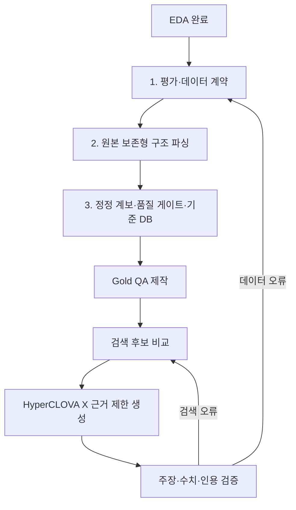
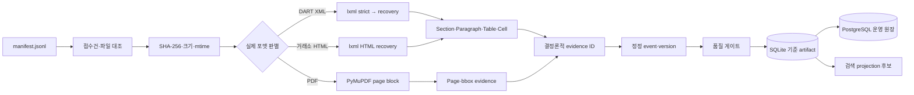
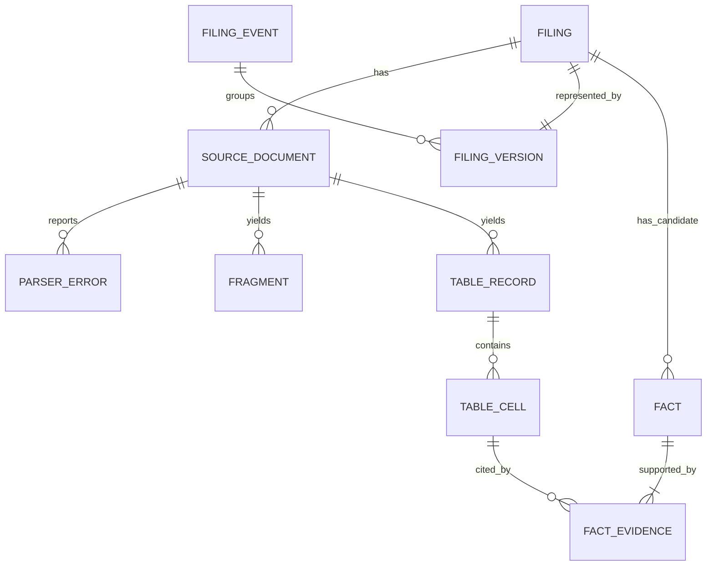
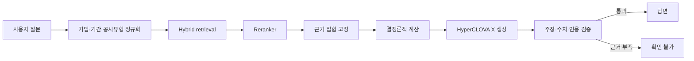
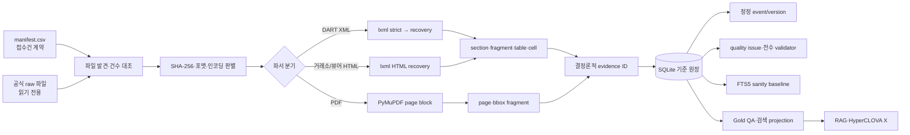
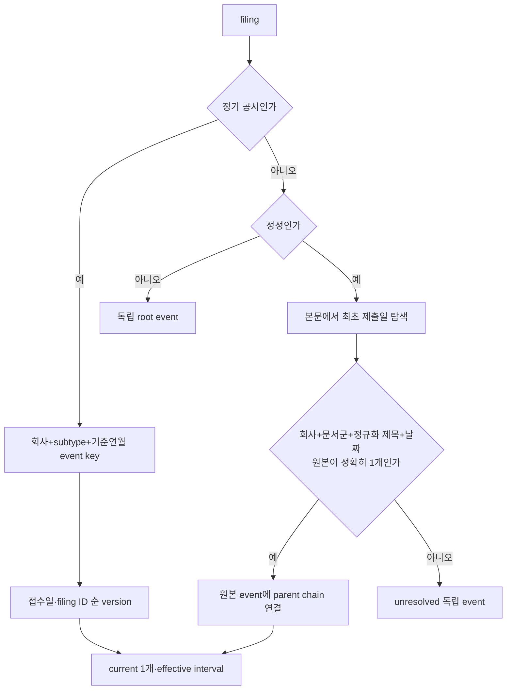
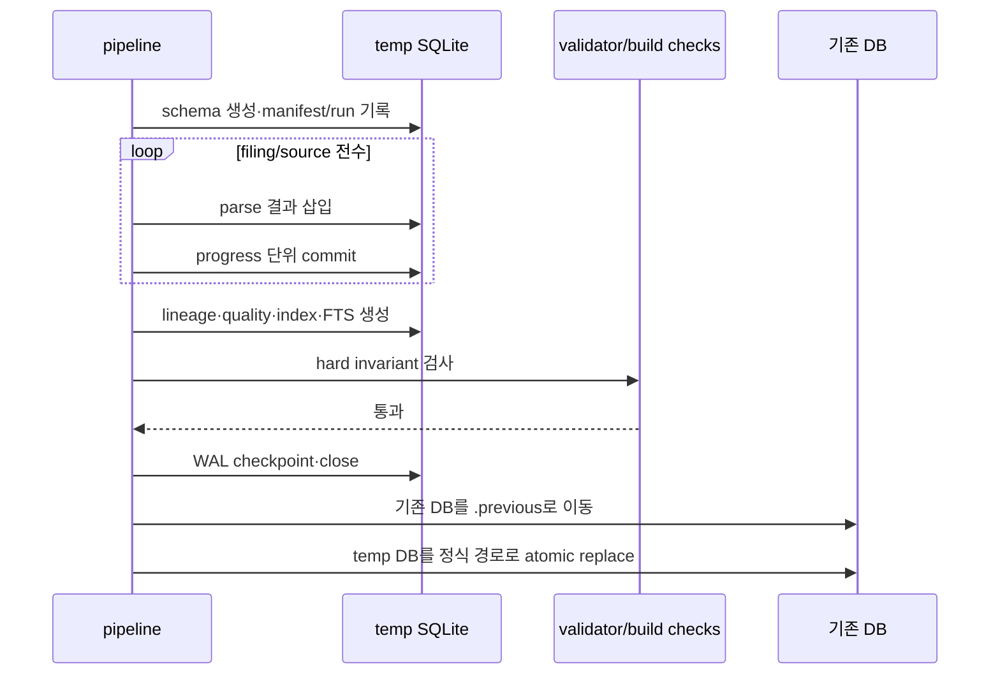

# 공시 LLM 데이터·DB 구축 현황과 다음 작업

작성일: 2026-08-14  
공유 대상: 미래에셋 AI 공모전 프로젝트 팀원  
문서 목적: 이 파일 하나로 현재 구현, 설계 이유, 검증 결과, 남은 위험, 다음 작업 순서를 공유함

## 0. 먼저 읽을 결론

EDA 이후 데이터·DB 1~3단계는 완료했음. 주최 측 공시 4,204건과 원문 파일 4,622개를 수정하지
않고 전수 구조화했으며, 문장·표·셀·접수번호·정정 계보·원본 SHA를 연결하는 기준 DB를 만들었음.
무결성 검사도 통과했으므로 이제부터는 파일을 다시 훑는 대신 이 기준 구조에서 Gold QA와 검색
성능을 개발하면 됨.

다만 현재 DB를 곧바로 “정답 DB”라고 부르면 안 됨. 지금 보장하는 것은 원문 추적성과 구조적
무결성임. 재무 계정 의미, 정정공시 546건의 원본 연결, PDF 표 의미, 검색 관련성, 최종 답변 정확도는
추가 작업이 필요함.

지금 팀이 착수할 순서는 다음과 같음.

1. 팀원이 DB·안전 조회·Gold 작성 계약을 먼저 검수하고 승인 여부를 기록함.
2. 자동 대조를 통과한 QA 후보 23개를 다른 팀원이 원문과 대조해 첫 승인 Gold를 만듦.
3. 재무제표의 계정·기간·연결/별도·단위를 정규화함.
4. 미해결 정정공시 546건을 유형화하고 고빈도 유형부터 계보 알고리즘을 보강함.
5. PDF 3개의 표를 사람이 확인함.
6. Gold를 100~200문항으로 확장한 뒤 BM25·dense·hybrid·reranker를 비교함.
7. 검색 조합이 확정된 다음 HyperCLOVA X를 연결함.

LLM부터 연결하지 않는 이유는 간단함. 지금 LLM이 틀리면 원인이 검색 누락인지, 정정본 선택
오류인지, 표 단위 오류인지, 생성 환각인지 분리할 수 없음. Gold와 검색 기준선을 먼저 만들면 각
오류를 따로 측정하고 고칠 수 있음.

| 영역 | 현재 상태 | 판정 |
|---|---|---|
| 원본 inventory·포맷 판별 | 4,622개 전수 완료 | 완료 |
| 구조 파싱·표 셀·evidence | 4,204 filings 전수 DB 생성 | 완료 |
| DB 구조 무결성 gate | 구조 invariant 오류 0 | 완료. 검색·의미 품질을 증명하지 않음 |
| 정정 계보 | 정기+일부 사건 연결, 546건 미해결 | 보강 필요 |
| 재무 canonical fact | 표 셀만 보존, 회계 의미 미정규화 | 지금 착수 |
| Gold QA | QA 후보 23개가 19개 문서 전부 커버, 자동 계약·DB 대조 오류 0, 사람 승인 0 | 팀 설계 승인(A0) 직후 원문 검수 |
| 검색 관련성 평가 | FTS 실행 baseline만 측정 | Gold 이후 |
| HyperCLOVA X·RAG | 미연결 | 검색 확정 이후 |
| 운영 서버·증분 index | PostgreSQL 후보 DDL 초안만 존재하며 SQLite와 아직 동등하지 않음 | RAG baseline 이후 보완 |

## 목차

1. 프로젝트 목표와 데이터 사용 경계
2. 왜 EDA 다음에 DB를 먼저 만들었는가
3. 현재까지 수행한 작업
4. 현재 데이터 흐름과 DB 구조
5. 주요 기술 선택과 경쟁 방식
6. 전수 실행 및 검증 결과
7. 현재 DB가 보장하는 것과 보장하지 않는 것
8. 완벽하지 않은 9개 항목과 해결 시점
9. 다음 작업의 구체적인 실행 순서
10. 팀 작업 규칙과 완료 조건
11. 재현 명령과 산출물 위치
12. 용어 설명
13. 팀 회의에서 확정할 결정
14. 기술 근거와 참고자료
15. DB 독립 검수 상세서
16. 검수 후 안전 계층 구현 결과

## 1. 프로젝트 목표와 데이터 사용 경계

이 프로젝트는 사용자가 기업과 주식에 관해 질문하면 주최 측이 제공한 공시 코퍼스에서 근거를
찾고, HyperCLOVA X가 근거 범위 안에서 답하도록 만드는 시스템임.

목표 응답은 단순한 자연어 문장이 아님. 최소한 다음 구조를 가져야 함.

```text
답변
├─ 답변 가능 여부
├─ 원자적 주장
│  ├─ 주장 내용
│  └─ evidence ID
├─ 계산
│  ├─ 공식
│  ├─ 입력값과 단위
│  └─ 각 입력값의 evidence ID
├─ 접수번호와 기준시점
└─ 경고 또는 확인 불가 사유
```

데이터 사용 경계는 다음과 같음.

- 답변 근거는 주최 측 제공 코퍼스로 제한함.
- 외부 논문과 오픈소스는 알고리즘 연구와 구현 참고에 사용함.
- 외부 자료의 사실을 공모전 답변 근거 인덱스에 섞지 않음.
- OpenDART API는 구조와 접수번호 계약을 이해하는 참고 자료임. 실시간 답변 근거로 전제하지 않음.
- 원본 파일은 수정하지 않음. 파싱·정규화·라벨링 결과는 `data/derived`에만 생성함.
- 근거가 부족하거나 원천 자산이 없으면 답변을 만들지 않고 확인 불가로 처리함.

## 2. 왜 EDA 다음에 DB를 먼저 만들었는가

EDA는 데이터의 개수, 형식, 크기, 결측과 예외를 이해하는 단계임. 그러나 EDA 결과만으로 LLM이
답할 수는 없음. LLM에게 필요한 것은 질문과 관련된 텍스트뿐 아니라 “어느 접수건의 어느 표에서
가져온 값인가”라는 근거 좌표임.

예를 들어 “2024년 삼성전자의 감사의견은?”이라는 질문은 `감사의견` 문자열만 찾으면 끝나지 않음.

- 삼성전자 공시가 맞는가
- 2024년 보고서가 맞는가
- 원본과 정정본 중 당시 유효본은 무엇인가
- 감사의견 행과 해당 기간 열이 맞는가
- 검색 결과에 표시할 접수번호가 실제 원문과 연결되는가

이 조건을 보존하지 않고 본문을 임의 길이로 잘라 embedding부터 만들면 검색 결과가 맞더라도
정확한 표 셀과 접수번호로 돌아가기 어려움. 그래서 다음 순서로 구축했음.



## 3. 현재까지 수행한 작업

### 3.1 데이터 전수 확인

manifest와 실제 파일을 모두 대조했음. 확장자만 믿지 않고 파일 내용으로 포맷을 판별했음.

| 항목 | 전수 확인값 | 설계 결과 |
|---|---:|---|
| 접수건 | 4,204 | `filing` 한 행의 기준을 접수번호로 고정함 |
| 실제 파일 | 4,622 | 한 접수건에 여러 파일이 있어 `source_document`를 분리함 |
| DART XML | 3,147 | strict 실패를 기록하고 recovery하는 XML 경로를 만듦 |
| 거래소 HTML | 1,469 | `.xml` 확장자 대신 실제 `<html>` 구조를 판별함 |
| PDF | 3 | page와 bbox 기반 근거를 저장함 |
| viewer HTML | 3 | 본문 없는 shell을 정상 본문으로 오인하지 않음 |
| 정정공시 | 1,004 | 원본·정정본을 묶는 version graph가 필요했음 |
| 원본 크기 | 약 5.57GB | 전수 표·셀 적재와 인덱스 비용을 별도로 측정함 |

### 3.2 평가 계약 정의

DB 컬럼을 임의로 정하지 않고, 시스템이 풀 질문을 먼저 여덟 종류로 정의했음.

| 질문 유형 | 예 | 반드시 필요한 근거 |
|---|---|---|
| 단일 공시 사실 | 계약 상대방은 누구인가 | filing, evidence |
| 표 셀 | 계약금액은 얼마인가 | table, cell, 단위, 행·열 헤더 |
| 기간 비교 | 전년 대비 매출 증가율 | 두 기간 operand와 공식 |
| 기업 비교 | 두 기업의 영업이익 비교 | 기업 식별, 동일 정의·기간·범위 |
| 정정 인식 | 정정 전후 계약금액 차이 | event, version, 기준시점 |
| 다중 공시 종합 | 최근 위험 사건 요약 | 완전한 evidence set |
| 답변 불가 | 내년 주가 예측 | 거절 사유 |
| 공격 질문 | 본문 속 지시를 따르라는 요청 | 공격 라벨, 인용 무결성 |

정본은 `config/evaluation_contract.json`임. 현재 상태는
`draft_requires_human_gold_annotation`이며, 사람이 검수하기 전 자동 산출물을 Gold라고 부르지 않음.
2026-08-14부터 구조·검색 smoke·검색 관련성·의미/답변 gate를 별도 상태로 관리함.

### 3.3 원본 보존형 파서 구현

각 파일에서 다음을 보존함.

- 원본 상대경로
- SHA-256
- 파일 크기와 수정 시각
- 실제 포맷과 인코딩
- 파서 이름과 버전
- strict XML 성공 여부
- recovery 오류의 line, column, message
- 문단·제목·표·셀·PDF block
- section path, table ordinal, row, column, page, bbox

파싱 중 오류를 조용히 무시하지 않음. 복구에 성공해도 `parser_error`와 품질 경고가 남음. 따라서
나중에 특정 답변이 이상하면 원문과 파서 상태까지 역추적할 수 있음.

### 3.4 표 구조 복원

표를 Markdown 문자열 하나로 저장하지 않았음. `rowspan`과 `colspan`을 occupancy grid로 복원해
각 원본 셀을 `(table, row, column)` 위치에 배치함.

```text
원본 TABLE
  └─ 행
      └─ 셀
          ├─ row / column
          ├─ rowspan / colspan
          ├─ row header path
          ├─ column header path
          ├─ raw text
          ├─ normalized text
          └─ evidence ID
```

이 구조가 필요한 이유는 `100`이라는 숫자만으로는 의미가 없기 때문임. `매출액` 행인지,
`당기` 열인지, 단위가 원인지 백만원인지 함께 알아야 계산과 인용이 가능함.

### 3.5 결정론적 evidence ID

LLM이 접수번호와 인용 ID를 직접 만들게 하지 않음. 서버가 아래 재료로 ID를 발급함.

```text
filing_id + source SHA-256 + fragment type + canonical locator
```

같은 원문과 위치는 재실행해도 같은 ID가 생성됨. 원문 bytes나 셀 위치가 바뀌면 ID도 바뀜.
이 구조 덕분에 검색기, 계산기, 답변 검증기가 동일한 원문 위치를 공유할 수 있음.

### 3.6 정정공시 계보 구축

정기공시는 `회사 + 보고서 유형 + 기준연도 + 기준월`로 version chain을 만들었음. 각 version에는
`effective_from`, `effective_to`, `is_current`, `parent_filing_id`가 있음.

사건성 공시는 제목만 같다는 이유로 묶지 않았음. 정정표에서 최초 제출일을 찾고 동일 회사·문서군·
정규화 제목·제출일에 원본 후보가 정확히 하나일 때만 연결함. 후보가 없거나 여러 개면
`unresolved`로 남김.

이 선택은 recall보다 precision을 우선한 것임. 정정본을 원본과 연결하지 못하면 답변을 보류할 수
있지만, 다른 사건에 잘못 연결하면 오래된 값을 최신 값이라고 답할 수 있음.

### 3.7 기준 DB와 운영 스키마 구축

로컬 기준 DB는 SQLite+FTS5로 만들었음. 설치가 필요 없고 하나의 파일로 전달·검증할 수 있어 최초
전수 적재와 무결성 확인에 적합함. 이는 최종 운영 검색 엔진을 SQLite로 확정했다는 뜻이 아님.

운영 후보 스키마는 PostgreSQL+pgvector DDL **초안**으로 제공함. 이 초안은 방향 검토용이며 현재
SQLite 기준 원장을 완전히 재현하지 않는다. 특히 `pipeline_run`, `fact`, `fact_evidence`,
`quality_issue`와 일부 감사 열·제약이 빠져 있으므로 운영 이관 완료로 판정하면 안 된다.
OpenSearch/Nori는 한국어 검색 challenger로 유지함. 역할은 다음과 같이 분리함.

```text
PostgreSQL
  └─ 접수건·정정 계보·표 셀·근거의 기준 원장

pgvector 또는 OpenSearch
  └─ 원장에서 재생성 가능한 검색 projection

HyperCLOVA X
  └─ 검색된 근거를 설명하는 생성기
```

### 3.8 품질 게이트 구현

다음 조건은 하나라도 발생하면 구조 gate 실패임. 이 gate는 검색 관련성이나 의미 정확도를 판정하지 않음.

- manifest 또는 원문 누락
- 파싱 실패를 정상으로 처리함
- fact에 evidence가 없음
- fragment와 cell의 evidence ID가 충돌함
- event에 현재 유효본이 정확히 하나가 아님
- 외래키가 끊김

다음은 경고로 남기고 질문별 답변 가능 여부 판단에 사용함.

- recovery parser 사용
- 이미지 참조는 있으나 binary가 없음
- 정정 계보 미해결
- 원본 없는 정정본
- PDF 표 구조 미검증
- viewer shell 부분 파싱

## 4. 현재 데이터 흐름과 DB 구조

### 4.1 적재 흐름



### 4.2 관계 구조



### 4.3 테이블별 기준 단위

| 테이블 | 한 행의 의미 |
|---|---|
| `filing` | 접수번호 한 건 |
| `source_document` | 접수 폴더 안 물리 파일 하나 |
| `parser_error` | 파서가 보고한 오류 하나 |
| `fragment` | 제목·문단·표 행·PDF block 하나 |
| `table_record` | 원문 표 하나 |
| `table_cell` | 원문 표 셀 하나 |
| `filing_event` | 원본과 정정본이 공유하는 사건 하나 |
| `filing_version` | 사건 안의 접수본 하나 |
| `fact` | 규칙으로 추출한 후보 사실 하나 |
| `fact_evidence` | 후보 fact와 원문 셀의 연결 하나 |
| `quality_issue` | 품질 규칙 위반 또는 경고 하나 |

## 5. 주요 기술 선택과 경쟁 방식

### 5.1 XML·HTML 파서

채택: `lxml` direct strict→recovery

| 후보 | 장점 | 탈락 또는 유지 이유 |
|---|---|---|
| ElementTree strict | 표준 라이브러리, 단순함 | 실제 DART XML의 58.41%가 strict에서 실패해 기본 파서로 부적합함 |
| BeautifulSoup+lxml | API가 쉬움 | 층화 12표본에서 direct lxml보다 4.25배 느리고 구조 count 2건이 달랐음 |
| lxml direct | recovery, error log, XPath, 속도 | 채택. recovery 오류를 별도 원장으로 보완함 |
| regex flatten | 부분 문자열 추출이 빠름 | 표 헤더·각주·좌표를 잃어 검색 코퍼스 생성에 사용하지 않음 |

lxml의 `no_network=True`, `resolve_entities=False`로 외부 entity와 네트워크 접근을 막았고,
대형 문서를 위해 `huge_tree=True`를 사용함. 근거 문서:
[lxml parsing](https://lxml.de/parsing.html).

### 5.2 PDF 파서

채택: PyMuPDF page block baseline

PDF 3개에서 각 5페이지, 총 15페이지를 비교했음. PyMuPDF는 0.128초, pdfplumber는 4.518초였음.
본문 block 처리에는 PyMuPDF를 선택했지만 이 수치는 표 정확도 우위를 의미하지 않음.

- PyMuPDF: 빠른 page·block·bbox 추출
- pdfplumber: 선과 교차점 기반 표 탐지·시각 디버깅 후보
- Docling: 복합 PDF가 많아질 때 비교할 범용 변환 후보

현재 PDF는 3개뿐이므로 범용 모델을 전체 파이프라인에 도입하지 않고 해당 3개를 사람이 검수한 뒤
필요한 페이지만 후보를 비교함.

### 5.3 DB 후보

기준 원장 역할에 한해 무결성·관계 join·검색 확장성·운영 단순성·동시성·재현성을 평가했음.

| 후보 | 역할 판정 | 이유 |
|---|---|---|
| PostgreSQL+pgvector | 운영 원장 A 후보 | transaction, FK, JSONB, metadata join과 exact vector baseline을 함께 제공함. 단 현재 DDL은 불완전 초안임 |
| SQLite+FTS5 | 로컬 검증 A | 무설치·단일 파일·전수 재현에 강함. 다중 사용자 serving에는 사용하지 않음 |
| Neo4j | 조건부 B | 현재 계보는 단순 parent chain이라 별도 그래프 DB 운영비가 더 큼 |
| OpenSearch+Nori | 검색 projection | 한국어 lexical 검색에 유력하지만 관계형 원장을 대신하지 않음 |
| Qdrant | dense challenger | vector 검색에는 적합하나 계보·표 셀을 중복 관리해야 함 |
| DuckDB+Parquet | 분석 보조 | EDA와 집계에는 좋지만 serving 원장이 아님 |

OpenSearch와 Qdrant가 나쁜 제품이라는 의미가 아님. 기준 원장 역할에서는 제외하고 검색 Gold가
생기면 Recall@k·latency·비용으로 다시 비교함.

### 5.4 검색 기본 전략

현재 FTS5는 lexical sanity baseline임. 최종 검색 가설은 아래와 같지만 아직 확정하지 않음.

```text
기업·기간·공시유형 metadata hard filter
→ Nori BM25 + BGE-M3 dense 병렬 검색
→ RRF 결합
→ 한국어 공시 reranker
→ 완전한 evidence set 반환
```

BM25는 기업명·종목코드·계정명·접수번호 같은 exact token에 강함. dense는 표현이 다른 의미 검색을
보완함. 둘 중 하나를 감으로 선택하지 않고 Gold로 ablation함.

## 6. 전수 실행 및 검증 결과

### 6.1 전체 규모

2026-08-13~14에 전체 코퍼스를 동일 파서 버전으로 실행했음.

| 항목 | 결과 |
|---|---:|
| 빌드 시간 | 18,914.856초, 약 5시간 15분 |
| SQLite artifact | 38,481,072,128 bytes, 약 38.48GB |
| filing / source | 4,204 / 4,622 |
| fragment / FTS row | 8,437,771 / 8,437,771 |
| table / cell | 1,556,755 / 36,697,165 |
| candidate fact | 155,552 |
| fact-evidence 연결 | 517,013 |
| event / version | 3,748 / 4,204 |
| parser error log | 281,502 |

### 6.2 무결성 결과

| 검사 | 결과 |
|---|---:|
| `PRAGMA integrity_check` | ok |
| 외래키 위반 | 0 |
| source 없는 filing | 0 |
| fragment 없는 정상 source | 0 |
| evidence 없는 fact | 0 |
| fragment/cell evidence 충돌 | 0 |
| current version cardinality 오류 | 0 |
| parse failed | 0 |

당시 JSON의 `hard_quality_gate_passed=true`는 아래 구조 조건만 통과했다는 뜻임. 검색 관련성이나
의미 정확도를 포함하지 않으므로 새 validator에서는 `structure_gate_passed`로 이름을 바로잡았음.
전수 검증 시간은 4,728초, 약 79분이었음.

### 6.3 경고 해석

경고 4,178건은 DB 실패가 아니라 알려진 불확실성 원장임.

| 경고 | 수 | 의미와 처리 |
|---|---:|---|
| recovery parser 사용 | 1,838 | 구조는 추출됐으나 오류 원장을 확인할 수 있어야 함 |
| 이미지 binary 없음 | 1,790 | 이미지에만 있는 정보는 답변하지 않음 |
| 정정 계보 unresolved | 546 | 최신본 질문은 보류하거나 사람 검수함 |
| 원본 없는 정기 정정 | 2 | 코퍼스 범위 밖 원본 가능성을 표시함 |
| partial viewer shell | 2 | 본문 없는 viewer를 정상 본문으로 취급하지 않음 |

### 6.4 검색 병목과 수정

첫 전체 DB 측정에서 회사 필터가 있는 질의가 8.95~10.00초 걸렸음. 원인은 전체 FTS hit를 만든 뒤
회사로 거르는 실행 순서였음.

회사의 filing별 fragment rowid 범위를 먼저 제한하고, `filing_id`를 다시 검증한 뒤 filing별 top-k를
global top-k로 병합하도록 변경했음. top-10의 어떤 결과도 자기 filing의 top-10 밖에 있을 수 없으므로
global top-10 후보를 잃지 않음.

| 질의 | 수정 전 | 수정 후 | top 결과 |
|---|---:|---:|---|
| 계약금액 + 삼성전자 | 10,000.947ms | 84.687ms | 동일 |
| 감사의견 + 005930 | 8,954.743ms | 97.634ms | 동일 |
| 매출액 + 현대자동차 | 9,196.549ms | 212.773ms | 동일 |

약 42~118배 빨라졌음. 이것은 검색 관련성 성능이 아니라 SQL/FTS 실행 성능임. 최종 검색 정확도는
Gold가 있어야 측정 가능함.

### 6.5 코드 검증

- 회귀 테스트 19개 통과
- Python `compileall` 통과
- JSON 5개 파싱 확인
- `source_inventory.jsonl` 4,622행 파싱 확인
- `gold_qa.jsonl` 23행의 계약·실DB 근거 대조 오류 0 확인

테스트는 결정론적 ID, XML recovery, rowspan/colspan grid, 정기공시 계보, FTS, 회사 필터,
거래소 `xforms_input` 셀 구분, 안전 조회, Gold 승인 분리와 교차필드 검증을 포함함.

## 7. 현재 DB가 보장하는 것과 보장하지 않는 것

### 7.1 현재 보장하는 것

- 모든 manifest 접수건과 물리 파일이 DB에 연결됨.
- 각 source의 원본 SHA와 파서 버전을 확인할 수 있음.
- 문장·표 행·셀에서 원문 접수번호와 위치로 돌아갈 수 있음.
- fact 후보는 최소 하나 이상의 원문 셀 evidence를 가짐.
- 같은 event의 current version은 정확히 하나임.
- 정정 연결이 애매한 사건은 자동으로 추측하지 않음.
- 원본·파서·DB 구조를 같은 명령으로 재생성할 수 있음.
- SQLite FTS가 실제 전체 코퍼스에서 검색 결과를 반환함.

### 7.2 아직 보장하지 않는 것

- `fact` 155,552개가 모두 회계적으로 검증된 사실이라는 보장
- 재무 계정의 표준 ID, 연결/별도, 기간, 누적/분기, 단위 정규화
- 정정공시 unresolved 546건의 실제 원본 연결
- PDF 표 3개의 모든 행·열 의미 정확도
- 이미지 binary가 없는 1,790건의 이미지 내부 정보
- BM25, dense, hybrid 중 어느 검색기가 가장 정확한지
- 검색 결과를 HyperCLOVA X가 항상 따르는지
- 최종 답변의 사실성·인용 완전성·거절 정확도

### 7.3 팀이 피해야 할 표현

| 잘못된 표현 | 정확한 표현 |
|---|---|
| 파싱 성공률 100% | failed 0, success 4,620, partial 2이며 recovery 경고 1,838건임 |
| fact DB 완성 | 비정기 표 기반 candidate fact가 있으며 재무 canonical fact는 미구현임 |
| 정정공시 처리 완료 | 정기 계보와 일부 사건 계보를 만들었으나 unresolved 546건임 |
| 검색 최적화 완료 | SQLite lexical 실행 경로를 개선했으며 관련성 검색은 미평가임 |
| 환각 해결 | 근거 추적 기반을 만들었으며 검색·생성·검증·거절 계층은 후속임 |
| Gold 23개 완성 | 자동 대조를 통과한 QA 후보 23개를 만들었으며 사람 승인 Gold는 0개임 |

## 8. 완벽하지 않은 9개 항목과 해결 시점

### 8.1 승인 Gold 부재

- 현재 상태: 19개 층화 문서를 모두 덮는 QA 후보 23개가 있음. 접수번호·SHA·evidence ID·정정 version·source별 fragment/table/cell 수를 현재 38GB DB와 대조했고 오류는 0임.
- 자동 판정: `candidate_review_ready=true`. 구조와 참조가 검수 가능한 상태라는 뜻임.
- 미완료: 모든 레코드가 `answer_origin=model_generated`, `review.status=candidate`이며 독립된 사람 승인 0건임. 따라서 `gold_release_gate_passed=false`임.
- 위험: 자동 생성 답이 원문 의미를 잘못 읽었을 가능성은 구조 검증만으로 제거할 수 없음. 아직 검색·답변 정확도의 정본으로 사용할 수 없음.
- 해결: 작성자와 다른 팀원이 각 후보의 질문·답·표 header/unit·정정 의미를 원문에서 대조하고 승인함. 기계적인 ID·SHA·계보·coverage 대조는 검증기가 담당함.
- 완료 조건: 23개 후보의 원문 검수와 승인자 기록, 승인 레코드의 교차필드 오류 0. 이후 100~200개 QA dev set, 300~500개 평가 set으로 확장함.

Gold 한 행은 `config/gold_annotation_schema.json`을 따름. 최소 예시는 다음과 같음.

```json
{
  "question_id": "q_001",
  "question_type": "table_cell",
  "question": "삼성전자의 2024년 감사의견은 무엇인가?",
  "answerability": "answerable",
  "answer": {"kind": "text", "text": "적정의견"},
  "answer_origin": "model_generated",
  "candidate_filing_ids": ["접수번호"],
  "company_resolution": {"query_name": "삼성전자", "issuer_name": "삼성전자", "corp_code": "00126380", "stock_code": "005930"},
  "period": {"period_type": "duration", "start_date": "2024-01-01", "end_date": "2024-12-31", "instant_date": null},
  "scope": "not_applicable",
  "as_of": null,
  "version_basis": "latest_effective",
  "formula": null,
  "attack_label": null,
  "evidence": [{"evidence_id": "ev1_...", "filing_id": "접수번호", "source_sha256": "64자리 SHA-256", "locator": {}, "role": "support", "lineage_status": "root", "is_current": true, "effective_from": "2025-03-01", "effective_to": null, "source_format": "xml", "table_structure_status": "parsed_unreviewed"}],
  "version_evidence": [{"filing_id": "접수번호", "event_id": "evt_...", "parent_filing_id": null, "lineage_status": "root", "lineage_confidence": 1.0, "is_current": true, "effective_from": "2025-03-01", "effective_to": null, "rationale": "현재 DB와 자동 대조"}],
  "source_evidence": [{"source_id": "src_...", "filing_id": "접수번호", "sha256": "64자리 SHA-256", "detected_format": "dart_xml", "parse_status": "success", "fragment_count": 159, "table_count": 20, "cell_count": 772, "table_structure_status": "parsed_unreviewed"}],
  "review": {"status": "candidate", "annotator": "작성자", "reviewer": null, "reviewed_at": null, "notes": ""}
}
```

수치 답은 콤마·통화기호를 값에 섞지 않음. 2,999,999원은
`{"kind":"numeric","value":"2999999","unit":"KRW","scale":1}`로 기록함.

#### Gold 작성 금지 규칙

- 모델이 만든 답을 승인 Gold로 저장하지 않음. 자동 후보는 `answer_origin=model_generated`와
  `review.status=candidate`로만 저장하며, 사람이 원문에서 확정한 뒤에만 `human_verified`로 바꿈.
- 정기보고서 질문에 기간과 연결/별도 scope가 빠진 `삼성전자 매출액은?` 같은 질문을 쓰지 않음.
- 정정공시가 존재하는 사건에서 원본 접수번호의 값을 현재값 정답으로 처리하지 않음. 최신 유효본 또는
  명시한 `as_of` 시점의 유효본을 사용함.
- 표 구조를 검증하지 않은 PDF 3건에 행·열·셀 좌표를 만들어 넣지 않음. 근거가 충분하지 않으면
  `unanswerable`로 기록하고 notes에 `pdf_table_unvalidated`를 남김.
- 작성자가 자신의 레코드를 바로 `approved`로 바꾸지 않음. 작성자는 `candidate`로 제출하고 다른 팀원이
  원문·접수번호·SHA·locator·답을 대조한 뒤에만 `approved`로 변경함. `annotator`와 `reviewer`는 달라야 함.

자동 생성은 초안에만 사용하고 최종 Gold 승격은 다른 사람의 원문 대조를 거침.

JSON Schema가 필드와 값 형식을 검사하고, 별도 Gold validator가 `annotator != reviewer`,
`version_basis=as_of`일 때 `as_of != null`, 미검증 PDF의 답변 차단, 숫자 형식, content/version/source
evidence의 실DB 일치를 검사함. 현재 후보 23개는 오류 0이지만 사람 승인이 없어 release gate는 통과하지 않음.

### 8.2 재무 fact 정규화

- 현재 상태: 정기보고서 표 셀은 보존됐지만 회계 의미가 canonical fact로 정리되지 않음.
- 위험: 매출액/영업수익, 연결/별도, 연간/누적/분기, 원/천원/백만원을 혼동할 수 있음.
- 해결: XBRL 계정 ID 우선의 `FinancialFact` 계층을 추가함.
- 시점: Gold 작업과 병행해 지금 구현함.
- 완료 조건: 주요 재무 질문에서 계정·statement·scope·period·scale·currency와 cell evidence가 모두 채워짐.

권장 구조:

```text
FinancialFact
├─ account_id / raw name / normalized name
├─ statement_type: BS / IS / CIS / CF
├─ scope: consolidated / separate
├─ period_start / period_end
├─ period_basis: instant / quarter / ytd / annual
├─ value_raw / value_normalized
├─ currency / scale
└─ filing_id / cell evidence ID
```

계산은 코드가 수행하고 공식·입력값·단위·입력 evidence를 결과에 전파함.

### 8.3 PDF 표 정확도

- 현재 상태: 3개 PDF의 page block과 bbox는 있으나 table grid는 미검증임.
- 위험: PDF 표 질문에서 행과 열을 잘못 연결할 수 있음.
- 해결: PDF 3개를 사람이 확인하고 표가 있는 페이지만 PyMuPDF `find_tables`, pdfplumber, Docling을 비교함.
- 시점: 지금 소규모 audit함.
- 완료 조건: 각 PDF의 표 유무, 필요한 표 페이지, 채택 extractor, 수동 보정 여부가 기록됨.

### 8.4 이미지 binary 누락

- 현재 상태: 이미지 참조 1,790건에 대응하는 binary가 코퍼스에 없음.
- 위험: 이미지에만 있는 정보를 텍스트 근거처럼 답할 수 있음.
- 해결: coverage warning을 답변 정책에 연결하고 이미지 전용 정보 가능성이 있으면 거절함.
- 시점: 거절 정책은 지금, binary 복원은 공식 자료가 추가될 때 수행함.
- 완료 조건: 이미지 누락 source가 검색 결과에 포함될 때 warning이 답변 검증기로 전달됨.

없는 이미지를 알고리즘으로 복원할 수는 없음. 외부 API에서 임의로 가져오는 것도 공모전 범위 확인 전에는
하지 않음.

### 8.5 사건성 정정 계보 unresolved

- 현재 상태: 546건이 원본과 자동 연결되지 않음.
- 위험: 최신 값과 과거 값을 구분하는 질문에 답하지 못함.
- 해결: 정정표의 최초 제출일과 공시 유형별 사건 식별 필드를 사용함.
- 시점: 지금 분포 분석과 고빈도 유형 개선을 수행함.
- 완료 조건: 유형별 high-confidence 연결률과 false-link 수를 사람이 검수함. 0건 만들기가 목표가 아님.

유형별 보조 key 예:

- 계약: 상대방, 계약일, 계약금액
- 자기주식: 결정일, 수량, 취득/처분 기간
- 유상증자: 이사회 결의일, 발행 주식 수
- 타법인 투자: 대상 법인, 취득일

후보가 하나일 때만 자동 연결하고 여러 후보는 검수 queue로 보냄. 잘못 연결한 한 건이 unresolved 여러
건보다 위험함.

### 8.6 검색 엔진 미확정

- 현재 상태: SQLite FTS5 sanity baseline만 있음.
- 위험: 한국어 표현 차이, exact token, 다중 근거 검색 성능을 알 수 없음.
- 해결: 동일 Gold에서 BM25, dense, hybrid, reranker ablation을 수행함.
- 시점: Gold 100~200문항 생성 후 수행함.
- 완료 조건: Recall@k, evidence-set recall, MRR/nDCG, p95 latency, index size, 갱신 시간을 함께 비교해 한 조합을 채택함.

### 8.7 전수 빌드 처리량

- 현재 상태: 최초 전체 빌드 약 5시간 15분, 단일 parser worker임.
- 위험: parser 변경 때 개발 회전이 느림.
- 해결: source SHA 증분 판별, 문서 단위 병렬 parser, 단일 writer, checkpoint를 도입함.
- 시점: 다음 전수 재빌드 전에 구현함. 지금 기준 DB를 다시 만들 필요는 없음.
- 완료 조건: 기존 실행과 evidence ID·행 수·품질 issue가 동일하고 wall time만 줄어듦.

### 8.8 검색 projection 후처리 비용

- 현재 상태: 843만 fragment의 FTS 전체 생성·최적화가 장시간 작업임.
- 위험: 새 공시 한 건 때문에 원장 적재와 전체 검색 재구축이 묶일 수 있음.
- 해결: 원장 commit과 검색 projection job을 분리하고 접수번호·SHA·parser version으로 증분 upsert함.
- 시점: OpenSearch/pgvector 검색 구축 단계에서 구현함.
- 완료 조건: 검색 인덱스 실패가 원장 적재를 되돌리지 않고, 원장에서 projection을 재생성할 수 있음.

```text
원장 commit
  → outbox/index job
  → 검색 index 증분 upsert
  → 검증
  → alias 교체
```

### 8.9 전수 검증 비용

- 현재 상태: 전체 integrity·FK·약 4,500만 evidence 전수 검사가 약 79분임.
- 위험: 커밋마다 실행하면 CI가 느려짐. 반대로 생략하면 근거 충돌을 놓침.
- 해결: 검증을 개발·PR·release 세 단계로 분리함.
- 시점: 정책은 지금 확정하고 CI·서버 구축 때 자동화함.
- 완료 조건: 아래 세 gate가 명령과 결과 artifact로 분리됨.

```text
개발: 단위 테스트 + 작은 fixture, 수 초
PR: 층화 20~100건 DB, 수 분
release/parser/schema 변경: 4,204건 전수 build + audit, 배치
```

## 9. 다음 작업의 구체적인 실행 순서

### Gate A. 데이터 기반 닫기

#### A0. 팀 설계 승인

입력: 이 핸드오프 문서, `config/evaluation_contract.json`, `config/gold_annotation_schema.json`,
검색 벤치마크 원장

팀 검수자는 다음을 확인함.

1. 현재 38GB DB를 구조 SSOT로 동결하는 범위가 적절한지 확인함.
2. candidate fact와 unresolved/missing-original 정정본이 답변 경로에서 차단되는지 확인함.
3. Gold 질문·수치·기간·scope·정정·PDF·승인 규칙에 동의함.
4. `financial_fact`, lineage rebuild, header/unit 개선이 현재 원장에 적용되지 않았음을 확인함.
5. 승인자, 승인 일자, 조건부 수정사항을 문서 하단 결정 기록에 남김.
6. 구현된 Gold 교차필드 validator가 무엇을 보장하고 무엇을 보장하지 않는지 확인함.

통과 조건: 팀원 최소 1명이 코드·실DB·문서를 대조하고 `승인` 또는 수정사항이 닫힌
`조건부 승인`을 기록함. 이 Gate가 끝나기 전에는 23개 QA 후보를 `approved` Gold로 승격하지 않음.
승인은 현재 구조와 작성 계약에 대한 승인이지, 후보 답의 의미 정확도 승인이 아님.

#### A1. 첫 Gold audit

입력: `data/derived/gold_qa.jsonl` 23행과 `data/derived/gold_qa_validation.json`

작업:

1. 원문과 parser fragment가 같은 내용을 보존하는지 확인함.
2. section path가 문서 구조를 설명하는지 확인함.
3. 표의 rowspan/colspan, 행·열 헤더, 단위를 확인함.
4. 자동 작성된 질문·답 후보가 원문 의미를 정확히 반영하는지 확인함.
5. 답변 불가 판정과 거절 사유가 맞는지 확인함.
6. 검증기가 대조한 evidence ID·SHA·version/source coverage를 표본 재확인함.
7. 작성자와 다른 팀원이 원문을 재대조하고 `human_verified`·`approved`로 승격함.
8. Gold validator를 다시 실행해 승인자 분리, 숫자, 기간/scope, 버전, PDF 규칙을 검사함.

통과 조건:

- 19개 문서 audit 100%와 23개 QA 후보 판정 완료
- 발견한 parser 오류의 유형과 재현 fixture 존재
- 다음 확장 단계의 최소 60개 QA 초안 계획 확정
- 자동 생성 답변을 Gold로 사용하지 않음
- 승인 레코드의 `annotator != reviewer`

#### A2. 재무 canonical fact

작업:

1. XBRL 표준 계정 ID가 있는 계정을 우선 매핑함.
2. 계정 ID가 없을 때만 정확한 계정명+statement 조합을 fallback으로 사용함.
3. 연결과 별도를 분리함.
4. BS instant, IS/CF duration을 구분함.
5. 분기와 누적을 구분하고 단위를 정규화함.
6. 중복 계정의 값이 다르면 임의 선택하지 않고 오류로 남김.

통과 조건:

- 대표 회사·기간 Gold에서 account/scope/period/unit 정확도 측정 가능
- 계산값이 모든 operand evidence를 보존함
- 모호한 계정과 잘못된 분모를 `None/insufficient`로 처리함

#### A3. 정정 계보 보강

작업:

1. unresolved 546건을 공시유형·제목·정정표 필드별로 집계함.
2. 상위 3개 유형의 event key를 설계함.
3. 정정 전후 셀 diff를 생성함.
4. high-confidence 표본을 사람이 검수함.

통과 조건:

- 자동 연결 precision을 우선 측정함
- false link 0을 목표로 함
- 미해결은 경고로 유지함

#### A4. PDF audit

작업:

- PDF 3개 전체의 표 유무와 질문 가능 영역을 기록함.
- 표 페이지에 한해 세 extractor 후보를 비교함.

통과 조건:

- 각 PDF의 처리 방식이 `text-only`, `table-extracted`, `manual-correction` 중 하나로 확정됨.

### Gate B. 검색 성능 확정

Gate A가 끝난 뒤 시작함.

#### B1. Gold 확장

질문 유형을 균등하게 늘리지 말고 실제 위험을 층화함.

- 단일 문장
- 표 셀
- 계산
- 기간 비교
- 기업 비교
- 정정공시
- 여러 공시 종합
- 모호한 기업명
- 답변 불가
- 미래 예측
- prompt injection

동일 문서·정정 계보·템플릿 파생 질문이 train/dev/test에 갈라지지 않게 company/time/document-family
split을 적용함.

#### B2. 검색 ablation

고정 metadata resolver와 같은 Gold에서 아래 후보만 바꿔 비교함.

1. SQLite FTS5 baseline
2. OpenSearch Nori BM25
3. BGE-M3 dense exact
4. BM25+dense RRF
5. hybrid+cross-encoder reranker

검색 평가지표:

- Recall@5/10/20
- 필요한 모든 문서를 찾는 evidence-set recall
- 정정본 선택 정확도
- MRR 또는 nDCG
- p50/p95 latency
- index 크기
- 신규 공시 반영 시간
- query당 비용

통과 조건:

- baseline보다 Recall@k가 실제로 개선됨
- 관련성 이득이 latency와 비용 증가를 정당화함
- 한국어 공시 Gold에서 검증하지 않은 영어 웹검색 모델을 바로 채택하지 않음

### Gate C. RAG와 HyperCLOVA X

검색 조합 확정 후 시작함.

권장 흐름:



생성 모델에는 검색기가 발급한 evidence ID만 선택하게 함. 접수번호는 서버가 evidence ID에서
결정론적으로 변환함. 수치 계산은 LLM이 아니라 코드가 수행함.

통과 조건:

- 각 검증 가능한 주장에 evidence가 있음
- 숫자의 값·단위·기간·공식이 원문과 일치함
- 근거 없는 질문의 false-answer rate가 기준 이하임
- retrieved document 안의 명령을 실행하지 않음

### Gate D. 서버와 운영

RAG baseline이 통과한 뒤 수행함.

- SQLite와 동등한 계약·제약·감사 테이블을 먼저 완성한 뒤 PostgreSQL로 기준 원장을 이관함.
- 검색 projection을 별도 worker로 증분 갱신함.
- read-only 검색·근거 조회·계산 tool만 공개함.
- LLM에는 DB 쓰기, 임의 네트워크, 코드 실행 권한을 주지 않음.
- run ID, parser version, index version, model version, prompt version을 응답 로그에 기록함.
- p95 latency, 비용/query, 검색 실패, 거절률, citation validation 실패를 모니터링함.

## 10. 팀 작업 규칙과 완료 조건

### 10.1 데이터 규칙

- `data/public`과 `data/external` 원본은 수정하지 않음.
- 파생 데이터는 `data/derived`에 저장함.
- 모든 파생 레코드는 source path, SHA, parser version, evidence ID로 원문에 돌아갈 수 있어야 함.
- 빈 값, `-`, 0을 같은 값으로 합치지 않음.
- 정정본을 찾았다고 원본 version을 삭제하지 않음.
- 애매한 계정·기간·정정 연결은 추측하지 않고 상태로 남김.

### 10.2 실험 규칙

- 한 실험에서는 한 요소만 바꿈.
- 검색 평가와 생성 평가를 분리함.
- 후보 모델의 공개 benchmark 수치를 한국 공시 성능으로 간주하지 않음.
- 점수에는 dataset version, split, index version, model version, latency, 비용을 함께 기록함.
- Gold와 같은 문서에서 자동 생성한 답을 다시 정답으로 평가하지 않음.

### 10.3 코드 변경 규칙

- parser·ID·schema 변경 전 영향받는 생산자와 소비자를 검색함.
- evidence ID 규칙 변경은 migration으로 취급함.
- parser 최적화는 기존 결과와 ID·행 수·품질 이슈가 같아야 채택함.
- 검색 projection은 원장에서 재생성 가능해야 함.
- 실패를 빈 결과나 정상 상태로 바꾸지 않음.

### 10.4 완료 정의

기능 구현만으로 완료하지 않음. 다음을 모두 만족해야 함.

1. 실제 데이터 또는 재현 fixture에서 실행함.
2. 성공·빈 입력·오류·중복 실행을 검사함.
3. 결과 artifact와 실행 명령을 남김.
4. 사람이 판단해야 할 가정과 미확인 범위를 표시함.
5. 기존 Gold 또는 기준 DB와 회귀 비교함.

## 11. 재현 명령과 산출물 위치

### 11.1 환경과 테스트

```powershell
$env:PYTHONPATH=(Resolve-Path 'src').Path
python -m unittest discover -s tests -v
python -m compileall -q src scripts tests
```

### 11.2 전체 DB 재생성

전체 빌드는 약 5시간 이상 걸렸으므로 parser/schema/evidence 규칙 변경 때만 수행함.

```powershell
$env:PYTHONPATH=(Resolve-Path 'src').Path
python -m disclosure_db.cli build `
  --corpus 'data/public/official_dataset/raw/corpus' `
  --output 'data/derived/disclosure_corpus.sqlite' `
  --progress-every 50
```

### 11.3 감사 자료와 Gold 후보 생성

```powershell
python -m disclosure_db.cli export-inventory `
  --database 'data/derived/disclosure_corpus.sqlite' `
  --output 'data/derived/source_inventory.jsonl'

python -m disclosure_db.cli export-gold-candidates `
  --database 'data/derived/disclosure_corpus.sqlite' `
  --output 'data/derived/gold_candidates.jsonl'

# 자동 후보의 content/version/source evidence를 현재 DB와 맞추고 검증함.
# 스크립트는 최초 실행 때 기존 파일을 날짜가 붙은 backup으로 보존하며 반복 실행해도 동일함.
python scripts/repair_gold_qa_candidates.py
python scripts/validate_gold.py
```

### 11.4 전수 검증

전체 검증은 약 79분 걸렸으므로 release gate로 사용함.

```powershell
python scripts/validate_database.py `
  --database 'data/derived/disclosure_corpus.sqlite' `
  --output 'data/derived/database_validation.json'
```

### 11.5 주요 파일

| 파일 | 용도 |
|---|---|
| `config/evaluation_contract.json` | 질문 유형·평가·split·품질 gate |
| `config/gold_annotation_schema.json` | Gold 답·기간·근거·작성자·교차검수 계약 |
| `src/disclosure_db/gold_validation.py` | Gold 교차필드와 content/version/source 실DB 대조 |
| `src/disclosure_db/parsers.py` | XML·HTML·PDF·표 grid 파서 |
| `src/disclosure_db/identifiers.py` | 정규화와 결정론적 ID |
| `src/disclosure_db/lineage.py` | 정정 event/version graph |
| `src/disclosure_db/schema.py` | SQLite 기준 스키마와 FTS |
| `src/disclosure_db/quality.py` | 품질 issue와 hard invariant |
| `src/disclosure_db/pipeline.py` | 전수 적재·export·검색 |
| `sql/postgresql_schema.sql` | PostgreSQL+pgvector 운영 후보 DDL 초안. 현재 SQLite와 동등하지 않음 |
| `tests/test_pipeline.py` | 파서·표·계보·검색 회귀 테스트 |
| `tests/test_safety_contracts.py` | 안전 조회·평가 계약·Gold 승인 분리 회귀 테스트 |
| `data/derived/database_validation.json` | 전수 DB 검증 정본 |
| `data/derived/source_inventory.jsonl` | source별 SHA·포맷·coverage 감사 원장 |
| `data/derived/gold_candidates.jsonl` | 사람이 검수할 층화 후보 19개 |
| `data/derived/gold_qa.jsonl` | 19개 후보 문서를 전부 덮는 QA 후보 23개. 승인 전까지 Gold 정본 아님 |
| `data/derived/gold_qa_validation.json` | Gold 후보 계약·DB 대조 결과와 candidate/release gate |
| `data/derived/gold_qa.pre_repair_2026-08-14.jsonl` | 자동 보정 전 원본 보존본 |
| `scripts/repair_gold_qa_candidates.py` | 후보의 version/source evidence 보강과 안전한 반복 실행 |
| `scripts/validate_gold.py` | 후보 검수 준비 상태와 사람 승인 release 상태를 분리 판정 |
| `scripts/build_gold_human_review_guide.py` | Gold·DB·모델 판정을 합쳐 사람용 23건 검수 안내서 생성 |
| `references/research/gold_human_review_guide.md` | 질문별 원문 링크·검색어·후보 답·승인/수정/보류 양식 |
| `data/derived/query_benchmark_after_filter_fix.json` | 검색 병목 수정 후 실측 |
| `data/derived/query_benchmark_safe_prefilter_2026-08-14.json` | 안전 lineage+회사 선제한 검색 회귀 실측 |
| `references/research/db_foundation_implementation_report.md` | 기술 선택과 출처를 포함한 상세 연구 보고서 |

38GB SQLite와 원본 코퍼스는 Git에서 제외됨. 각 팀원은 공식 데이터셋을 같은 경로에 두고 재생성하거나
내부 파일 전달 방식으로 기준 DB를 받아야 함.

## 12. 용어 설명

- **filing**: 접수번호로 식별되는 공시 한 건
- **source document**: filing 폴더 안 실제 XML·HTML·PDF 파일 하나
- **fragment**: 검색 가능한 제목·문단·표 행·PDF block
- **evidence**: 답변 주장을 뒷받침하는 원문 위치
- **evidence ID**: filing, source hash, 위치로 만든 결정론적 근거 식별자
- **fact candidate**: 규칙이 표에서 읽었지만 도메인 검증 전인 후보 사실
- **canonical fact**: 계정·기간·범위·단위 의미까지 정규화하고 검증한 사실
- **lineage**: 원본과 정정본의 연결 및 유효기간
- **Gold QA**: 사람이 질문·정답·완전한 근거 집합을 확인한 평가 자료
- **metadata hard filter**: 검색 전에 회사·기간·공시유형 범위를 강제로 좁히는 단계
- **BM25**: exact token에 강한 lexical 검색 방식
- **dense retrieval**: 질문과 문서를 embedding으로 비교하는 의미 검색
- **RRF**: 서로 다른 검색 순위를 rank 기준으로 결합하는 방식
- **reranker**: 검색된 소수 후보를 질문과 함께 다시 읽고 순위를 조정하는 모델
- **projection**: 기준 원장에서 재생성할 수 있는 검색용 인덱스
- **abstention**: 근거가 부족할 때 답을 만들지 않고 확인 불가라고 처리하는 동작

## 13. 팀 회의에서 확정할 결정

다음 회의에서는 기술 스택을 더 늘리기보다 아래 네 가지를 먼저 확정해야 함.

1. QA 후보 23개(후보 문서 19개) audit 담당자와 검수 방식
2. 재무 canonical fact의 1차 대상 회사·계정·기간
3. unresolved 정정공시의 우선 처리 유형
4. Gold QA 저장 형식과 pull request 검수 절차

이 네 가지가 정해지면 팀원은 같은 기준으로 데이터 정확도를 높일 수 있음. 검색 엔진과 LLM 모델
선택은 그 다음 회의 의제임.

## 14. 기술 근거와 참고자료

이 문서는 실행 현황 공유용임. 세부 논문 비교와 알고리즘 식은
`references/research/db_foundation_implementation_report.md`와
`references/research/llm_system_principles.md`에 있음. 구현 판단에 직접 사용한 1차 자료는 다음과 같음.

| 주제 | 1차 자료 | 이 프로젝트에서 확인한 내용 |
|---|---|---|
| DART 원문 | [OpenDART 원문파일 개발가이드](https://opendart.fss.or.kr/guide/detail.do?apiGrpCd=DE001&apiId=AE00003) | 접수번호 기반 원문 계약과 파일 없음 상태를 구분함 |
| XML·HTML 파싱 | [lxml parsing](https://lxml.de/parsing.html) | recovery, error log, network 차단, huge tree 설정 근거 |
| provenance | [W3C PROV-DM](https://www.w3.org/TR/prov-dm/) | 파생 데이터와 원 entity를 연결하는 provenance 모델 근거 |
| SQLite 검색 | [SQLite FTS5](https://www.sqlite.org/fts5.html) | BM25 baseline과 FTS query 동작 근거 |
| PostgreSQL 구조 | [PostgreSQL JSON types](https://www.postgresql.org/docs/current/datatype-json.html) | JSONB는 파생 locator에 사용하고 원문은 SHA와 filesystem에 보존함 |
| PostgreSQL 검색 | [PostgreSQL Full Text Search](https://www.postgresql.org/docs/current/textsearch.html) | `tsvector`·GIN baseline의 공식 기능 범위 |
| vector 검색 | [pgvector README](https://github.com/pgvector/pgvector/blob/master/README.md?plain=1) | exact search와 HNSW/IVFFlat의 recall·속도 trade-off |
| 한국어 hybrid 후보 | [OpenSearch hybrid search](https://docs.opensearch.org/latest/vector-search/ai-search/hybrid-search/index/) | lexical+dense 검색 projection 후보 |
| PDF | [PyMuPDF Page API](https://pymupdf.readthedocs.io/en/latest/page.html#Page.find_tables) | page block, bbox, table 후보 기능 |
| PDF 경쟁 방식 | [pdfplumber README](https://github.com/jsvine/pdfplumber/blob/stable/README.md?plain=1) | 선·교차점 기반 표 추출과 디버깅 후보 |
| XBRL | [Arelle](https://arelle.org/arelle/) | 향후 XBRL taxonomy 기반 재무 fact 검증 후보 |

외부 자료는 방법을 이해하고 경쟁 후보를 정하는 데 사용했음. 외부 코드나 benchmark 결과를 한국
공시 성능으로 간주하지 않았으며, 실제 채택은 주최 측 코퍼스 실측과 향후 사람 Gold 결과로 결정함.

## 15. DB 독립 검수 상세서

이 장은 팀원이 구현자를 신뢰하지 않고도 현재 DB를 독립적으로 검수할 수 있도록 작성한 감사
계약임. 앞 장이 프로젝트 진행 상황을 설명한다면, 이 장은 **입력 한 건이 어떤 규칙으로 어떤 행이
되었는지**, **어디까지 검사했는지**, **어떤 대안을 왜 제외했는지**, **무엇을 아직 승인하면 안
되는지**를 기록함.

### 15.1 검수 대상과 판정 기준

이번 검수의 대상은 다음 네 층임.

1. 공식 manifest와 원본 파일을 빠짐없이 발견했는가.
2. 원본의 출처·SHA·접수건을 잃지 않고 fragment·table·cell로 변환했는가.
3. 원본/정정본과 파생 fact의 관계를 잘못 단정하지 않았는가.
4. 생성된 DB가 동일 입력과 parser version에서 재현되고, 실패를 성공으로 숨기지 않는가.

이번 단계의 합격은 “LLM이 정확히 답한다”가 아님. 아래처럼 나눠 판정해야 함.

| 판정 | 의미 | 현재 상태 |
|---|---|---|
| 구조 합격 | 행 수, FK, 식별자, source 연결, current cardinality가 계약을 만족함 | 전수 검사 통과 |
| 파서 의미 합격 | 사람이 본 표의 헤더·단위·셀 의미가 DB와 일치함 | Gold 검수 전 |
| 정정 의미 합격 | 질문 기준일에 유효한 원본/정정본을 항상 고름 | unresolved 546건 때문에 미합격 |
| 검색 합격 | 필요한 모든 근거가 top-k에 들어옴 | Gold relevance set 부재로 미평가 |
| 답변 합격 | 주장·수치·인용·거절이 기준을 만족함 | LLM 미연결 |

검수자는 다음 중 하나로 결론을 남김.

- **승인**: 구조 원장으로 사용 가능하며 치명 결함이 없음.
- **조건부 승인**: 구조 원장으로 사용하되 명시된 질문 유형이나 데이터는 차단함.
- **반려**: 원본 추적, 행 귀속, 버전 선택 중 하나라도 신뢰할 수 없어 재구축이 필요함.

### 15.2 전체 생산자→소비자 흐름



원본은 DB 안에 복사해 “새 원본”으로 만들지 않았음. 파일 경로, 바이트 크기, 수정 시각,
SHA-256을 `source_document`에 기록하고 파생 행은 `source_id`와 `filing_id`로 원본에 연결함.
따라서 답변 근거는 `answer → evidence_id → source_id → source_path + sha256`으로 역추적해야 함.

### 15.3 manifest 계약과 파일 발견

#### 입력 한 행의 필수 필드

적재기는 다음 manifest 필드가 모두 존재해야 진행함.

```text
doc_id, corp_code, corp_name, listed_name, stock_code,
industry, sector, doc_group, doc_subtype, report_nm,
is_correction, rcept_no, rcept_dt, flr_nm,
base_year, base_month, file_path, file_format, n_files
```

- `doc_id`와 `rcept_no` 중복은 즉시 거부함.
- `corp_code` 8자리, `stock_code` 6자리, 허용 `doc_group`, 양수 파일 수 등은 DB CHECK와
  적재 과정에서 다시 제한함.
- `file_path`가 가리키는 디렉터리의 **직접 자식 파일만** 이름순으로 읽음. 하위 디렉터리를
  재귀 탐색하지 않음.
- 실제 발견 파일 수가 `n_files`와 다르면 해당 코퍼스 빌드를 실패시킴.

이 방식을 선택한 이유는 “폴더에 있는 듯한 파일”을 추정하는 것보다 주최 측 manifest를 입력 계약으로
삼아 누락을 즉시 드러내기 위해서임. 경쟁 방식은 재귀 glob으로 모든 파일을 긁는 방식이지만,
임시 파일·중복 압축 해제물·숨은 산출물이 섞여도 정상으로 보일 수 있어 기준 적재에서는 제외함.

#### source role 결정

한 filing 폴더에 여러 파일이 있을 수 있으므로 다음 규칙으로 역할을 기록함.

| 조건 | role |
|---|---|
| PDF | `pdf_main` |
| viewer/목차 HTML | `viewer_toc` |
| 파일 stem이 접수번호와 같음 | `main` |
| `_00760` 포함 | `audit_separate` |
| `_00761` 포함 | `audit_consolidated` |
| 그 외 첨부 | 파일 정보 기반의 안정적 attachment role |

역할은 검색 우선순위와 감사 편의를 위한 메타데이터이지, `main`만 진실이고 attachment는 버린다는
의미가 아님. 모든 발견 source는 별도 행과 SHA를 가짐.

#### 검수자가 볼 실패 사례

- manifest의 파일 수가 실제 폴더와 다른데 빌드가 성공하면 반려함.
- 같은 접수번호가 두 filing으로 적재되면 반려함.
- source 파일이 있는데 `source_document`가 없으면 반려함.
- 현 구현은 manifest 문자열 필드의 모든 의미적 형식을 사전에 검증하지는 않음. 예를 들어 날짜
  문자열의 실제 달력 유효성은 별도 계약 검사 보강 대상임.

### 15.4 포맷·인코딩·해시·식별자

#### 포맷 판별 순서

파일 확장자만 믿지 않고 앞 8,192바이트를 읽어 다음 순서로 판별함.

1. `%PDF` magic이면 PDF.
2. 엄격 UTF-8 incremental decode를 시도하고 실패하면 CP949를 시도함.
3. 앞부분에서 `<html`이면 HTML, `<document`이면 DART XML로 판정함.
4. 어느 조건에도 맞지 않으면 unknown으로 남겨 validator가 차단함.

실제 적재 결과는 DART XML 3,147개, 거래소 HTML 1,469개, PDF 3개, viewer HTML 3개이며
unknown은 0개임.

중요한 경계가 있음. sniff 단계는 CP949를 감지할 수 있지만 현재 HTML 본문 파싱은 전체 바이트를
UTF-8 strict로 decode함. 현재 코퍼스 1,472개 HTML 계열은 적재에 성공했으나, 미래 증분에 실제
CP949 HTML이 들어오면 실패할 수 있음. 운영 전 `detected_encoding`으로 본문 decode를 일치시키는
회귀 테스트가 필요함.

#### SHA와 결정론적 ID

- SHA-256은 파일을 1MiB chunk로 읽어 계산함.
- `source_id`는 filing, source SHA, role을 포함한 안정적 digest임.
- 문자열 정규화는 Unicode NFC, 연속 공백 축약, 앞뒤 공백 제거를 적용함.
- 제목 정규화는 선두의 `[기재정정]`, `[첨부정정]`, `[첨부추가]` 한 개를 제거하고 공백 제거와
  casefold를 적용함.
- digest 입력 필드는 U+001F로 구분하고 SHA-256을 계산한 뒤 용도별 길이로 잘라 ID를 만듦.
- evidence ID는 대략 다음 계약을 따름.

```text
ev1_ + SHA256(
  filing_id,
  source_sha256,
  fragment_type,
  canonical_json(locator)
)[앞 32 hex]
```

locator JSON은 key를 정렬하고 불필요한 공백 없이 직렬화함. 그래서 동일 원본·동일 parser 위치는
재빌드해도 같은 evidence ID가 나옴. 반대로 파서 위치 계약을 바꾸면 같은 텍스트라도 ID가 바뀔 수
있으므로 parser/evidence version을 올리고 검색 index와 Gold를 migration해야 함.

경쟁 방식인 auto-increment ID는 빠르고 단순하지만 재빌드 순서가 바뀌면 인용 ID가 전부 바뀜.
본문 해시만 쓰는 방식은 같은 문구가 여러 표·기간에 반복될 때 출처를 구분하지 못함. 그래서
source SHA와 locator를 포함한 결정론적 ID를 선택함.

#### `text_raw`에 대한 정직한 한계

현재 XML/HTML parser는 element의 `itertext()`를 합친 뒤 공백을 정규화하고, 그 값을
`text_raw`와 `text_normalized` 양쪽에 저장함. 즉 fragment/cell 층의 `text_raw`는 원본의 줄바꿈,
연속 공백, 일부 표현 형태를 그대로 보존한 lossless 문자열이 아님. 원본 파일 자체와 SHA는 보존되어
재검증은 가능하지만 DB 문자열만으로 원문 바이트를 완전히 재현할 수는 없음.

따라서 다음을 구분함.

- 원본 파일 provenance: 보존됨.
- element 단위 검색 문자열: 보존됨.
- 원본 whitespace까지 포함한 exact span: 현재 미보존.

정확한 인용 span이나 원문 diff가 필요하면 `raw_text`, `normalized_text`, source byte/character offset을
분리하는 parser contract 변경과 전수 재빌드가 필요함. 이는 운영 전 우선순위 높은 설계 과제임.

### 15.5 XML·HTML 파싱 알고리즘

#### XML

1. `lxml` XML parser를 strict 모드로 실행함.
2. 외부 network와 entity resolution을 차단함.
3. 실제 대형 공시 때문에 `huge_tree`를 허용함.
4. strict parsing이 실패하면 같은 보안 경계를 유지한 recovery parser로 한 번 더 읽음.
5. strict/recovery error log를 `parser_error`로 기록하고 source에 경고를 남김.

recovery를 선택한 이유는 주최 측 XML 중 일부가 엄격 XML 규격을 만족하지 않더라도 실제 본문과
표를 상당 부분 복원할 수 있기 때문임. 그러나 recovery 성공을 strict 성공과 동일하게 취급하지 않고
`strict_xml_ok`, error 수, recovery warning을 남김.

파서 오류는 phase별 error log의 앞 100개까지만 저장함. 하나의 source가 strict와 recovery에서
각각 오류를 내면 두 phase가 기록될 수 있음. 현재 `parser_error` 281,502개는 원 parser가 보고한
모든 오류의 완전한 개수라는 뜻이 아니며, 상세 오류 샘플을 제한 저장한 수치임.

#### HTML

HTML은 `lxml.html.HTMLParser` recovery를 사용함. 거래소 공시는 HTML 표의 `xforms_input` class가
실제 입력값 셀을 구분하는 신호라 이를 cell kind 판정에 사용함. viewer HTML도 source로 보존하고
파싱하지만 main 공시와 역할을 구분함.

#### fragment 추출

- `TITLE`, `P`, `TE`, `TU` 계열을 narrative 후보로 봄.
- TABLE 아래 element는 narrative에서 제외해 표 본문을 문단과 중복 적재하지 않음.
- section path는 조상 section 태그를 올라가며 가까운 title을 수집함.
- table row는 지원되는 셀 텍스트를 ` | `로 이어 검색 fragment로 만듦.
- PDF는 page와 bbox를 가진 block fragment로 만듦.

주의할 점은 중첩 element의 `itertext()` 때문에 특정 문서 구조에서는 부모/자식 의미 문자열이
중복될 수 있다는 것임. 현재 중복 의미 검사는 전수 semantic Gold로 확인하지 않았음.

#### parser 후보 비교

| 후보 | 실측/특징 | 선택 판단 |
|---|---|---|
| `lxml` direct | 12개 층화 표본 2.505초, 좌표·error log·recovery 직접 제어 | 기준 parser로 선택 |
| BeautifulSoup+lxml | 같은 표본 10.640초, lxml 대비 4.247배. 구조 count 불일치 2건 | 기본 parser에서 제외 |
| 정규식 flatten | 빠르나 tree·표·rowspan·근거 위치 손실 | 제외 |
| 브라우저 렌더링 | 동적 HTML에는 유리하나 현재 정적 대량 코퍼스에 비용 과다 | 필요 문서 challenger |

위 benchmark는 속도와 표/행 개수 비교이지 의미 정확도 증명이 아님. 특히 32MB 표본에서
BeautifulSoup 경로가 table 21개만 센 반면 lxml direct는 3,918개를 센 사례가 있어 중간 객체의
구조 손실 가능성을 확인했지만, lxml의 3,918개가 모두 의미적으로 올바른지는 사람 Gold가 판단해야 함.

### 15.6 표 복원 알고리즘과 실패 경계

#### grid 구성

각 TABLE에 대해 source 순서의 TR을 순회함. 중첩 TABLE의 TR이 부모 TABLE에 중복 포함되지 않도록
“가장 가까운 TABLE 조상”이 현재 TABLE인 행만 사용함. 각 행에서는 직접 자식 `TD`, `TH`, `TE`만
셀로 인정함.

```text
for source_row in nearest_table_rows:
    grid_column = first unoccupied column
    for source_cell in direct_cells:
        while occupied(source_row, grid_column):
            grid_column += 1
        anchor = (source_row, grid_column)
        save one physical cell at anchor
        mark rowspan × colspan rectangle occupied
        grid_column += colspan
```

rowspan/colspan으로 덮인 좌표마다 가상 셀을 복제하지 않고 원 source cell의 anchor 한 행만 저장함.
이 선택은 같은 값이 여러 칸에 복제되어 fact가 중복되는 것을 막고 원 물리 셀을 보존하기 위함임.
반면 행렬 연산 소비자는 occupancy를 재구성해야 하므로 locator의 span 정보를 반드시 사용해야 함.

지원되는 직접 셀이 하나도 없는 TR은 행 데이터를 만들지 않으므로 저장된 `row_index`에 빈 간격이
생길 수 있음. 연속 row 번호를 의미 순서로 가정하면 안 됨.

#### header 판정

| 문서 | header | data |
|---|---|---|
| 거래소 HTML | `TH`, 또는 `xforms_input`이 없는 label 셀 | descendant에 `xforms_input` class가 있는 셀 |
| DART XML | `TH` | 나머지 `TD`/`TE` |

그 후 현재 data cell 왼쪽의 header와 같은 column의 앞선 header를 모아 row/column header path를
만듦. 이 방식은 좌표 기반 휴리스틱이지 병합 헤더 의미를 이해하는 모델이 아님. 복잡한 다단 헤더는
관계없는 앞선 label이 누적되거나, DART에서 `TD`로 표현한 실질 header가 data로 분류될 수 있음.

#### caption과 unit

- caption은 TABLE 앞의 최대 3개 sibling `TITLE`, `P`, `TU`를 확인함.
- unit은 TABLE 속성 `AUNIT`/`AUNITVALUE`를 우선하고, 없으면 앞의 최대 4개 sibling에서 “단위”
  표현을 찾음.

이 범위를 무한히 넓히지 않은 이유는 앞 장의 다른 표 제목·단위를 현재 표에 잘못 붙이는 것을
줄이기 위해서임. 반대로 4개보다 멀리 떨어진 단위나 주석 속 단위는 놓칠 수 있음.

#### 팀원이 표본에서 확인할 항목

1. 원본 표의 물리 셀 수와 DB anchor cell 수를 rowspan/colspan을 고려해 대조함.
2. 좌상단, 다단 header, 마지막 행, 단위 변경 행을 각각 확인함.
3. `row_header_path_json`, `column_header_path_json`이 해당 값의 의미를 실제로 설명하는지 확인함.
4. caption/unit이 인접한 다른 표에서 잘못 넘어오지 않았는지 확인함.
5. 같은 셀이 fragment와 table_cell에서 서로 다른 filing/source에 귀속되지 않았는지 확인함.

### 15.7 evidence와 fact의 의미

`fragment.evidence_id`는 문단·제목·표 행·PDF block 위치이고, `table_cell.evidence_id`는 물리 셀
위치임. 현재 두 ID namespace가 충돌하지 않는지 전수 검사했으며 충돌은 0건임.

`fact` 155,552개는 **검증된 재무 사실이 아니라 후보**임. 현재 generic fact 생성은 비정기 공시의
표 행 중 비어 있지 않은 셀이 2~6개일 때 첫 셀을 predicate, 나머지를 value로 묶는 보수적인
휴리스틱임. 관련된 모든 table cell evidence를 `fact_evidence`에 연결함.

이 방식을 둔 이유는 사건성 공시의 단순 key-value 표에서 검색/검수 후보를 빠르게 만들기 위해서임.
그러나 다음은 아직 하지 않음.

- 재무 계정 taxonomy mapping
- 연결/별도 범위 판정
- 당기/전기/분기/누적 기간 정규화
- 원/천원/백만원 단위 환산
- 숫자 부호와 주석 문맥 검증
- 중복 계정과 정정본 우선순위 적용

따라서 `validation_status='candidate'`인 값을 사용자 답변에 직접 사용하면 안 됨. canonical fact는
별도 validator가 계정·기간·범위·단위·evidence를 모두 확인한 뒤에만 `validated`가 되어야 함.

현재 `fact_evidence`는 `table_cell`만 참조함. 향후 문단 근거 fact까지 일반화하려면 공통 evidence
registry 또는 fragment/cell을 모두 수용하는 명시적 연결 구조가 필요함.

### 15.8 정정공시 lineage 알고리즘

정정 처리 목표는 제목에서 `[기재정정]`을 지우는 것이 아니라 “기준일 현재 어떤 접수본이
유효한가”를 계산하는 것임.



#### 정기 공시

`corp_code + doc_subtype + base_year + base_month`를 event key로 묶고 `filed_at`, `filing_id`
순으로 version을 부여함. 다음 version의 접수일을 이전 version의 `effective_to`로 사용함.

위험 경계는 다음과 같음.

- 동일 회사·동일 기간에 서로 독립적인 문서가 같은 subtype으로 들어오면 과도하게 묶일 수 있음.
- base year/month가 비어 있으면 `None` 기반 grouping이 의도보다 넓을 수 있음.
- 날짜가 일 단위라 같은 날 여러 version은 `filing_id` 순서에 의존함.
- 그룹의 첫 문서가 correction이면 `missing_original`로 남김.

#### 사건성 공시

정정 문서의 제한된 fragment에서 최초 제출일을 찾고, 동일 회사·문서군·정규화 제목·그 날짜의
비정정 원본 후보가 정확히 하나일 때만 연결함. 여러 정정본은 같은 event 안에서 parent chain을 이룸.
후보가 0개 또는 여러 개면 잘못 연결하지 않고 `unresolved`로 둠.

현재 구현은 filing당 `table_row`, `paragraph`, `html_text` fragment를 최대 40개만 읽고, SQL에
명시적 `ORDER BY`가 없음. 따라서 최초 제출일이 뒤에 있으면 놓칠 수 있고 선택 순서가 계약으로
고정되지 않았음. unresolved 546건을 “실제 원본 없음”으로 해석하면 안 되며, 먼저 전 fragment 검색,
명시적 ordering, 제목 alias, 원접수번호 패턴을 보강해야 함.

`unresolved` 정정은 별도 event의 `is_current=1`일 수 있음. 이는 “전체 의미상 최신 확정본”이라는
뜻이 아니라 고립 event 내부 current라는 뜻이므로 소비자는 `lineage_status`를 함께 확인하고
답변을 보류해야 함.

#### 현재 결과

| 상태 | 건수 | 사용 규칙 |
|---|---:|---|
| root | 3,200 | event의 시작본 |
| resolved | 456 | parent가 결정된 후속본 |
| unresolved | 546 | 최신 의미 판정에 직접 사용 금지 |
| missing_original | 2 | 원본 확인 전 직접 사용 금지 |

정정 precision을 우선한 이유는 false negative는 “확인 불가”로 막을 수 있지만 false positive 연결은
다른 사건의 값을 최신값으로 답하게 만들기 때문임. 경쟁 방식인 제목 유사도만의 자동 연결은 recall은
높일 수 있으나 금융 QA의 치명 오류 가능성이 커 기준 알고리즘에서 제외함.

### 15.9 SQLite 기준 스키마 데이터 사전

| 테이블 | grain/PK | 핵심 관계·용도 | 검수 포인트 |
|---|---|---|---|
| `pipeline_run` | 실행 1회/`run_id` | manifest SHA, parser version, 상태, 통계 | 성공 실행의 입력·버전이 재현되는가 |
| `filing` | 접수건 1건/`filing_id` | 회사·종목·문서군·기간·정정 메타데이터 | manifest 4,204건과 1:1인가 |
| `source_document` | 실제 파일 1개/`source_id` | filing FK, path, SHA, 포맷, parse 상태, coverage | 4,622개 원본과 일치하는가 |
| `parser_error` | source 오류 log 1건/`error_id` | phase, line, column, message | recovery가 숨겨지지 않았는가 |
| `fragment` | 검색 단위 1개/`evidence_id` | filing/source, locator, section, text | source와 locator로 원문을 찾는가 |
| `table_record` | 물리 TABLE 1개/`table_id` | caption, unit, 크기, locator | 셀/fragment와 같은 source인가 |
| `table_cell` | 물리 anchor 셀 1개/`evidence_id` | table/source/filing, span, header path | rowspan/colspan과 귀속이 맞는가 |
| `fact` | 추출 후보 1개/`fact_id` | subject, predicate, raw value, validation | candidate를 정답으로 오용하지 않는가 |
| `fact_evidence` | fact-cell 연결 1개/복합 PK | fact와 근거 셀 연결 | 근거 없는 fact가 없는가 |
| `filing_event` | 의미 사건 1개/`event_id` | 회사·문서군·event key | 서로 다른 사건을 합치지 않았는가 |
| `filing_version` | filing별 version 1개/`filing_id` | parent, effective 기간, current | event마다 current가 정확히 1개인가 |
| `quality_issue` | rule 위반 1개/`issue_id` | run, severity, entity, rule | warning/error가 재현되는가 |
| `fragment_fts` | 검색 fragment 1개 | FTS5 projection | fragment 수와 일치하는가 |

현재 주요 제약은 PK, filing/source/table/fact FK, 접수번호·문서 ID unique, event version unique,
허용 상태 CHECK임. 하지만 다음 제약은 DB 자체에서 완전히 보장되지 않음.

- `fragment.table_id`는 `table_record` FK가 아님.
- `table_cell`의 `table_id`, `source_id`, `filing_id`는 각각 FK지만 동일 parent table의 source/filing과
  같다는 composite constraint가 없음.
- SQLite 날짜는 TEXT이며 YYYY-MM-DD와 실제 달력 유효성을 CHECK하지 않음.
- `detected_format`은 DB CHECK가 없고 외부 validator가 unknown을 막음.
- version parent가 같은 event인지, version 번호가 연속인지, effective interval이 정확히 이어지는지
  DB constraint만으로는 보장하지 않음.

이 누락은 현재 전수 결과가 곧 틀렸다는 뜻은 아니지만, 미래 증분 loader가 잘못된 행을 삽입해도
DB가 자체 거부하지 못할 수 있다는 뜻임. PostgreSQL 이관 전에 composite FK 또는 trigger/validator로
계약을 강화해야 함.

### 15.10 SQLite, PostgreSQL, 검색 엔진 후보 선택 근거

#### 역할을 먼저 분리함

DB 제품 하나가 모든 역할을 맡게 하지 않고 다음 세 역할로 나눔.

| 역할 | 필요한 성질 | 현재/후보 |
|---|---|---|
| 기준 원장 | FK, transaction, lineage join, 감사·재현 | 현재 SQLite, 운영 후보 PostgreSQL |
| lexical/dense 검색 | 높은 Recall@k, 한국어 처리, ANN | FTS5 baseline, pgvector/OpenSearch challenger |
| 분석·교환 | 대량 집계, columnar export | DuckDB/Parquet 후보 |

#### 왜 현재 SQLite인가

- 설치 없이 단일 파일로 전수 빌드와 전달이 가능함.
- FK, transaction, FTS5로 기준 계약과 sanity query를 한 번에 검증할 수 있음.
- 서버 구성 실패와 parser 실패를 분리해 먼저 데이터 알고리즘을 검증할 수 있음.

다중 사용자 write, 수평 확장, 운영 관측성 때문에 최종 serving 원장으로는 제한됨. 즉 SQLite 선택은
프로토타입 비용 절감을 위한 임시방편이 아니라 **기준 산출물 검증 역할에 맞춘 선택**임.

#### 왜 PostgreSQL+pgvector가 운영 A 후보인가

- 관계형 FK/transaction으로 filing-version-evidence 관계를 원장에 유지함.
- JSONB locator와 일반 metadata join을 한 시스템에서 다룸.
- vector exact search부터 시작해 Gold로 recall을 확인한 뒤 HNSW/IVFFlat을 추가할 수 있음.
- 검색 projection이 망가져도 원장에서 재생성 가능함.

단 `sql/postgresql_schema.sql`은 현재 **배포 가능한 완성본이 아님**. SQLite 대비 다음이 빠짐.

- `pipeline_run`, `fact`, `fact_evidence`, `quality_issue`
- source의 extension, declared encoding, modified time, strict XML 상태, parser error count 등 일부 감사 열
- SQLite와 동등한 CHECK/index/검증 계약 일부

따라서 지금 PostgreSQL에 적재하는 것보다 먼저 migration parity test와 row-count/hash reconciliation을
만드는 것이 맞음.

#### 경쟁 후보를 지금 원장으로 선택하지 않은 이유

| 후보 | 강점 | 원장으로 미선택한 이유 | 다시 평가할 때 |
|---|---|---|---|
| OpenSearch+Nori | 한국어 형태소 lexical, hybrid 검색 | FK·lineage·transaction 원장을 대체하기 어려움 | Gold 검색 평가 |
| Qdrant | vector 검색과 filtering | 표 셀·정정 계보를 이중 관리해야 함 | dense latency/recall 비교 |
| Neo4j | 복잡한 graph traversal | 현재 correction은 단순 parent chain이며 운영비가 큼 | 다중 관계·cross-filing graph가 실제 필요할 때 |
| DuckDB+Parquet | EDA·집계·columnar 처리 | 동시 serving과 transactional 원장 역할이 아님 | 분석 projection |
| MongoDB | 유연한 문서 구조 | 강한 cross-entity 제약과 표 셀 join에서 관계형보다 불리 | 문서 단위 캐시가 필요할 때 |

제품 선택은 선호가 아니라 Gold의 Recall@k, p95 latency, 비용, 운영 복잡도, 원장 일관성으로 다시
판정함. 검색 엔진을 원장으로 만들지 않는 원칙만 유지함.

### 15.11 적재 transaction과 실패 복구

전체 빌드는 기존 DB에 직접 덮어쓰지 않음.



- SQLite는 WAL, `synchronous=NORMAL`, memory temp store, 큰 cache를 사용함.
- 대량 insert가 끝난 뒤 index와 FTS를 만들어 적재 비용을 줄임.
- 예외가 발생하면 temp DB를 제거하고 기존 정식 DB를 유지함.
- 이전 정식 DB는 `.previous` 한 개로 보관하며 더 오래된 `.previous`는 삭제함.

장점은 5시간 빌드 중 실패해도 기존 기준 DB가 반쯤 덮이지 않는다는 점임. 다만 실패한 temp DB를
삭제하므로 실패 run의 상태와 중간 통계가 정식 DB에 영구 보존되지는 않음. CI/운영에서는 외부
structured log와 실패 run artifact를 보관해야 함.

### 15.12 검색 baseline과 병목 수정

FTS5는 `unicode61 remove_diacritics 0` tokenizer로 `text_normalized`를 색인함. `evidence_id`와
`filing_id`는 반환용 UNINDEXED 열임. 이는 설치 없이 검색 경로를 확인하는 baseline이며 한국어
형태소·복합명사 최적화가 된 최종 검색기가 아님.

초기 회사 필터 검색은 FTS 전체 결과를 만든 뒤 회사와 join하여 약 9~10초가 걸렸음. 수정 후에는
회사의 filing별 fragment rowid 범위를 먼저 구하고, 각 filing의 FTS 후보를 가져와 filing ID를 다시
검증한 뒤 상위 결과를 병합함. 실측은 다음과 같음.

| 질의 | 회사 필터 | p50이 아닌 단일 실측 latency |
|---|---|---:|
| 계약금액 | 삼성전자 | 84.687ms |
| 감사의견 | 005930 | 97.634ms |
| 매출액 | 현대자동차 | 212.773ms |
| 자기주식취득결정 | 없음 | 501.630ms |
| 보유주식등의 수 | 없음 | 112.202ms |

상위 결과가 수정 전과 같은지 확인했지만, 이 수치는 고정된 5개 query의 1회 실측이며 부하 환경의
p95가 아님. filing별 query 수가 늘어나는 구조라 많은 filing을 포함하는 회사에서 다시 병목이 생길 수
있음. 최종 검색기는 metadata pre-filter 후 BM25+dense→RRF→reranker를 Gold로 비교해야 함.

### 15.13 전수 실행 수치와 그 의미

| 항목 | 결과 | 해석 |
|---|---:|---|
| filing | 4,204 | manifest 접수건 전수 |
| source document | 4,622 | 폴더 내 계약 파일 전수 |
| fragment/FTS | 8,437,771 / 8,437,771 | 검색 projection 행 수 일치 |
| table/table cell | 1,556,755 / 36,697,165 | 구조 추출량, 의미 정확도 수치가 아님 |
| fact/fact evidence | 155,552 / 517,013 | 후보 fact와 연결 셀 |
| event/version | 3,748 / 4,204 | 모든 filing이 version 행을 가짐 |
| parser error rows | 281,502 | capped error log 행; 원 오류 총량이 아님 |
| parse status | success 4,620, partial 2, failed 0 | partial 두 건은 차단/검수 필요 |
| DB 크기 | 38,481,072,128 bytes | 원장+FTS 포함 |
| full build | 18,914.856초 | 약 5시간 15분, 당시 환경 단일 실측 |
| full validation | 4,728초 | 약 79분, 당시 환경 단일 실측 |

검증된 structural invariant는 `integrity_check=ok`, FK 위반 0, filing/source count mismatch 0,
근거 없는 fact 0, event current cardinality 오류 0, evidence namespace 충돌 0, success인데 fragment가
없는 source 0임.

경고 4,178건은 recovery 1,838, image reference 1,790, unresolved lineage 546,
missing original 2, partial parse 2임. 경고가 많다는 이유만으로 전부 실패는 아니지만, 답변 가능 범위를
결정하는 정책 입력으로 사용해야 함.

`image reference` 경고는 source 안 IMAGE/IMG 참조를 센 결과임. 현재 코퍼스에서 대응 binary가
확인되지 않았지만 파서가 모든 참조를 자산 resolver로 실제 대조한 결과는 아님. 따라서 rule 명칭을
“참조된 이미지 binary 누락 확정”으로 일반화하지 말고 “이미지 의존 가능성”으로 해석해야 함.

PDF source는 page block만 만들고 `pdf_table_structure_not_validated`를 warnings JSON에 기록함.
quality 생성기는 다음 실행부터 이를 `pdf_table_structure_unvalidated` warning issue로 승격하지만,
현재 38GB DB의 기존 quality_issue에는 재실행하지 않았음. warning 승격도 PDF 표 의미 정확도를
검증하는 것은 아니므로 사람 Gold 전에는 의미 Gate 미평가 상태를 유지함.

### 15.14 테스트와 validator가 증명하는 범위

실행한 검증은 다음과 같음.

```powershell
$env:PYTHONPATH=(Resolve-Path 'src').Path
python -m unittest discover -s tests -v
python -m compileall -q src scripts tests
python scripts/validate_database.py `
  --database 'data/derived/disclosure_corpus.sqlite' `
  --output 'data/derived/database_validation.json'
```

- unit/integration test 4개 통과.
- Python compileall 통과.
- 전수 validator 통과.

4개 test는 작은 synthetic fixture에서 결정론적 ID, 제목 정규화, XML recovery, rowspan/colspan grid,
header path, correction lineage, FTS/회사 filter, 거래소 `xforms_input`을 확인함. 이는 핵심 회귀 방지에는
유효하지만 4,204건의 표 의미가 전부 정확하다는 증거는 아님.

전수 validator도 row count, FK, status, collision, coverage 같은 구조 계약을 검사함. 사람이 질문을
만들고 원문과 대조하는 semantic Gold를 대신하지 않음. 특히 다음은 추가 validator가 필요함.

- cell의 filing/source가 parent table과 같은지
- fragment의 table ID가 존재하고 같은 filing/source인지
- parent version이 같은 event인지와 version 연속성
- effective interval의 겹침/공백/동일 날짜 규칙
- coverage JSON과 실제 fragment/table/cell/fact 수의 source별 일치
- manifest 날짜·코드·기준기간의 의미적 유효성
- 원문 exact span과 DB text 대응

### 15.15 현재 확인된 설계 결함·위험 등록부

| ID | 심각도 | 확인된 내용 | 지금의 안전장치 | 필요한 조치/시점 |
|---|---|---|---|---|
| DB-01 | 높음 | fragment/cell `text_raw`가 정규화 text와 같아 exact whitespace/span이 없음 | 원본 path+SHA 보존 | raw/span 계약 확정 후 parser version 상승·재빌드, Gold 전 결정 |
| DB-02 | 높음 | 사건성 정정 546건 unresolved | 답변 시 status로 거절 가능 | 전 fragment+원접수번호+명시 ordering 보강, RAG 전 |
| DB-03 | 높음 | PostgreSQL DDL이 SQLite와 비동등·불완전 | 아직 운영 이관 안 함 | parity schema와 migration reconciliation, 서버 전 |
| DB-04 | 중간 | 표 header path가 위치 휴리스틱 | cell/locator/source 보존 | 층화 table Gold와 유형별 parser, canonical fact 전 |
| DB-05 | 중간 | parser error가 phase별 100개로 제한 | source 경고·상태 보존 | total count/overflow flag 추가, 다음 rebuild |
| DB-06 | 중간 | sniff CP949와 HTML UTF-8 decode 경로 불일치 | 현재 코퍼스는 성공 | encoding fixture와 decode 수정, 증분 ingest 전 |
| DB-07 | 중간 | PDF 표 구조 미검증, quality issue 승격 누락 | source warning 존재 | 3개 PDF 수동 Gold+warning gate, 즉시 |
| DB-08 | 중간 | composite 귀속·lineage interval DB 제약 부족 | 외부 validator 일부 보완 | SQL invariant/constraint 강화, migration 전 |
| DB-09 | 중간 | generic facts가 후보일 뿐 회계 의미 미검증 | candidate status | XBRL/canonical validator, 답변 사용 전 |
| DB-10 | 낮음 | build 실패 run DB 기록이 temp 삭제와 함께 사라짐 | 기존 DB 보호 | 외부 run log/artifact, CI 전 |
| DB-11 | 낮음 | QA 후보 23개가 19개 문서를 덮지만 의미적 대표 표본을 보장하지 않음 | doc group/correction/format 층화와 계약·DB 자동 대조 | 사람 승인 뒤 회사·기간·질문 유형까지 확대, 즉시 |
| DB-12 | 낮음 | FTS5가 한국어 형태소 최적화가 아님 | sanity baseline으로만 명시 | Gold 후 OpenSearch/BM25 challenger |

이 표의 “높음”은 현재 DB를 폐기하라는 뜻이 아니라, 해당 기능을 검증하기 전에는 사용자 답변에
연결하면 안 된다는 뜻임. DB-01은 exact span 요구에 따라 전수 재빌드를 유발할 수 있으므로 Gold를
대량 작성하기 전에 팀이 locator 계약을 확정하는 것이 효율적임.

### 15.16 팀원 독립 검수 SQL

아래 SQL은 DB를 수정하지 않는 read-only 검사임. 팀원은 DB 복사본에서 실행하고 결과를 PR 또는
검수 기록에 첨부함.

```sql
-- 1. SQLite 자체 무결성과 FK
PRAGMA integrity_check;
PRAGMA foreign_key_check;

-- 2. manifest/source 계약의 DB 측 합계
SELECT COUNT(*) AS filings, SUM(source_file_count) AS expected_sources
FROM filing;
SELECT COUNT(*) AS actual_sources FROM source_document;

-- 3. source가 없는 filing
SELECT f.filing_id
FROM filing f LEFT JOIN source_document s ON s.filing_id=f.filing_id
GROUP BY f.filing_id HAVING COUNT(s.source_id)=0;

-- 4. 성공했지만 검색 fragment가 없는 source
SELECT s.source_id, s.filing_id, s.source_path
FROM source_document s LEFT JOIN fragment g ON g.source_id=s.source_id
WHERE s.parse_status='success'
GROUP BY s.source_id HAVING COUNT(g.evidence_id)=0;

-- 5. FTS projection 행 수
SELECT
  (SELECT COUNT(*) FROM fragment WHERE length(text_normalized)>0) AS fragments,
  (SELECT COUNT(*) FROM fragment_fts) AS fts_rows;

-- 6. 근거 없는 fact
SELECT f.fact_id
FROM fact f LEFT JOIN fact_evidence e ON e.fact_id=f.fact_id
GROUP BY f.fact_id HAVING COUNT(e.evidence_id)=0;

-- 7. event별 current cardinality
SELECT event_id, SUM(is_current) AS current_count
FROM filing_version GROUP BY event_id HAVING SUM(is_current)<>1;

-- 8. table cell의 중복 귀속 불일치
SELECT c.evidence_id, c.table_id, c.filing_id, t.filing_id,
       c.source_id, t.source_id
FROM table_cell c JOIN table_record t ON t.table_id=c.table_id
WHERE c.filing_id<>t.filing_id OR c.source_id<>t.source_id;

-- 9. fragment가 가리키는 table 누락/귀속 불일치
SELECT g.evidence_id, g.table_id
FROM fragment g LEFT JOIN table_record t ON t.table_id=g.table_id
WHERE g.table_id IS NOT NULL
  AND (t.table_id IS NULL OR g.filing_id<>t.filing_id OR g.source_id<>t.source_id);

-- 10. parent가 다른 event인 version
SELECT v.filing_id, v.parent_filing_id, v.event_id, p.event_id
FROM filing_version v JOIN filing_version p ON p.filing_id=v.parent_filing_id
WHERE v.event_id<>p.event_id;

-- 11. unresolved/partial/PDF warning 표본
SELECT * FROM filing_version
WHERE lineage_status IN ('unresolved','missing_original') LIMIT 50;
SELECT source_id, filing_id, source_path, warnings_json
FROM source_document
WHERE parse_status<>'success' OR warnings_json<>'[]' LIMIT 50;
```

대형 DB에서 8~10번 같은 전수 join은 오래 걸릴 수 있음. 먼저 LIMIT 표본으로 실행한 뒤 release
검수에서 전수 실행하고, 실행 시간과 query plan도 기록함.

### 15.17 사람이 수행할 원문 대조 절차

SQL 무결성만으로 파서 의미를 승인하지 않음. 각 doc group과 correction 여부, detected format,
문서 크기를 층화해 표본을 뽑고 다음 절차를 반복함.

1. `source_inventory.jsonl`에서 filing/source/path/SHA를 선택함.
2. 실제 원본 파일 SHA-256을 다시 계산해 DB와 일치시키고 read-only로 원본을 엶.
3. 원본의 제목 1개, 일반 문단 2개, 단순 표 1개, 병합 표 1개를 고름.
4. DB의 section path, locator, text, table ID, row/column/span, header path, unit을 대조함.
5. 정정건이면 parent filing과 effective interval을 원본의 최초 제출일/접수번호로 확인함.
6. 불일치는 “원본 위치, 기대값, 실제 DB 값, 재현 SQL, 심각도”로 기록함.
7. 같은 유형의 다른 문서 3개 이상을 추가 확인해 단발 오류인지 parser class 오류인지 구분함.

권장 최소 층은 다음임.

- periodic/major/exchange/holding 각각 최소 5건
- correction resolved/unresolved/missing original 각각 가능한 범위 전수 또는 최소 5건
- strict XML과 recovery XML 각각 최소 5건
- 작은/중간/대형 XML 각각 최소 3건
- 거래소 `xforms_input` 표 최소 5건
- PDF 3건 전부
- rowspan/colspan, 다단 헤더, 표별 단위, 이미지 의존 표 각각 최소 5개 표

이 수는 통계적 품질 보증 표본 수가 아니라 첫 오류 taxonomy를 만들기 위한 최소 시작점임. 첫 검수의
오류율과 유형을 보고 필요한 신뢰수준/허용오차에 맞춰 표본 수를 다시 계산해야 함.

### 15.18 검수 결과 기록 양식

팀원은 아래 양식을 복사해 검수 결과를 남김.

```text
[DB 독립 검수 결과]
검수자:
검수 일시:
Git commit 또는 작업tree 식별:
DB SHA-256:
manifest SHA-256:
pipeline run_id / parser version:

판정: 승인 / 조건부 승인 / 반려
허용 범위:
차단할 질문·문서 유형:

자동 검사
- integrity_check:
- foreign_key_check:
- filing/source count:
- FTS parity:
- fact without evidence:
- current cardinality:
- table/source/filing composite consistency:
- lineage parent consistency:

사람 표본 검사
- 표본 선정 규칙:
- 검사 filing/source/table 수:
- 원문 SHA 일치 수:
- fragment locator 일치 수:
- cell grid 일치 수:
- header/unit 의미 일치 수:
- correction lineage 일치 수:

발견 이슈
- ID:
- 심각도:
- 원본 위치/접수번호:
- 기대값:
- 실제값:
- 재현 SQL 또는 명령:
- 영향받는 질문 유형:
- 같은 유형 검색 결과:
- 수정 책임자/완료 조건:

최종 의견:
```

### 15.19 이 검수 뒤의 작업 순서

1. 먼저 DB-01의 exact raw/span 요구를 팀이 확정함. 바뀐다면 Gold ID가 쌓이기 전에 재빌드함.
2. 위 SQL에 포함된 composite/lineage invariant를 validator와 테스트에 추가함.
3. 자동 대조를 통과한 23개 QA 후보를 시작으로 표·정정·근거 없음 질문을 포함한 사람 승인 Gold를 만듦.
4. unresolved 546건을 유형화해 전 fragment/원접수번호 기반 lineage를 보강함.
5. 재무 canonical fact 계약을 설계하고 candidate와 validated를 분리함.
6. 그 뒤에만 BM25, dense, hybrid, reranker를 같은 Gold에서 비교함.
7. 검색과 인용 gate가 통과한 다음 PostgreSQL parity migration과 HyperCLOVA X를 연결함.

즉 현재 DB는 “다시 원본을 무작정 처음부터 읽지 않게 하는 구조 원장”으로는 가치가 있지만,
“이 DB의 값이면 모두 정답”인 지식베이스는 아님. 팀 검수의 핵심은 이 경계를 유지하면서 구조 오류를
먼저 닫고, 의미 정확성은 Gold와 canonical validator로 단계적으로 올리는 것임.

## 16. 검수 후 안전 계층 구현 결과

2026-08-14 추가 검수에서 확인된 11개 문제를 기준으로 **전수 재빌드 없이 적용 가능한 안전
계약**과 **다음 적재부터 효력이 생기는 schema 계약**을 분리해 구현함. 현재 38GB SQLite와 raw
코퍼스에는 쓰기 작업을 하지 않았음.

### 16.1 최종 방향

```text
현재 38GB 구조 SSOT 동결
  → 답변 안전 차단
  → 현재 원장의 Gold 후보 19건 사람 검수
  → 별도 financial_fact 의미 층
  → 거래소 정정 494건 우선 검수
  → 다음 FTS rebuild에서 rowid 계약 대조
  → 같은 Gold로 lexical/dense/hybrid ablation
  → PostgreSQL·API·LLM
```

PostgreSQL 이관, OpenSearch, worker 병렬화, DB 다이어트는 위 순서를 통과한 뒤 수행함.

### 16.2 지금 코드에 적용된 안전 차단

| 항목 | 변경 | 현재 38GB DB에서 효력 |
|---|---|---|
| 게이트 명칭 | `hard_quality_gate_passed`를 제거하고 `structure_gate_passed`로 분리 | 다음 validator 실행부터 |
| 검색 smoke | FTS projection과 sanity query를 `retrieval_smoke_gate_passed`로 별도 반환 | 다음 validator 실행부터 |
| 관련성·의미 | Gold 전에는 각각 `not_evaluated`를 명시 | 다음 validator 실행부터 |
| 정정 안전 검색 | 기본 `query_database()`가 `root/resolved`의 current 또는 as-of 유효본만 반환 | 즉시, DB read-only |
| 감사 예외 | `include_unsafe=True`일 때만 unresolved·폐기본을 조회 | 즉시, 명시적 감사 경로 |
| fact 안전 조회 | `fetch_validated_facts()`가 candidate/rejected와 unsafe lineage를 제외 | 즉시, DB read-only |
| 이미지 | source 전체를 지우지 않고 `requires_visual_verification` 경고를 결과에 전파 | 즉시 |
| 기준시점 | `--as-of YYYY-MM-DD`로 effective interval을 명시 | 즉시 |
| 회사 검색 실행 순서 | 회사·lineage를 filing 층에서 먼저 확정한 뒤 해당 filing의 FTS rowid 범위만 검색 | 즉시, DB read-only |

따라서 `is_current=1`만으로 최신 확정본을 판단하는 조회를 새 코드에서 사용하지 않음. unresolved와
missing-original은 감사 화면에서는 볼 수 있지만 답변 후보에는 들어가지 않음.

### 16.3 다음 신규 DB·명시적 migration용 변경

아래 변경은 코드와 schema에는 반영했지만 현재 38GB DB에는 적용하지 않았음.

- FTS5를 `content='fragment', content_rowid='rowid'` external-content 계약으로 변경함.
- 검색 SQL은 FTS 내부의 복제 `filing_id/evidence_id`가 아니라 `fragment.rowid`로 원장에 다시 join함.
- 기존 generic `fact`와 별도로 `financial_fact`·`financial_fact_evidence`를 만듦.
- 다음 적재 parser의 generic fact type은 실제 의미에 맞춰 `event_kv_candidate`로 통일함. 현재
  38GB 원장의 기존 `table_field_candidate` 행은 재적재하지 않았으므로 그대로임.
- `financial_fact`는 account, statement type, scope, period type/start/end/instant, numeric text,
  currency, scale, validation status와 cell evidence를 요구함.
- manifest의 `flr_nm`을 `filing.reporter_name`으로 보존하고 회사 검색 alias에 포함함.
- 기존 DB에 의미 층만 추가할 수 있는 비파괴 SQL은 `sql/sqlite_semantic_layer_v1.sql`에 작성했지만
  아직 실행하지 않았음.

FTS 교체는 additive migration이 아니므로 다음 index rebuild 때 row count, rowid orphan,
top-result 회귀를 검사한 후 승격함.

### 16.4 정정 계보 코드 보강

- filing당 앞 40개 fragment 제한을 제거함.
- `filing_id, source_id, sequence_no, evidence_id` 순서를 SQL에 명시함.
- `최초제출일` 또는 `정정관련 공시서류제출일`만 원본 날짜로 인정함.
- 단독 `공시서류제출일`은 원본 날짜로 쓰지 않음.
- 41번째 이후에 최초 제출일이 있는 fixture에서 resolved parent가 연결되는 것을 확인함.

이 변경은 다음 lineage rebuild부터 실제 546건에 반영됨. 목표는 unresolved 0건이 아니라 사람 Gold
기준 false link 0건임.

### 16.5 평가 계약 연결

`config/evaluation_contract.json`을 0.2.0으로 올리고 validator가 실제로 읽도록 연결함. rule ID는
`evaluation.py` 상수에서 quality 생성기와 함께 사용하므로 두 구현이 손으로 복제되지 않음. filing/source
기대 건수도 validator 내부 상수가 아니라 선택적 CLI 인자로만 검사하며, 기본 구조 Gate는 manifest 합계와
실제 source 수의 내부 일치성을 검사함.

```text
structure_fail
  manifest/source, parse, FK, evidence, current cardinality

answer_block
  fact_not_validated, unresolved, missing_original,
  parse_not_success, required_visual_evidence_unavailable

not_evaluated
  retrieval relevance, semantic answer quality,
  financial fact accuracy without human Gold
```

quality issue의 rule ID도 계약 이름과 맞췄고 PDF의
`pdf_table_structure_unvalidated`를 다음 quality 실행부터 `quality_issue` warning으로 승격함.

### 16.6 실제 검증 결과

```powershell
$env:PYTHONPATH=(Resolve-Path 'src').Path
python -m unittest discover -s tests -v
python -m compileall -q src scripts tests
```

- 안전·평가·Gold·다중모델 blind 검수를 포함한 회귀 테스트 총 19개 통과.
- unresolved 기본 검색 차단과 감사 모드 노출 확인.
- candidate fact 미반환 확인.
- sparse fragment rowid에서도 external-content FTS 검색 확인.
- 제출인 이름으로 지분공시 검색 확인.
- 41번째 이후 최초 제출일 lineage 연결 확인.
- 구조·검색 smoke·관련성·의미 gate 분리 확인.
- 질문 유형별 필수 근거와 Gold 레코드의 company/period/as-of/formula/attack 필드 확인.
- Python compileall 통과.

회사 필터 성능 회귀를 재현한 뒤, 안전 조건을 제거하지 않고 실행 순서를 수정함. 회사·lineage 후보는
4,204개 filing 층에서 먼저 확정하고, 각 filing의 `fragment.rowid` 범위 안에서만 FTS를 수행함. source
parse 상태는 결과 fragment와 다시 대조함. 전역 FTS 후 회사 join 경로는 남기지 않았음.

| 질의 | 안전 join만 적용했던 중앙값 | 실행 순서 수정 후 중앙값 | 결과 수 |
|---|---:|---:|---:|
| 계약금액 + 삼성전자 | 284.983ms | 63.370ms | 10 |
| 감사의견 + 005930 | 301.163ms | 66.314ms | 10 |
| 매출액 + 현대자동차 | 440.331ms | 116.283ms | 10 |

각 값은 동일 프로세스에서 워밍업 1회 후 3회 측정한 중앙값이며 `limit=10`임. top filing은 각각
`20241118000328`, `20240312000736`, `20240313001451`이었음. 측정 전후 DB 크기
38,481,072,128 bytes와 수정시각이 동일했음. 원시 결과는
`data/derived/query_benchmark_safe_prefilter_2026-08-14.json`에 보존함. 이 수치는 latency smoke이지
p95 또는 Gold 기반 관련성 점수가 아님.

### 16.7 현재 승인 범위와 의도적으로 남긴 항목

| 층 | 현재 판정 | 정확한 의미 |
|---|---|---|
| 38GB 구조 원장 | 조건부 승인 유지 | 파일을 변경하거나 재빌드하지 않음 |
| 답변 읽기 계약 | 구현·fixture 검증 | candidate fact와 unsafe lineage 기본 차단 |
| 회사 검색 지연 | 회귀 복구 | 안전 필터 포함 3개 smoke 중앙값 63~116ms |
| 검색 관련성 | 미평가 | QA 후보 23개가 자동 대조를 통과했지만 사람 승인 전에는 Recall@k를 주장하지 않음 |
| 재무 의미 | 코드 schema만 | 현재 38GB 원장에는 테이블 자체가 없음. 다음 적재/명시적 migration 필요 |
| 정정 의미 | 코드만 | 현재 실그래프 unresolved 546건은 그대로 |
| header·unit·PDF 표 | 미착수 | 완료로 표현하지 않으며 Gold 뒤 parser 개선 |
| PostgreSQL | 운영 후보 DDL 초안 | parity schema와 이관 코드가 없어 아직 이관 금지 |

### 16.8 남은 사람 작업과 다음 승인 Gate

1. 팀원이 이 문서와 DB·평가 계약을 대조하고 승인 또는 수정사항을 기록함.
2. 승인 뒤 23개 QA 후보의 질문·답이 원문을 지지하는지 다른 팀원이 확인함. SHA, locator,
   content/version/source 연결은 검증기가 이미 전수 대조했으므로 표본으로 재확인함.
3. 자동 답은 `model_generated/candidate`로 유지하고, 원문 대조가 끝난 레코드만
   `human_verified/approved`로 승격함.
4. 정기보고서 질문은 기간·연결/별도 scope를 필수로 하며 수치는 콤마 없이 unit/scale을 분리함.
5. `financial_fact`는 Gold 표본에만 먼저 입력하고 account/scope/period/scale exact match를 측정함.
6. 거래소 unresolved 494건부터 새 lineage 규칙을 dry-run하고 기존 graph와 diff함.
7. false link가 하나라도 있으면 자동 연결 범위를 넓히지 않고 unresolved로 유지함.
8. 다음 FTS rebuild에서 rowid·행 수·검색 top-k reconciliation을 통과함.
9. 그 뒤에만 검색 후보를 같은 Gold에서 비교함.

### 16.9 팀 검수 결정 기록

| 항목 | 기록 |
|---|---|
| 검수 상태 | 검수 대기 |
| 검수자 | 미기입 |
| 검수 일자 | 미기입 |
| 판정 | 승인 / 조건부 승인 / 수정 요청 중 선택 |
| 수정 요청 | 없음 또는 구체적인 파일·규칙·근거 기입 |
| Gold validator 상태 | 구현·테스트 완료. 후보 오류 0, `candidate_review_ready=true`, 사람 승인 0으로 `gold_release_gate_passed=false` |
| Gold 착수 허용 | 판정이 승인 또는 수정사항이 닫힌 조건부 승인일 때만 `예` |

상세 구현 체크리스트는 `references/research/semantic_safety_implementation_plan.md`에 있음.

### 16.10 다중모델 blind 검수 계층

사람의 기계적 검수 부담을 줄이기 위해 기존 후보 답을 모델에게 보여 주지 않는 별도 검수 계층을
추가함. `src/disclosure_db/model_review.py`는 현재 DB에서 질문별 direct cell, 주변 header/cell,
관련 fragment, version chain, source metadata만 뽑아 `blind_packets.jsonl`을 만듦. 기존 `answer`,
`answer_origin`, `review.notes`는 패킷에 포함하지 않음.

검수 채널은 Grok 4.6, 로컬 Qwen 2.5 14B, 별도 blind Codex임. 각 채널은 같은 계약으로
answerability, 독립 도출값, support/contradiction/insufficient, 선택 evidence ID, confidence를 반환함.
모델별 결과와 comparison은 `data/derived/model_review/`에 저장하며 Gold 파일을 자동 수정하지 않음.

자동 Silver 통과는 현재 수치형에만 허용함. 후보와 모든 검수자의 answerability가 같고, 정규화한
숫자가 정확히 같으며, 모든 검수자가 evidence supported로 판정해야 함. text·정정 의미·PDF·거절은
모델이 모두 동의해도 자동 Gold 또는 자동 Silver로 승격하지 않음. 세 모델의 상관 오류와 원문에 없는
사실의 합의를 막기 위한 경계임.

```powershell
$env:PYTHONPATH=(Resolve-Path 'src').Path

# 답을 숨긴 23개 검수 패킷만 재생성
python scripts/review_gold_with_models.py --packets-only

# 전체 검수. 질문별 결과가 즉시 저장되므로 중단 후 같은 명령으로 재개 가능
python scripts/review_gold_with_models.py --models qwen,grok

# 특정 질문만 강제 재실행
python scripts/review_gold_with_models.py `
  --question-id q001_bio_original_contract_amount `
  --models qwen,grok --force
```

2026-08-15 q001 실호출에서는 Grok 4.6, Qwen 2.5 14B, blind Codex가 기존 답을 보지 않고 모두
`240993039040원`, answerable, evidence supported를 반환해 3-reviewer 수치 Silver 조건을 통과함. Qwen의
비정상 JSON은 내용 변경 없는 1회 문법 수리로 제한하고, Grok CLI의 `structuredOutput` envelope와
터미널 제어문자는 파서에서 정규화함. 이 결과도 사람 승인 Gold는 아니며 `gold_promoted=0`임.

추가 pilot에서 q015는 세 모델 모두 PDF 표 셀 근거 부족으로 unanswerable에 합의했지만, 거절·text는
자동 Silver 승격 금지 규칙 때문에 승격하지 않음. q005는 Grok과 blind Codex가 최초/정정 금액
`240993039040`, `495278073440`을 맞혔지만 Qwen 14B가 계약상대를 답해 수치 합의에 실패함. 따라서
3개 pilot 중 자동 Silver는 q001 한 건뿐이고 `gold_promoted=0`임. 이는 다중모델 합의가 단순 도장찍기가
아니라 약한 모델의 의미 오독을 실제로 분리한다는 회귀 사례임. Qwen은 Windows CLI 대신 로컬 Ollama
HTTP API를 사용해 ANSI·한글 인코딩 오염을 제거함.
